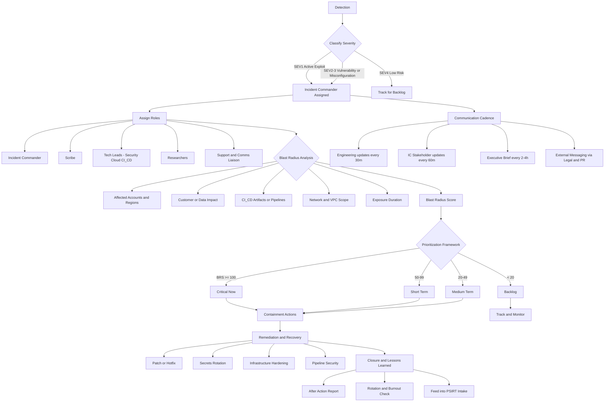

# Playbook

```mermaid
flowchart TD
    %% Detection & Initial Response
    A[🚨 Security Incident Detected] --> B{Validate Signal}
    B -->|False Positive| C[Document & Close]
    B -->|Confirmed Threat| D[Establish War Room<br/>< 10 minutes]
    
    %% Role Assignment
    D --> E[Assign Roles:<br/>• IC (Incident Commander)<br/>• Investigation Lead<br/>• Communication Lead<br/>• Technical Responders]
    
    %% Severity Classification
    E --> F{Classify Severity}
    F -->|SEV1: Critical| G[Immediate Response<br/>15 min SLA]
    F -->|SEV2: High| H[Urgent Response<br/>2 hour SLA]
    F -->|SEV3: Medium| I[Standard Response<br/>4 hour SLA]
    F -->|SEV4: Low| J[Routine Response<br/>24 hour SLA]
    
    %% Parallel Response Tracks
    G --> K[🔴 IMMEDIATE CONTAINMENT]
    H --> K
    I --> L[🟠 CONTROLLED RESPONSE]
    J --> M[🟡 PLANNED RESPONSE]
    
    %% Containment Phase
    K --> N{Threat Contained?}
    N -->|No| O[Escalate Containment<br/>Additional Resources]
    N -->|Yes| P[Begin Investigation]
    O --> N
    
    %% Investigation & Forensics (Parallel Track)
    P --> Q[🔍 INVESTIGATION PHASE]
    Q --> Q1[• Evidence Collection<br/>• Timeline Reconstruction<br/>• Blast Radius Analysis<br/>• Root Cause Analysis]
    
    %% Communication Track (Parallel)
    P --> R[📢 COMMUNICATION PHASE]
    R --> R1{Customer Impact?}
    R1 -->|Yes| R2[Customer Notifications<br/>Legal Review Required]
    R1 -->|No| R3[Internal Comms Only]
    R2 --> S[Regulatory Assessment]
    R3 --> S
    
    %% Remediation Planning
    Q1 --> T[📋 REMEDIATION PLANNING]
    T --> U[Remediation Buckets:<br/>🔴 Critical Now (Hours)<br/>🟠 Short-term (Days)<br/>🟡 Medium-term (Weeks)<br/>🟢 Long-term (Months)]
    
    %% Escalation Decision Points
    S --> V{Escalation Needed?}
    V -->|Criminal Activity| W[Law Enforcement<br/>Engagement]
    V -->|Regulatory Breach| X[Compliance<br/>Notifications]
    V -->|Executive Decision| Y[C-Suite<br/>Briefing]
    V -->|Continue Response| Z[Execute Remediation]
    
    W --> Z
    X --> Z
    Y --> Z
    
    %% Recovery & Validation
    Z --> AA[🔧 RECOVERY PHASE]
    AA --> BB[• Deploy Fixes<br/>• Restore Services<br/>• Validate Security<br/>• Monitor for Reoccurrence]
    
    %% Resolution Validation
    BB --> CC{All Systems Recovered?}
    CC -->|No| DD[Continue Recovery<br/>Update Stakeholders]
    CC -->|Yes| EE[📊 CLOSURE PHASE]
    DD --> BB
    
    %% Post-Incident Activities
    EE --> FF[After-Action Review<br/>< 48 Hours]
    FF --> GG[• Document Timeline<br/>• Identify Lessons Learned<br/>• Create Action Items<br/>• Update Playbooks]
    
    %% Continuous Improvement
    GG --> HH[📈 CONTINUOUS IMPROVEMENT]
    HH --> II[• Process Updates<br/>• Training Enhancements<br/>• Detection Improvements<br/>• Tool Integration]
    
    %% Communication Updates (Ongoing)
    L --> K
    M --> L
    
    %% Stakeholder Update Frequencies
    subgraph Updates [" Communication Cadence "]
        direction TB
        U1[👥 Engineering: 30 min]
        U2[🎯 Executive: 60 min SEV1, 4hr SEV2]
        U3[⚖️ Legal: 2 hours]
        U4[🌐 External: As required]
    end
    
    %% Decision Authority Matrix
    subgraph Authority [" Decision Authority "]
        direction TB
        A1[🔧 Technical: Investigation Lead]
        A2[💼 Business: IC + Manager]
        A3[📢 Customer: IC + Legal + CS]
        A4[🏛️ Public: Legal + PR + Exec]
    end
    
    %% Evidence Preservation (Parallel Process)
    subgraph Evidence [" Evidence & Legal "]
        direction TB
        E1[📁 Chain of Custody]
        E2[🔐 Digital Forensics]
        E3[⚖️ Legal Hold]
        E4[🛡️ Compliance Assessment]
    end
    
    %% Metrics & SLAs
    subgraph Metrics [" Key Metrics "]
        direction TB
        M1[⏱️ MTTD: Mean Time to Detection]
        M2[🚀 MTTR: Mean Time to Response]
        M3[🛑 MTTC: Mean Time to Containment]
        M4[🔄 MTTR: Mean Time to Recovery]
    end
    
    %% Connect parallel processes
    R -.-> Updates
    P -.-> Authority  
    Q -.-> Evidence
    II -.-> Metrics
    
    %% Styling
    classDef critical fill:#ff6b6b,stroke:#d63031,stroke-width:3px,color:#fff
    classDef high fill:#fd79a8,stroke:#e84393,stroke-width:2px,color:#fff
    classDef medium fill:#fdcb6e,stroke:#f39c12,stroke-width:2px,color:#000
    classDef low fill:#55a3ff,stroke:#2d3436,stroke-width:1px,color:#fff
    classDef process fill:#00b894,stroke:#00a085,stroke-width:2px,color:#fff
    classDef decision fill:#a29bfe,stroke:#6c5ce7,stroke-width:2px,color:#fff
    
    class A,K,G critical
    class H,L high  
    class I,M medium
    class J low
    class P,Q,R,T,AA,EE,FF,GG,HH process
    class B,F,N,R1,V,CC decision
```


# PSIRT Incident Response Process (Flyover)


##
##


# Blast Radius to Prioritization Decision Tree

```mermaid
flowchart TD
    A[Blast Radius Analysis] --> B[Calculate Blast Radius Score]

    B --> C{Score Range}
    C -->|BRS >= 100| D[Critical Now]
    C -->|50 to 99| E[Short Term]
    C -->|20 to 49| F[Medium Term]
    C -->|< 20| G[Backlog]

    %% Map to Remediation
    D --> H[Containment Actions Immediately]
    E --> H
    F --> I[Plan Remediation in Days]
    G --> J[Track and Monitor]

    H --> K[Remediation and Recovery]
    I --> K
    J --> K
