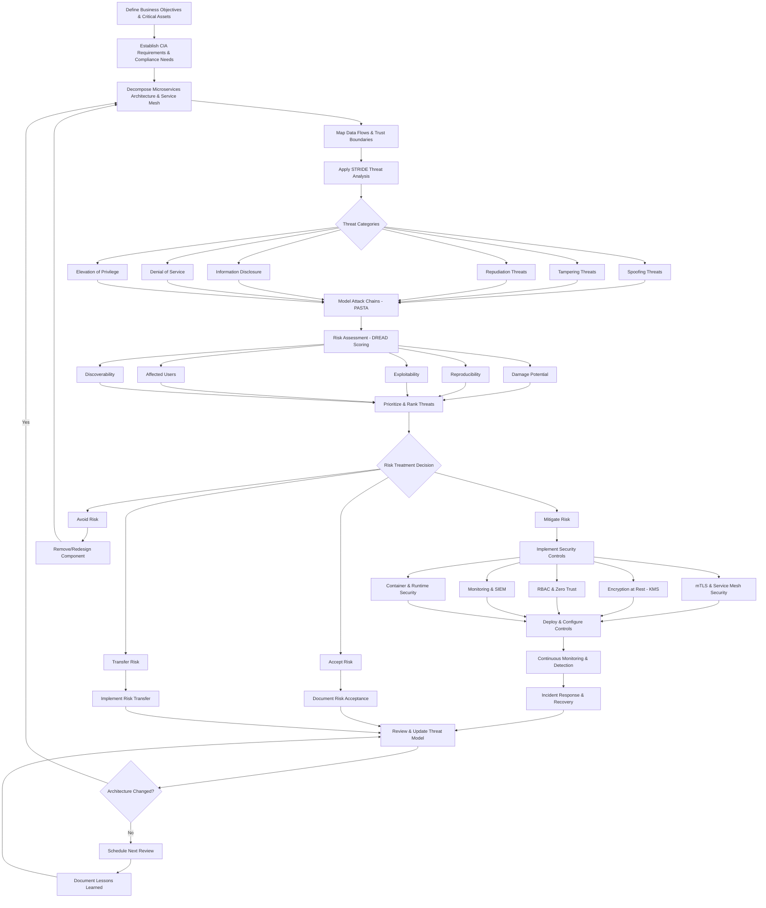
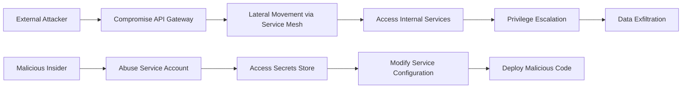

# Enhanced Threat Modeling Framework for Microservices (..beta..)


## Updated Combined Threat Modeling Process



## Enhanced Framework Details

### Phase 1: Asset Identification & Scope Definition

**Business Context Analysis:**
- **Critical Business Functions**: Payment processing, user authentication, data analytics
- **Regulatory Requirements**: GDPR, SOX, HIPAA, PCI-DSS compliance needs
- **Service Level Agreements**: RPO/RTO requirements, availability targets
- **Data Classification**: Public, internal, confidential, restricted data types

**Asset Inventory:**
```yaml
critical_assets:
  - name: "Customer PII Database"
    classification: "Restricted"
    compliance: ["GDPR", "CCPA"]
    availability_requirement: "99.9%"
  
  - name: "Payment Processing Service"
    classification: "Restricted"
    compliance: ["PCI-DSS"]
    availability_requirement: "99.99%"
  
  - name: "Authentication Service"
    classification: "Confidential"
    dependencies: ["Identity Provider", "Session Store"]
```

### Phase 2: Microservices Architecture Decomposition

**Service Mesh Mapping:**
- **Control Plane**: Istio/Linkerd configuration and policies
- **Data Plane**: Envoy proxy configurations and traffic routing
- **Service-to-Service Communication**: mTLS enforcement points
- **External Integrations**: API gateways, third-party services

**Container & Runtime Analysis:**
```yaml
service_boundaries:
  user_service:
    container_runtime: "containerd"
    security_policies: ["AppArmor", "SELinux"]
    network_policies: "deny-all-default"
    secrets_management: "Kubernetes Secrets + External KMS"
  
  payment_service:
    isolation_level: "VM + Container"
    compliance_controls: ["PCI-DSS network segmentation"]
    monitoring: ["Real-time transaction monitoring"]
```

### Phase 3: Enhanced STRIDE Analysis

**Spoofing Threats - Service Identity:**
- **Service Account Impersonation**: Weak JWT validation, stolen service certificates
- **Client Identity Spoofing**: Bypassed authentication, session hijacking
- **Infrastructure Spoofing**: DNS poisoning, service mesh proxy compromise

**Tampering Threats - Data Integrity:**
- **Message Tampering**: Intercepted API calls, request/response modification
- **Configuration Drift**: Unauthorized policy changes, infrastructure mutations
- **Supply Chain Attacks**: Compromised container images, malicious dependencies

**Repudiation Threats - Audit Trail:**
- **Log Tampering**: Centralized logging system compromise, audit trail gaps
- **Non-repudiation Failures**: Missing digital signatures, weak audit controls

**Information Disclosure - Confidentiality:**
- **Data Exfiltration**: Database access, API response disclosure
- **Configuration Exposure**: Secrets in environment variables, exposed endpoints
- **Side-channel Attacks**: Timing attacks, resource exhaustion information leaks

**Denial of Service - Availability:**
- **Resource Exhaustion**: CPU/memory bombs, storage filling
- **Network Flooding**: DDoS attacks, service mesh overload
- **Cascading Failures**: Circuit breaker failures, dependency chains

**Elevation of Privilege - Authorization:**
- **RBAC Bypass**: Role escalation, policy misconfiguration
- **Container Escape**: Runtime vulnerabilities, privileged containers
- **Infrastructure Access**: Kubernetes API abuse, cloud IAM escalation

### Phase 4: PASTA Attack Simulation

**Attack Chain Modeling:**


**Realistic Attack Scenarios:**
1. **Supply Chain Compromise**: Malicious container image → Runtime execution → Credential harvesting → Lateral movement
2. **Service Mesh Exploitation**: mTLS bypass → Service impersonation → Data access → Persistent access
3. **Cloud Infrastructure Attack**: IAM misconfiguration → Privilege escalation → Resource access → Data exfiltration

### Phase 5: DREAD Risk Scoring Matrix

| Threat Scenario | Damage | Reproducibility | Exploitability | Affected Users | Discoverability | Total Score | Priority |
|------------------|---------|-----------------|----------------|----------------|-----------------|-------------|----------|
| mTLS Certificate Theft | 9 | 6 | 7 | 8 | 5 | 35 | High |
| Container Runtime Escape | 10 | 8 | 6 | 9 | 7 | 40 | Critical |
| Service Mesh Policy Bypass | 8 | 7 | 8 | 7 | 6 | 36 | High |
| KMS Key Compromise | 10 | 4 | 5 | 10 | 4 | 33 | High |

### Phase 6: Security Control Implementation

**Service Mesh Security:**
```yaml
istio_security_policies:
  - name: "default-deny-all"
    type: "AuthorizationPolicy"
    action: "DENY"
    selector:
      matchLabels: {}
  
  - name: "strict-mtls"
    type: "PeerAuthentication"
    mtls:
      mode: "STRICT"
  
  - name: "jwt-validation"
    type: "RequestAuthentication"
    jwtRules:
    - issuer: "https://identity.company.com"
      jwksUri: "https://identity.company.com/.well-known/jwks.json"
```

**Encryption & Key Management:**
```yaml
encryption_strategy:
  at_rest:
    databases: "AES-256 with AWS KMS"
    secrets: "Sealed Secrets + External KMS"
    storage: "LUKS encryption for persistent volumes"
  
  in_transit:
    service_mesh: "mTLS with certificate rotation"
    external_apis: "TLS 1.3 minimum"
    database_connections: "TLS with client certificates"
```

**Zero Trust Implementation:**
```yaml
zero_trust_controls:
  identity_verification:
    - "Multi-factor authentication for all humans"
    - "Service account certificates with short TTL"
    - "Continuous identity validation"
  
  least_privilege_access:
    - "RBAC with principle of least privilege"
    - "Just-in-time access for sensitive operations"
    - "Regular access reviews and cleanup"
  
  network_segmentation:
    - "Microsegmentation via service mesh"
    - "Network policies at Kubernetes level"
    - "Cloud VPC security groups"
```

### Phase 7: Monitoring & Detection

**Security Monitoring Stack:**
```yaml
monitoring_components:
  metrics:
    - "Prometheus for infrastructure metrics"
    - "Custom SLIs for security events"
    - "Service mesh observability (Kiali/Jaeger)"
  
  logging:
    - "Centralized logging with ELK/EFK"
    - "Structured logging with correlation IDs"
    - "Immutable audit logs"
  
  alerting:
    - "Real-time security event detection"
    - "Behavioral anomaly detection"
    - "Automated incident response triggers"
```

**Detection Rules Examples:**
```yaml
security_alerts:
  - name: "Suspicious Service Communication"
    condition: "service_mesh.request_count{source_unknown=true} > 100"
    severity: "High"
    action: "Block traffic + Alert SOC"
  
  - name: "Certificate Expiry Warning"
    condition: "certificate_expiry_days < 30"
    severity: "Medium"
    action: "Auto-renew + Notify team"
  
  - name: "Privilege Escalation Attempt"
    condition: "kubernetes.audit{verb=create,resource=clusterrolebinding}"
    severity: "Critical"
    action: "Block + Immediate escalation"
```

## Implementation Checklist

- [ ] **Architecture Documentation**: Complete service mesh topology
- [ ] **Threat Model Documentation**: Living document with regular updates
- [ ] **Security Controls Testing**: Automated security validation
- [ ] **Incident Response Playbooks**: Service mesh specific procedures
- [ ] **Compliance Mapping**: Controls to regulatory requirements
- [ ] **Team Training**: Threat modeling workshops and security awareness
- [ ] **Tool Integration**: Threat modeling tools in CI/CD pipeline
- [ ] **Metrics & KPIs**: Security posture measurement and reporting


