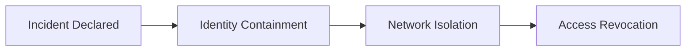
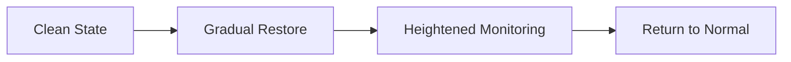
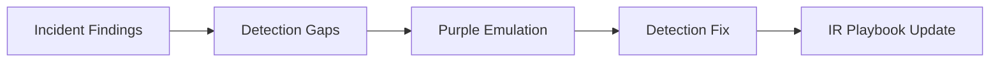

# Incident Response Handbook –  

*A detection-driven, cloud-native, identity-centric Incident Response framework derived from Purple Team validation.*

---

## Executive Summary

This **Incident Response (IR) Handbook** defines how an organization detects, triages, contains, eradicates, and recovers from real security incidents in modern cloud-native environments.

This handbook is **explicitly derived from Purple Team operations**.  
Only detections, telemetry, workflows, and controls that have been **validated through Purple Team exercises** are considered authoritative for Incident Response.

**Core Principle:**  
Purple Teaming proves what *should* work. Incident Response executes when it *must*.

---

## Relationship to Purple Teaming

Incident Response and Purple Teaming are adjacent but distinct disciplines.

| Area | Purple Team | Incident Response |
|----|-------------|------------------|
| Trigger | Simulated adversary | Real compromise |
| Objective | Improve defenses | Stop damage |
| Pace | Risk-calibrated | Time-critical |
| Output | Detection improvements | Business recovery |
| Ownership | Security Engineering | IR / DFIR |

Purple Team outputs directly inform:
- IR playbooks
- Alert confidence
- Escalation thresholds
- Timing SLAs

---

## Incident Response Objectives

Incident Response exists to:

- Protect customers and business operations
- Contain adversary activity rapidly
- Preserve forensic evidence
- Restore services safely
- Prevent recurrence through validated fixes

---

## Incident Classification & Severity

All incidents **must be classified immediately** upon detection.

### Severity Levels

| Severity | Name | Description | Example |
|-------|------|-------------|---------|
| SEV-0 | Crisis | Active compromise with existential impact | Widespread IAM takeover |
| SEV-1 | Critical | Confirmed breach of sensitive systems | CI/CD compromise |
| SEV-2 | High | Likely compromise, limited scope | Token theft |
| SEV-3 | Medium | Suspicious activity | Beaconing |
| SEV-4 | Low | Benign or false positive | No impact |

Severity is **impact-driven**, not alert-driven.

---

## Incident Response Timing SLAs

| Severity | Triage | Containment | Eradication | Exec Update |
|-------|--------|-------------|-------------|-------------|
| SEV-0 | ≤ 5 min | ≤ 15 min | ASAP | ≤ 30 min |
| SEV-1 | ≤ 15 min | ≤ 30 min | ≤ 24 hrs | ≤ 1 hr |
| SEV-2 | ≤ 30 min | ≤ 4 hrs | ≤ 72 hrs | ≤ 24 hrs |
| SEV-3 | ≤ 24 hrs | As needed | As needed | As needed |
| SEV-4 | Best effort | N/A | N/A | N/A |

These SLAs are validated by Purple Team exercises and reviewed quarterly.

---

## Incident Response Lifecycle

```mermaid
flowchart TD
    A[Detection Trigger] --> B[Triage]
    B --> C{Real Incident?}
    C -->|No| D[Close / Tune Detection]
    C -->|Yes| E[Containment]
    E --> F[Eradication]
    F --> G[Recovery]
    G --> H[Post-Incident Review]
````

---

## Detection Sources (Authoritative)

Only telemetry validated through Purple Teaming is considered authoritative.

| Source     | Examples                     |
| ---------- | ---------------------------- |
| SIEM / XDR | Auth abuse, lateral movement |
| eBPF       | Runtime process abuse        |
| Cloud Logs | IAM, API misuse              |
| Identity   | MFA, OAuth, token anomalies  |
| CI/CD      | Pipeline tampering           |

---

## Triage Phase

### Objectives

* Confirm reality
* Establish scope
* Prevent unnecessary escalation

### Triage Checklist

* Is the activity expected?
* Is the identity legitimate?
* Is lateral movement occurring?
* Is production impacted?

```mermaid
flowchart TD
    A[Alert Received] --> B[Validate Context]
    B --> C{Confirmed?}
    C -->|No| D[Close or Tune]
    C -->|Yes| E[Declare Incident]
```

---

## Containment Phase

Containment prioritizes **blast-radius reduction**, not cleanup.

### Containment Actions

| Area     | Action                          |
| -------- | ------------------------------- |
| Identity | Revoke tokens, force reauth     |
| Network  | Isolate workloads, block egress |
| CI/CD    | Freeze pipelines                |
| Cloud    | Disable compromised roles       |



---

## Eradication Phase

Eradication removes adversary persistence.

* Remove backdoors
* Rotate credentials
* Patch vulnerabilities
* Rebuild compromised workloads

Eradication must not destroy forensic evidence prematurely.

---

## Recovery Phase

Recovery restores **safe and verified service**.

* Re-enable access incrementally
* Validate detections fire correctly
* Monitor for re-entry
* Confirm business stability



---

## Post-Incident Review (PIR)

Every SEV-0 and SEV-1 requires a PIR.

### PIR Outputs

* Root cause
* Detection gaps
* Timeline accuracy
* Control failures
* Preventative actions

PIR outputs **must feed the Purple Team backlog**.

---

## Purple Team → IR Feedback Loop



---

## Roles & Responsibilities

| Role              | Responsibility                  |
| ----------------- | ------------------------------- |
| IR Commander      | Decision authority              |
| DFIR Lead         | Forensics and timeline          |
| SOC               | Monitoring and escalation       |
| Cloud Engineering | Infrastructure control          |
| Legal             | Regulatory handling             |
| Communications    | Internal and external messaging |

---

## Evidence Handling & Forensics

* Preserve logs immutably
* Snapshot disks and memory
* Timestamp all actions
* Maintain chain of custody

---

## Communications & Governance

### Internal

* Establish war room
* Define single incident commander
* Maintain one source of truth

### External

* Legal approval required
* Regulatory timelines tracked
* Customer trust prioritized

---

## Metrics & Effectiveness

| Metric          | Purpose           |
| --------------- | ----------------- |
| MTTD            | Detection quality |
| MTTC            | Containment speed |
| MTTR            | Recovery speed    |
| Recurrence Rate | Fix effectiveness |

Metrics must map back to Purple Team validation.

---

## Incident Readiness Requirements

An organization is IR-ready only if:

* Detections are Purple-validated
* Playbooks are exercised quarterly
* Roles are clearly assigned
* Telemetry coverage is complete
* Authority is unambiguous

---

## Templates

| Template              | Purpose            |
| --------------------- | ------------------ |
| Incident Declaration  | Severity and scope |
| Containment Checklist | Rapid response     |
| PIR Template          | Lessons learned    |
| Executive Brief       | Leadership updates |

---

## FAQ

**Does IR run Purple tooling?**
No. Purple tooling informs IR; IR executes.

**Can IR stop Purple exercises?**
Yes. IR always has priority.

**How often are playbooks updated?**
After every SEV-0 or SEV-1 and quarterly.

---

## Contributors

Derived from Purple Team Framework contributors and IR practitioners.

---

## Closing Notes

This Incident Response Handbook is:

* Detection-driven
* Purple-informed
* Cloud-native
* Identity-first
* Executive-safe
* Operator-realistic

It represents the execution arm of a mature Purple Team program.

##
##
