# AWS Employee Device Compromise — Professional Incident Response Matrix v2.1

## Executive Summary Document

### Document Control
```yaml
Version: 2.1
Last Updated: 2025-11-28
Owner: Security Operations Manager
Review Cycle: Quarterly
Classification: INTERNAL - SECURITY SENSITIVE
Change Notes: "Adjusted timelines for operational realism; added comprehensive flowchart"
```

---

## 🎯 PHASE-BASED EXECUTION FRAMEWORK

### PHASE 0: DECLARATION & MOBILIZATION (T+0 → T+15min)

| ID | Action | Owner | Dependencies | Success Criteria | Deliverable | Timeline |
|----|--------|-------|--------------|------------------|-------------|----------|
| P0-001 | Declare Incident (SEV1/SEV2) | SOC L2/L3 | Alert validation | Incident ticket created | INC-YYYYMMDD-### | 5 min |
| P0-002 | Activate War Room | IR Lead | P0-001 | Slack channel + Zoom active | #incident-YYYYMMDD | 8 min |
| P0-003 | Assign Roles (IC, Scribe, SMEs) | IR Lead | P0-002 | Role matrix populated | Roles document | 10 min |
| P0-004 | Initial Notification (CISO, Legal, HR) | IR Lead | P0-001 | Stakeholders notified | Email confirmation | 12 min |
| P0-005 | Freeze Change Controls | IR Lead | P0-002 | Deployments paused | Freeze confirmation | 10 min |
| P0-006 | Establish Communication Cadence | IR Lead | P0-003 | Update schedule set | Comms plan | 15 min |

**Phase Deliverables:**
- ✅ Incident Declaration Record (`incidents/INC-{id}/declaration.json`)
- ✅ War Room Link & Role Assignment
- ✅ Initial Notification Log
- ✅ Change Freeze Confirmation
- ✅ Communication Schedule

**Phase Exit Criteria:**
- [ ] Incident ticket created with severity assignment
- [ ] War room established with all critical roles present
- [ ] Stakeholders aware and change freeze in effect
- [ ] Communication cadence established (updates every 30 min)

**Realistic Considerations:**
- People need time to join war room
- Context sharing takes 5-10 minutes
- Stakeholder availability varies

---

### PHASE 1: RAPID CONTAINMENT (T+15 → T+45min)

#### 1A: Identity Lockdown (Parallel Execution)

| ID | Action | Owner | System | Command/API | Validation | Timeline | Rollback |
|----|--------|-------|--------|-------------|------------|----------|----------|
| P1-001 | Snapshot IAM State (Pre-Revoke) | CloudSec | AWS | `aws iam get-user --user-name X` | JSON export saved | 3 min | N/A |
| P1-002 | Suspend Okta Account | IAM Admin | Okta | `POST /api/v1/users/{id}/lifecycle/suspend` | Account status = SUSPENDED | 2 min | Yes |
| P1-003 | Terminate All Sessions | IAM Admin | Okta | `DELETE /api/v1/users/{id}/sessions` | Session count = 0 | 3 min | No |
| P1-004 | Revoke OAuth Tokens | IAM Admin | Okta | `DELETE /api/v1/users/{id}/grants` | Token count = 0 | 4 min | No |
| P1-005 | Remove MFA Factors | IAM Admin | Okta | `DELETE /api/v1/users/{id}/factors/{fid}` | Factor count = 0 | 2 min | Yes |
| P1-006 | Verify Okta Deactivation | IAM Admin | Okta | Manual check + API | All access revoked | 5 min | N/A |

**Subtotal: 15-20 minutes** (including verification and coordination)

#### 1B: AWS Access Revocation (Parallel Execution)

| ID | Action | Owner | System | Command/API | Validation | Timeline | Rollback |
|----|--------|-------|--------|-------------|------------|----------|----------|
| P1-101 | Apply Explicit DENY Policy | CloudSec | AWS IAM | Attach `DenyAllPolicy` | Policy attached | 3 min | Yes |
| P1-102 | List All Access Keys | CloudSec | AWS IAM | `aws iam list-access-keys` | Keys inventoried | 2 min | N/A |
| P1-103 | Delete Access Keys | CloudSec | AWS IAM | `aws iam delete-access-key` | Key count = 0 | 5 min | No |
| P1-104 | Revoke STS Sessions | CloudSec | AWS STS | Policy update forces new auth | No active sessions | 8 min | No |
| P1-105 | Tag User Account | CloudSec | AWS IAM | `aws iam tag-user` | Tag: Incident={id} | 2 min | No |
| P1-106 | Initiate Multi-Account Scan | CloudSec | AWS Orgs | Lambda scan function | Scan started | 3 min | N/A |
| P1-107 | Review Cross-Account Keys | CloudSec | AWS Orgs | Lambda results | Report generated | 10 min | N/A |

**Subtotal: 20-25 minutes** (including multi-account operations)

#### 1C: Endpoint Isolation (Parallel Execution)

| ID | Action | Owner | System | Command/API | Validation | Timeline | Rollback |
|----|--------|-------|--------|-------------|------------|----------|----------|
| P1-201 | Identify Active Devices | Response Eng | EDR | Query active endpoints | Device list | 3 min | N/A |
| P1-202 | Verify Device Identity | Response Eng | EDR + MDM | Cross-reference | Correct device | 4 min | N/A |
| P1-203 | Network Isolate (Contain) | Response Eng | CrowdStrike | `contain` command | Status = Contained | 5 min | Yes |
| P1-204 | Terminate User Processes | Response Eng | EDR | Kill process tree | Processes = 0 | 3 min | No |
| P1-205 | Capture Pre-Isolation State | Response Eng | EDR | State snapshot | Snapshot saved | 5 min | N/A |
| P1-206 | Block at Firewall (IP/MAC) | NetSec | Palo Alto | Add block rule | Rule active | 8 min | Yes |
| P1-207 | Disable VPN Access | NetSec | VPN Gateway | Revoke certificate | Cert invalid | 6 min | Yes |
| P1-208 | Verify Isolation | Response Eng | EDR + Network | Test connectivity | Zero access | 5 min | N/A |

**Subtotal: 25-30 minutes** (including verification across multiple systems)

**Phase Deliverables:**
- ✅ Identity Revocation Report (`artifacts/phase1/identity_revocation.json`)
- ✅ AWS Access Summary (`artifacts/phase1/aws_access_summary.json`)
- ✅ Multi-Account Scan Results (`artifacts/phase1/multi_account_scan.json`)
- ✅ Endpoint Isolation Confirmation (`artifacts/phase1/endpoint_status.json`)
- ✅ Pre-Revocation IAM Snapshot (`artifacts/phase1/iam_baseline.json`)
- ✅ Pre-Isolation Device State (`artifacts/phase1/device_state.json`)

**Phase Exit Criteria:**
- [ ] Okta account suspended + all sessions terminated (verified)
- [ ] AWS access keys deleted + STS sessions invalidated (verified)
- [ ] Multi-account scan completed and any additional keys revoked
- [ ] Endpoint network-contained + processes killed (verified)
- [ ] All containment actions logged with timestamps
- [ ] War room updated with containment status

**Critical Success Metrics:**
- Time to Identity Revocation: **< 20 minutes**
- Time to AWS Lockdown: **< 25 minutes**
- Time to Endpoint Isolation: **< 30 minutes**
- Time to Complete Containment Verification: **< 45 minutes**

**Realistic Considerations:**
- Multi-account scans take time
- Verification steps are critical
- Coordination between teams adds overhead
- False positives need to be ruled out

---

### PHASE 2: EVIDENCE COLLECTION (T+30 → T+90min)

#### 2A: Cloud Evidence (Parallel Collection)

| ID | Artifact | Owner | Source | Collection Method | Storage | Hash | Timeline |
|----|----------|-------|--------|-------------------|---------|------|----------|
| P2-001 | CloudTrail Logs (14d) | CloudSec | CloudTrail | Athena export to S3 | `s3://evidence/cloudtrail/` | SHA256 | 15 min |
| P2-002 | AWS Config Snapshots | CloudSec | Config | API export | `s3://evidence/config/` | SHA256 | 10 min |
| P2-003 | GuardDuty Findings | SOC | GuardDuty | JSON export | `s3://evidence/guardduty/` | SHA256 | 8 min |
| P2-004 | VPC Flow Logs | CloudSec | VPC | S3 sync | `s3://evidence/vpcflow/` | SHA256 | 12 min |
| P2-005 | S3 Access Logs | CloudSec | S3 Bucket | S3 sync | `s3://evidence/s3access/` | SHA256 | 10 min |
| P2-006 | IAM Activity Report | CloudSec | IAM Access Analyzer | CSV export | `s3://evidence/iam/` | SHA256 | 8 min |
| P2-007 | CloudWatch Logs | CloudSec | CloudWatch | Export to S3 | `s3://evidence/cloudwatch/` | SHA256 | 12 min |
| P2-008 | Lambda Execution Logs | CloudSec | CloudWatch Logs | Filter + export | `s3://evidence/lambda/` | SHA256 | 10 min |

**Subtotal: 30-40 minutes** (parallel collection with quality checks)

#### 2B: Endpoint Forensics (Sequential Collection)

| ID | Artifact | Owner | Source | Tool | Storage | Timeline | Priority |
|----|----------|-------|--------|------|---------|----------|----------|
| P2-101 | Memory Dump | Forensics | EDR | Volatility | `forensics/memory/` | 15 min | P0 |
| P2-102 | Process List (detailed) | Forensics | EDR | EDR API | `forensics/processes/` | 5 min | P0 |
| P2-103 | Network Connections | Forensics | EDR | Netstat capture | `forensics/network/` | 5 min | P0 |
| P2-104 | Running Services | Forensics | EDR | Service enumeration | `forensics/services/` | 5 min | P1 |
| P2-105 | Registry Analysis | Forensics | EDR | RegRipper | `forensics/registry/` | 12 min | P1 |
| P2-106 | File System Timeline | Forensics | EDR | MFT parse | `forensics/timeline/` | 20 min | P1 |
| P2-107 | Browser History | Forensics | EDR | BrowserHistory | `forensics/browser/` | 8 min | P2 |
| P2-108 | Persistence Mechanisms | Forensics | EDR | Autoruns analysis | `forensics/persistence/` | 10 min | P1 |

**Subtotal: 45-60 minutes** (forensically sound collection)

#### 2C: Log Aggregation (Parallel Collection)

| ID | Artifact | Owner | Source | Query/Filter | Storage | Timeline |
|----|----------|-------|--------|--------------|---------|----------|
| P2-201 | SIEM Query Results | Detection | Splunk | User activity (7d) | `logs/siem/` | 10 min |
| P2-202 | Okta System Logs | IAM Admin | Okta | `/api/v1/logs` (30d) | `logs/okta/` | 8 min |
| P2-203 | GitHub Audit Log | DevSecOps | GitHub | Audit API | `logs/github/` | 8 min |
| P2-204 | Application Logs | SRE | Kibana | User session logs | `logs/app/` | 12 min |
| P2-205 | WAF Logs | NetSec | CloudFlare | IP-based filter | `logs/waf/` | 10 min |
| P2-206 | VPN Connection Logs | NetSec | VPN Gateway | User filter | `logs/vpn/` | 8 min |
| P2-207 | Database Audit Logs | DBA | RDS/Aurora | Query logs | `logs/database/` | 15 min |
| P2-208 | API Gateway Logs | CloudSec | API Gateway | CloudWatch export | `logs/api/` | 10 min |

**Subtotal: 30-40 minutes** (parallel with coordination)

#### 2D: Evidence Validation & Chain of Custody

| ID | Task | Owner | Method | Timeline |
|----|------|-------|--------|----------|
| P2-301 | Generate SHA256 Hashes | Forensics | sha256sum all files | 10 min |
| P2-302 | Create Evidence Manifest | Forensics | JSON catalog | 8 min |
| P2-303 | Verify Evidence Integrity | Forensics | Hash verification | 5 min |
| P2-304 | Document Chain of Custody | Forensics | Custody log | 7 min |
| P2-305 | Upload to Secure Storage | Forensics | S3 + encryption | 10 min |

**Subtotal: 30-40 minutes**

**Phase Deliverables:**
- ✅ Cloud Evidence Package (`evidence/cloud_evidence_manifest.json`)
- ✅ Endpoint Forensic Package (`evidence/endpoint_forensics_manifest.json`)
- ✅ Log Aggregation Package (`evidence/logs_manifest.json`)
- ✅ Evidence Integrity Hashes (`evidence/SHA256SUMS`)
- ✅ Chain of Custody Documentation (`evidence/chain_of_custody.pdf`)
- ✅ Evidence Collection Report (`evidence/collection_report.md`)

**Phase Exit Criteria:**
- [ ] All priority evidence collected and hashed
- [ ] Evidence uploaded to secure incident bucket
- [ ] Chain of custody documented and signed
- [ ] Evidence manifest generated and validated
- [ ] No gaps in critical time windows
- [ ] Evidence storage permissions verified

**Realistic Considerations:**
- Large CloudTrail exports take time
- Memory dumps can be 16GB+ 
- Network transfers have bandwidth limits
- Forensic integrity checks can't be rushed
- Multi-source correlation needs quality time

---

### PHASE 3: BLAST RADIUS ANALYSIS (T+60 → T+120min)

#### 3A: AWS Impact Assessment

| ID | Analysis | Owner | Query/Tool | Output | Timeline | Severity Threshold |
|----|----------|-------|------------|--------|----------|-------------------|
| P3-001 | IAM Role Assumptions | CloudSec | Athena query | Assumed roles list | 12 min | Any cross-account |
| P3-002 | Resource Creation Timeline | CloudSec | CloudTrail filter | New resources | 15 min | EC2, Lambda, S3 |
| P3-003 | Policy Modifications | CloudSec | Config timeline | Changed policies | 12 min | Any inline policy |
| P3-004 | S3 Bucket Access Analysis | CloudSec | S3 access analyzer | Accessed buckets | 10 min | Public/sensitive |
| P3-005 | Secret Access Audit | CloudSec | Secrets Manager logs | Retrieved secrets | 8 min | Production secrets |
| P3-006 | Database Connection Analysis | DBA | RDS/Aurora logs | DB connections | 15 min | Production DBs |
| P3-007 | Lambda Function Invocations | CloudSec | CloudWatch Insights | Invoked functions | 10 min | Admin functions |
| P3-008 | EC2 Instance Analysis | CloudSec | EC2 API + CloudTrail | Modified instances | 12 min | Production instances |
| P3-009 | Security Group Changes | CloudSec | Config timeline | Modified SGs | 10 min | Wide open rules |

**Subtotal: 40-50 minutes** (comprehensive AWS analysis)

#### 3B: Network Path Analysis

| ID | Analysis | Owner | Tool | Output | Timeline |
|----|----------|-------|------|--------|----------|
| P3-101 | Exfiltration Detection | Detection | VPC Flow + SIEM | Unusual outbound | 15 min |
| P3-102 | C2 Communication Hunt | Threat Intel | Firewall + IDS | Suspicious IPs | 12 min |
| P3-103 | Lateral Movement Detection | Detection | Network graph | Movement pattern | 18 min |
| P3-104 | VPN Access Pattern Analysis | NetSec | VPN logs | Connection timeline | 10 min |
| P3-105 | DNS Query Analysis | NetSec | DNS logs | Unusual domains | 12 min |
| P3-106 | Internal Port Scanning | Detection | Network logs | Scan attempts | 10 min |

**Subtotal: 35-45 minutes** (network forensics)

#### 3C: Application Impact Assessment

| ID | Analysis | Owner | Tool | Output | Timeline |
|----|----------|-------|------|--------|----------|
| P3-201 | API Access Pattern Analysis | AppSec | API Gateway logs | Unusual endpoints | 15 min |
| P3-202 | Data Access Audit | AppSec | App logs + DB logs | Sensitive data access | 18 min |
| P3-203 | SaaS Integration Impact | IT Ops | SCIM/API logs | Compromised integrations | 12 min |
| P3-204 | User Behavior Analytics | Detection | UEBA platform | Anomalies | 15 min |
| P3-205 | Privilege Escalation Check | AppSec | Auth logs | Elevation attempts | 10 min |

**Subtotal: 30-40 minutes** (application layer analysis)

#### 3D: Impact Report Synthesis

| ID | Task | Owner | Method | Timeline |
|----|------|-------|--------|----------|
| P3-301 | Correlate All Findings | IR Lead | Cross-analysis | 15 min |
| P3-302 | Build Attack Timeline | Detection | Timeline tool | 12 min |
| P3-303 | Create Impact Matrix | CloudSec | Severity scoring | 10 min |
| P3-304 | Generate Blast Radius Report | IR Lead | Template | 15 min |
| P3-305 | Validate with SMEs | All | Review meeting | 20 min |

**Subtotal: 50-60 minutes**

**Phase Deliverables:**
- ✅ Blast Radius Report (`analysis/blast_radius_summary.md`)
- ✅ Impacted Resources List (`analysis/impacted_resources.csv`)
- ✅ Attack Timeline (`analysis/attack_timeline.json`)
- ✅ Risk Assessment Matrix (`analysis/risk_matrix.csv`)
- ✅ Network Path Diagram (`analysis/network_paths.png`)
- ✅ Data Access Report (`analysis/data_access_summary.pdf`)

**Phase Exit Criteria:**
- [ ] Complete inventory of all accessed resources
- [ ] Timeline of attacker activity established (±5 min accuracy)
- [ ] Impact severity assessed for each resource (H/M/L)
- [ ] Lateral movement paths identified and mapped
- [ ] Data exfiltration scope determined
- [ ] All findings validated by subject matter experts

**Realistic Considerations:**
- Deep log analysis is time-intensive
- Cross-system correlation requires multiple SMEs
- False positives need investigation
- Complex environments have many dependencies
- Accurate timelines require careful reconstruction

---

### PHASE 4: THREAT HUNTING & IOC GENERATION (T+90 → T+180min)

| ID | Hunt Activity | Owner | Focus Area | Method | Output | Timeline |
|----|---------------|-------|------------|--------|--------|----------|
| P4-001 | Persistence Mechanism Hunt | Detection | AWS, Endpoints | SIEM queries | Persistence list | 20 min |
| P4-002 | Credential Reuse Detection | CloudSec | Multi-account scan | API calls | Reused keys | 18 min |
| P4-003 | Malware Artifact Analysis | Forensics | Endpoint files | YARA + sandbox | File hashes | 25 min |
| P4-004 | Network IOC Extraction | Threat Intel | Firewall, DNS, Proxy | Pattern analysis | IP/domain list | 15 min |
| P4-005 | Process IOC Extraction | Forensics | Memory dump | String extraction | Process hashes | 20 min |
| P4-006 | TTPs Mapping | Red Team | All sources | MITRE ATT&CK | TTP matrix | 30 min |
| P4-007 | Similar Activity Hunt | Detection | Historical logs | Pattern matching | Related incidents | 20 min |
| P4-008 | Backdoor Discovery | Forensics | System analysis | Multiple tools | Backdoor catalog | 25 min |
| P4-009 | Credential Dump Analysis | Forensics | Memory analysis | Mimikatz detection | Credential exposure | 18 min |
| P4-010 | Web Shell Hunt | AppSec | Web server logs | Pattern matching | Web shells | 15 min |

**IOC Package Creation:**

| ID | Task | Owner | Method | Timeline |
|----|------|-------|--------|----------|
| P4-101 | Compile IOC List | Threat Intel | Aggregation | 15 min |
| P4-102 | IOC Enrichment | Threat Intel | TI platforms | 20 min |
| P4-103 | False Positive Filtering | Detection | Validation | 15 min |
| P4-104 | STIX Format Generation | Threat Intel | Conversion | 10 min |
| P4-105 | IOC Distribution Prep | Threat Intel | Packaging | 10 min |

**Phase Deliverables:**
- ✅ IOC Package (`iocs/ioc_feed.json`, `iocs/ioc_feed.stix`)
- ✅ TTP Matrix (`iocs/mitre_attack_mapping.json`)
- ✅ Hunting Report (`iocs/threat_hunt_results.md`)
- ✅ Yara Rules (`iocs/custom_yara_rules.yar`)
- ✅ Network Indicators (`iocs/network_indicators.csv`)
- ✅ File Indicators (`iocs/file_indicators.csv`)
- ✅ Behavioral Indicators (`iocs/behavioral_patterns.md`)

**Phase Exit Criteria:**
- [ ] All persistence mechanisms identified
- [ ] IOC package validated and enriched
- [ ] TTPs mapped to MITRE ATT&CK framework
- [ ] Historical hunt completed (no related incidents found)
- [ ] IOCs ready for distribution to defensive tools
- [ ] Threat intel brief prepared

**Realistic Considerations:**
- Deep hunting takes significant time
- Memory analysis is complex
- Malware analysis may need sandboxing
- False positive rates can be high
- Context is needed for each IOC

---

### PHASE 5: REMEDIATION & HARDENING (T+120 → T+360min / 6 hours)

#### 5A: Immediate Remediation (T+120 → T+240min)

| ID | Action | Owner | System | Validation | Timeline | Priority |
|----|--------|-------|--------|------------|----------|----------|
| P5-001 | Rotate AWS Secrets Manager | CloudSec | Secrets Manager | All secrets rotated | 45 min | P0 |
| P5-002 | Rotate Database Passwords | DBA | RDS/Aurora | All passwords changed | 35 min | P0 |
| P5-003 | Rotate Application API Keys | CloudSec | 1Password/Vault | All keys rotated | 40 min | P0 |
| P5-004 | Rotate SSH Keys | SRE | Bastion/Servers | New keys deployed | 30 min | P0 |
| P5-005 | Rebuild Compromised Instances | SRE | EC2 | New instances validated | 60 min | P0 |
| P5-006 | Deploy IOC Blocklists | NetSec | Firewall/EDR | IOCs blocked | 25 min | P0 |
| P5-007 | Patch Exploited Vulnerabilities | SRE | Affected systems | Patches applied | 45 min | P0 |
| P5-008 | Remove Backdoors/Persistence | Forensics | Endpoints/Cloud | All removed | 40 min | P0 |

**Subtotal: 120-150 minutes** (with validation and coordination)

#### 5B: Detection Enhancement (T+180 → T+300min)

| ID | Enhancement | Owner | System | Deliverable | Timeline |
|----|-------------|-------|--------|-------------|----------|
| P5-101 | Deploy New SIEM Rules | Detection | Splunk | Rules active + tested | 35 min |
| P5-102 | Update GuardDuty Config | CloudSec | GuardDuty | Custom findings | 25 min |
| P5-103 | Deploy EDR Detections | Response Eng | CrowdStrike | IOAs active | 40 min |
| P5-104 | Update WAF Rules | NetSec | CloudFlare | Rules deployed | 20 min |
| P5-105 | Configure CloudTrail Alerts | CloudSec | CloudWatch | Alarms active | 30 min |
| P5-106 | Deploy Network Signatures | NetSec | IDS/IPS | Signatures live | 35 min |
| P5-107 | Update UEBA Baselines | Detection | UEBA Platform | Baselines updated | 25 min |
| P5-108 | Test Detection Coverage | Red Team | All systems | Test results | 45 min |

**Subtotal: 100-120 minutes** (with testing)

#### 5C: Infrastructure Hardening (T+240 → T+360min)

| ID | Hardening Action | Owner | System | Validation | Timeline |
|----|------------------|-------|--------|------------|----------|
| P5-201 | Review & Fix IAM Policies | CloudSec | AWS IAM | Least privilege verified | 40 min |
| P5-202 | Enable MFA on All Accounts | IAM Admin | Okta/AWS | 100% MFA coverage | 35 min |
| P5-203 | Implement Network Segmentation | NetSec | VPC/Firewall | Segmentation verified | 50 min |
| P5-204 | Deploy Additional Logging | CloudSec | CloudTrail/Config | Logs verified | 30 min |
| P5-205 | Harden Endpoint Configuration | Response Eng | EDR/MDM | Hardening validated | 40 min |
| P5-206 | Review Security Group Rules | CloudSec | AWS VPC | Rules tightened | 35 min |
| P5-207 | Enable S3 Block Public Access | CloudSec | S3 | All buckets protected | 25 min |
| P5-208 | Implement IP Allowlisting | NetSec | Multiple | Lists active | 30 min |

**Subtotal: 100-120 minutes**

**Phase Deliverables:**
- ✅ Remediation Checklist (`remediation/checklist.md`)
- ✅ Secret Rotation Log (`remediation/secret_rotation.json`)
- ✅ Detection Deployment Log (`remediation/detection_updates.json`)
- ✅ Infrastructure Rebuild Report (`remediation/rebuild_summary.md`)
- ✅ Hardening Validation Report (`remediation/hardening_report.pdf`)
- ✅ Test Results Summary (`remediation/test_results.csv`)

**Phase Exit Criteria:**
- [ ] All production secrets rotated and verified
- [ ] Compromised systems rebuilt from clean images
- [ ] All IOCs blocked across defensive layers
- [ ] New detections deployed and tested
- [ ] Infrastructure hardened per security baseline
- [ ] No residual attacker access confirmed

**Realistic Considerations:**
- Secret rotation affects production systems
- Database password changes need application restarts
- Rebuilding instances requires testing
- Detection tuning needs validation period
- Hardening changes may impact functionality
- Change windows may be required

---

### PHASE 6: VALIDATION & CLOSURE (T+240min / 4hr → T+480min / 8hr)

#### 6A: Technical Validation (T+240 → T+300min)

| ID | Validation | Owner | Method | Pass Criteria | Timeline |
|----|------------|-------|--------|---------------|----------|
| P6-001 | Verify Zero User Access | CloudSec | API test attempts | All auth fails | 15 min |
| P6-002 | Verify Endpoint Isolation | Response Eng | Network connectivity test | No connectivity | 10 min |
| P6-003 | Verify Secret Rotation | CloudSec | Secret version check | All rotated | 20 min |
| P6-004 | Verify Detection Coverage | Detection | Simulation/test cases | All detections fire | 45 min |
| P6-005 | Verify IOC Blocking | NetSec | Test IOC access | All blocked | 15 min |
| P6-006 | Verify No Persistence | Forensics | System scan | Clean systems | 30 min |
| P6-007 | Verify Hardening Complete | CloudSec | Compliance scan | All controls pass | 25 min |
| P6-008 | Test Application Functionality | SRE | Smoke tests | Apps operational | 30 min |

**Subtotal: 60-90 minutes** (thorough validation)

#### 6B: Continuous Monitoring (T+240 → T+480min / 4 hours)

| ID | Monitoring Activity | Owner | System | Alert Criteria | Duration |
|----|---------------------|-------|--------|----------------|----------|
| P6-101 | Monitor for Reactivation | SOC | SIEM | Any user activity | 4 hours |
| P6-102 | Monitor for New IOCs | SOC | SIEM/EDR | IOC matches | 4 hours |
| P6-103 | Monitor for Similar TTPs | Detection | SIEM | Pattern matches | 4 hours |
| P6-104 | Monitor AWS Activity | CloudSec | CloudTrail | Related activity | 4 hours |
| P6-105 | Monitor Network Traffic | NetSec | Firewall/IDS | Anomalies | 4 hours |

#### 6C: Documentation & Reporting (T+300 → T+420min)

| ID | Document | Owner | Template | Audience | Timeline |
|----|----------|-------|----------|----------|----------|
| P6-201 | Technical Incident Report | IR Lead | Technical template | Security team | 60 min |
| P6-202 | Executive Brief | SecOps Mgr | Executive template | Leadership | 45 min |
| P6-203 | Detailed Timeline Report | Scribe | Timeline template | All stakeholders | 75 min |
| P6-204 | Evidence Catalog | Forensics | Catalog template | Legal/Compliance | 50 min |
| P6-205 | Lessons Learned Draft | IR Lead | Lessons template | Security team | 40 min |
| P6-206 | Customer Communication | Comms | Customer template | Customers (if needed) | 30 min |
| P6-207 | Compliance Report | Compliance | Regulatory template | Auditors | 45 min |

**Subtotal: 120-150 minutes** (comprehensive documentation)

#### 6D: Handoff & Transition (T+420 → T+480min)

| ID | Task | Owner | Audience | Deliverable | Timeline |
|----|------|-------|----------|-------------|----------|
| P6-301 | SOC Handoff Briefing | IR Lead | SOC Team | Monitoring guide | 20 min |
| P6-302 | Engineering Handoff | IR Lead | SRE/Dev Teams | Remediation summary | 25 min |
| P6-303 | Management Briefing | SecOps Mgr | Leadership | Status update | 30 min |
| P6-304 | Schedule Post-Mortem | IR Lead | All participants | Meeting invite | 10 min |
| P6-305 | Archive Incident Materials | Scribe | All | Archive complete | 20 min |

**Phase Deliverables:**
- ✅ Validation Report (`validation/validation_results.json`)
- ✅ Technical Incident Report (`reports/technical_report.md`)
- ✅ Executive Summary (`reports/executive_summary.pdf`)
- ✅ Detailed Timeline (`reports/detailed_timeline.xlsx`)
- ✅ Evidence Catalog (`reports/evidence_catalog.xlsx`)
- ✅ Lessons Learned Draft (`reports/lessons_learned_draft.md`)
- ✅ Monitoring Playbook (`reports/ongoing_monitoring.md`)
- ✅ Compliance Documentation (`reports/compliance_package.pdf`)

**Phase Exit Criteria:**
- [ ] All technical validation complete with passing results
- [ ] 4-hour monitoring period complete with no alerts
- [ ] All documentation complete and reviewed
- [ ] Stakeholders briefed and acknowledged
- [ ] Post-mortem scheduled (within 72 hours)
- [ ] Incident status changed to "Monitoring"
- [ ] SOC has clear monitoring procedures
- [ ] All materials archived with proper retention

**Realistic Considerations:**
- Validation must be thorough, not rushed
- Documentation quality matters for compliance
- Executive summaries need careful wording
- Handoffs require knowledge transfer time
- Some systems may need extended monitoring

---

## 📊 UPDATED RESPONSIBILITY MATRIX (RACI)

| Phase | Duration | IR Lead | CloudSec | IAM Admin | Response Eng | Detection | Forensics | NetSec | SRE | DBA |
|-------|----------|---------|----------|-----------|--------------|-----------|-----------|--------|-----|-----|
| P0: Declaration | 15 min | **A** | C | C | I | C | I | I | I | I |
| P1A: Identity | 20 min | **R** | C | **A** | I | I | I | I | I | I |
| P1B: AWS | 25 min | **R** | **A** | C | I | I | I | C | C | I |
| P1C: Endpoint | 30 min | **R** | C | I | **A** | I | I | **R** | I | I |
| P2A: Cloud Evidence | 40 min | **A** | **R** | C | I | **R** | C | C | C | C |
| P2B: Endpoint Evidence | 60 min | **A** | I | I | C | C | **R** | I | I | I |
| P2C: Log Evidence | 40 min | **A** | C | C | C | **R** | C | C | **R** | **R** |
| P3A: AWS Analysis | 50 min | **A** | **R** | I | I | C | C | C | C | **R** |
| P3B: Network Analysis | 45 min | **A** | C | I | C | **R** | C | **R** | C | I |
| P3C: App Analysis | 40 min | **A** | C | I | I | **R** | C | C | **R** | **R** |
| P4: Hunting | 90 min | **A** | C | I | C | **R** | **R** | C | C | I |
| P5A: Remediation | 150 min | **A** | **R** | C | **R** | C | C | **R** | **R** | **R** |
| P5B: Detection | 120 min | **A** | **R** | I | **R** | **R** | I | **R** | C | I |
| P5C: Hardening | 120 min | **A** | **R** | **R** | **R** | C | I | **R** | **R** | I |
| P6A: Validation | 90 min | **A** | **R** | **R** | **R** | **R** | **R** | **R** | **R** | C |
| P6B: Monitoring | 240 min | **A** | **R** | I | C | **R** | C | **R** | C | I |
| P6C: Documentation | 150 min | **A** | C | C | C | C | **R** | C | C | C |

**Legend:** A=Accountable | R=Responsible | C=Consulted | I=Informed

---

## 📈 UPDATED KEY PERFORMANCE INDICATORS (KPIs)

### Incident Response Metrics

| Metric | Target | Acceptable | Critical Threshold | Measurement |
|--------|--------|------------|-------------------|-------------|
| Time to Declaration | < 5 min | < 10 min | > 20 min | Alert → INC ticket |
| Time to War Room Active | < 15 min | < 20 min | > 30 min | INC ticket → All roles present |
| Time to Containment (Identity) | < 20 min | < 30 min | > 45 min | War room → Okta suspended |
| Time to Containment (Cloud) | < 25 min | < 35 min | > 60 min | War room → AWS locked |
| Time to Containment (Endpoint) | < 30 min | < 40 min | > 60 min | War room → Device isolated |
| Time to Complete Containment | < 45 min | < 60 min | > 90 min | War room → All systems locked |
| Evidence Collection Time | < 90 min | < 120 min | > 180 min | Containment → Evidence secured |
| Blast Radius Analysis Time | < 60 min | < 90 min | > 180 min | Evidence → Impact report |
| Threat Hunting Time | < 90 min | < 120 min | > 180 min | Analysis → IOC package |
| Time to Remediation Complete | < 240 min | < 300 min | > 480 min | Hunting → All systems hardened |
| Time to Validation Complete | < 90 min | < 120 min | > 180 min | Remediation → Validated |
| Time to Full Resolution | < 8 hr | < 10 hr | > 12 hr | Declaration → Final report |

### Quality Metrics

| Metric | Target | Measurement |
|--------|--------|-------------|
| Evidence Integrity (Hash Verification) | 100% | All artifacts hashed + verified |
| Containment Success Rate | 100% | No missed access paths |
| Detection Coverage Post-Incident | > 95% | New detections cover identified TTPs |
| Documentation Completeness | 100% | All required deliverables present |
| Stakeholder Notification SLA | < 15 min | CISO/Legal/HR notified |
| False Positive Rate in IOCs | < 5% | IOCs validated before distribution |
| Remediation Validation Pass Rate | 100% | All remediation actions verified |

---

## 🔄 COMPREHENSIVE INCIDENT RESPONSE FLOWCHART

```mermaid
%%{init: {'theme':'base', 'themeVariables': {'primaryColor':'#2d3748','primaryTextColor':'#fff','primaryBorderColor':'#4a5568','lineColor':'#718096','secondaryColor':'#4299e1','tertiaryColor':'#48bb78','noteBkgColor':'#f7fafc','noteTextColor':'#2d3748'}}}%%

flowchart TB
    Start([🚨 Alert Detected]) --> AlertVal{Alert<br/>Validated?}
    AlertVal -->|No| FalsePos[Close as False Positive]
    AlertVal -->|Yes| Declare[📋 P0: DECLARE INCIDENT<br/>T+0 → T+15min]
    
    Declare --> DeclareSteps[1. Create INC Ticket<br/>2. Activate War Room<br/>3. Assign Roles IC/Scribe/SMEs<br/>4. Notify CISO/Legal/HR<br/>5. Freeze Change Controls]
    
    DeclareSteps --> ContainDecision{Containment<br/>Strategy?}
    
    ContainDecision --> ParallelContain[🔒 P1: RAPID CONTAINMENT<br/>T+15 → T+45min<br/>PARALLEL EXECUTION]
    
    ParallelContain --> P1A[P1A: Identity Lockdown<br/>15-20 min]
    ParallelContain --> P1B[P1B: AWS Revocation<br/>20-25 min]
    ParallelContain --> P1C[P1C: Endpoint Isolation<br/>25-30 min]
    
    P1A --> P1ASteps[1. Snapshot IAM State<br/>2. Suspend Okta<br/>3. Terminate Sessions<br/>4. Revoke OAuth Tokens<br/>5. Remove MFA<br/>6. Verify Deactivation]
    
    P1B --> P1BSteps[1. Apply DENY Policy<br/>2. List Access Keys<br/>3. Delete Keys<br/>4. Revoke STS<br/>5. Tag Account<br/>6. Multi-Account Scan<br/>7. Cross-Account Revoke]
    
    P1C --> P1CSteps[1. Identify Devices<br/>2. Verify Identity<br/>3. Network Contain<br/>4. Kill Processes<br/>5. Capture State<br/>6. Block Firewall<br/>7. Disable VPN<br/>8. Verify Isolation]
    
    P1ASteps --> ContainCheck{All Access<br/>Revoked?}
    P1BSteps --> ContainCheck
    P1CSteps --> ContainCheck
    
    ContainCheck -->|No| EscalateContain[Escalate to Manager<br/>Review Gaps]
    EscalateContain --> ContainDecision
    
    ContainCheck -->|Yes| ParallelEvidence[📦 P2: EVIDENCE COLLECTION<br/>T+30 → T+90min<br/>PARALLEL COLLECTION]
    
    ParallelEvidence --> P2A[P2A: Cloud Evidence<br/>30-40 min]
    ParallelEvidence --> P2B[P2B: Endpoint Forensics<br/>45-60 min]
    ParallelEvidence --> P2C[P2C: Log Aggregation<br/>30-40 min]
    ParallelEvidence --> P2D[P2D: Chain of Custody<br/>30-40 min]
    
    P2A --> P2ASteps[1. CloudTrail 14d Export<br/>2. AWS Config Snapshots<br/>3. GuardDuty Findings<br/>4. VPC Flow Logs<br/>5. S3 Access Logs<br/>6. IAM Activity<br/>7. CloudWatch Logs<br/>8. Lambda Logs]
    
    P2B --> P2BSteps[1. Memory Dump<br/>2. Process List<br/>3. Network Connections<br/>4. Running Services<br/>5. Registry Analysis<br/>6. File Timeline<br/>7. Browser History<br/>8. Persistence Check]
    
    P2C --> P2CSteps[1. SIEM Queries 7d<br/>2. Okta Logs 30d<br/>3. GitHub Audit<br/>4. Application Logs<br/>5. WAF Logs<br/>6. VPN Logs<br/>7. Database Logs<br/>8. API Gateway Logs]
    
    P2D --> P2DSteps[1. Generate SHA256<br/>2. Create Manifest<br/>3. Verify Integrity<br/>4. Document Custody<br/>5. Upload Secure Storage]
    
    P2ASteps --> EvidenceCheck{Evidence<br/>Complete?}
    P2BSteps --> EvidenceCheck
    P2CSteps --> EvidenceCheck
    P2DSteps --> EvidenceCheck
    
    EvidenceCheck -->|Gaps Found| CollectMore[Identify Missing<br/>Evidence Sources]
    CollectMore --> ParallelEvidence
    
    EvidenceCheck -->|Complete| ParallelAnalysis[🔍 P3: BLAST RADIUS ANALYSIS<br/>T+60 → T+120min<br/>PARALLEL ANALYSIS]
    
    ParallelAnalysis --> P3A[P3A: AWS Impact<br/>40-50 min]
    ParallelAnalysis --> P3B[P3B: Network Paths<br/>35-45 min]
    ParallelAnalysis --> P3C[P3C: App Impact<br/>30-40 min]
    ParallelAnalysis --> P3D[P3D: Report Synthesis<br/>50-60 min]
    
    P3A --> P3ASteps[1. IAM Role Assumptions<br/>2. Resource Creation<br/>3. Policy Mods<br/>4. S3 Access<br/>5. Secret Access<br/>6. DB Connections<br/>7. Lambda Invocations<br/>8. EC2 Analysis<br/>9. Security Group Changes]
    
    P3B --> P3BSteps[1. Exfiltration Detection<br/>2. C2 Communication<br/>3. Lateral Movement<br/>4. VPN Patterns<br/>5. DNS Analysis<br/>6. Port Scanning]
    
    P3C --> P3CSteps[1. API Access Patterns<br/>2. Data Access Audit<br/>3. SaaS Integration<br/>4. User Behavior<br/>5. Privilege Escalation]
    
    P3D --> P3DSteps[1. Correlate Findings<br/>2. Build Timeline<br/>3. Impact Matrix<br/>4. Blast Radius Report<br/>5. SME Validation]
    
    P3ASteps --> ImpactAssess{Impact<br/>Scope Known?}
    P3BSteps --> ImpactAssess
    P3CSteps --> ImpactAssess
    P3DSteps --> ImpactAssess
    
    ImpactAssess -->|Unclear| DeepDive[Deep Dive Analysis<br/>Additional SME Review]
    DeepDive --> ParallelAnalysis
    
    ImpactAssess -->|Clear| ThreatHunt[🎯 P4: THREAT HUNTING<br/>T+90 → T+180min<br/>90 MINUTES]
    
    ThreatHunt --> P4Steps[1. Persistence Hunt<br/>2. Credential Reuse<br/>3. Malware Analysis<br/>4. Network IOCs<br/>5. Process IOCs<br/>6. TTP Mapping<br/>7. Historical Hunt<br/>8. Backdoor Discovery<br/>9. Credential Dumps<br/>10. Web Shell Hunt<br/>11. IOC Compilation<br/>12. IOC Enrichment<br/>13. False Positive Filter<br/>14. STIX Generation]
    
    P4Steps --> IOCReady{IOCs<br/>Validated?}
    
    IOCReady -->|No| RefineIOC[Refine and<br/>Re-validate IOCs]
    RefineIOC --> ThreatHunt
    
    IOCReady -->|Yes| ParallelRemediate[🔧 P5: REMEDIATION<br/>T+120 → T+360min<br/>PARALLEL EXECUTION<br/>6 HOURS]
    
    ParallelRemediate --> P5A[P5A: Immediate Remediation<br/>120-150 min]
    ParallelRemediate --> P5B[P5B: Detection Enhancement<br/>100-120 min]
    ParallelRemediate --> P5C[P5C: Infrastructure Hardening<br/>100-120 min]
    
    P5A --> P5ASteps[1. Rotate AWS Secrets<br/>2. Rotate DB Passwords<br/>3. Rotate API Keys<br/>4. Rotate SSH Keys<br/>5. Rebuild Instances<br/>6. Deploy IOC Blocks<br/>7. Patch Vulnerabilities<br/>8. Remove Backdoors]
    
    P5B --> P5BSteps[1. Deploy SIEM Rules<br/>2. Update GuardDuty<br/>3. Deploy EDR Detections<br/>4. Update WAF<br/>5. CloudTrail Alerts<br/>6. Network Signatures<br/>7. UEBA Baselines<br/>8. Test Coverage]
    
    P5C --> P5CSteps[1. Fix IAM Policies<br/>2. Enable MFA All<br/>3. Network Segmentation<br/>4. Additional Logging<br/>5. Harden Endpoints<br/>6. Security Group Review<br/>7. S3 Block Public<br/>8. IP Allowlisting]
    
    P5ASteps --> RemediateCheck{Remediation<br/>Complete?}
    P5BSteps --> RemediateCheck
    P5CSteps --> RemediateCheck
    
    RemediateCheck -->|Failed| FixIssues[Fix Failed<br/>Remediation Items]
    FixIssues --> ParallelRemediate
    
    RemediateCheck -->|Success| Validation[✅ P6: VALIDATION<br/>T+240 → T+480min<br/>4-8 HOURS]
    
    Validation --> P6A[P6A: Technical Validation<br/>60-90 min]
    Validation --> P6B[P6B: Continuous Monitoring<br/>240 min 4 hours]
    
    P6A --> P6ASteps[1. Verify Zero Access<br/>2. Verify Isolation<br/>3. Verify Rotation<br/>4. Verify Detection<br/>5. Verify IOC Blocking<br/>6. Verify No Persistence<br/>7. Verify Hardening<br/>8. Test Apps]
    
    P6B --> P6BSteps[Monitor for:<br/>1. Reactivation<br/>2. New IOCs<br/>3. Similar TTPs<br/>4. AWS Activity<br/>5. Network Traffic]
    
    P6ASteps --> ValidCheck{All Tests<br/>Pass?}
    
    ValidCheck -->|No| ValidationFail[Document Failures<br/>Escalate Issues]
    ValidationFail --> ParallelRemediate
    
    ValidCheck -->|Yes| MonitorCheck{4hr Clean?}
    P6BSteps --> MonitorCheck
    
    MonitorCheck -->|Activity Detected| NewIncident[Treat as New<br/>Incident]
    NewIncident --> Declare
    
    MonitorCheck -->|Clean| Documentation[📄 P6C: DOCUMENTATION<br/>120-150 min]
    
    Documentation --> DocSteps[1. Technical Report<br/>2. Executive Brief<br/>3. Detailed Timeline<br/>4. Evidence Catalog<br/>5. Lessons Learned<br/>6. Customer Comms<br/>7. Compliance Report]
    
    DocSteps --> Handoff[🤝 P6D: HANDOFF<br/>60 min]
    
    Handoff --> HandoffSteps[1. SOC Briefing<br/>2. Engineering Handoff<br/>3. Management Brief<br/>4. Schedule Post-Mortem<br/>5. Archive Materials]
    
    HandoffSteps --> CloseDecision{Ready to<br/>Close?}
    
    CloseDecision -->|Need Extended Monitoring| ExtendedMon[Extended Monitoring<br/>Phase 24-48hr]
    ExtendedMon --> MonitorCheck
    
    CloseDecision -->|Yes| StatusChange[Change Status:<br/>RESOLVED → MONITORING]
    
    StatusChange --> PostMortem[📅 Schedule Post-Mortem<br/>Within 72 Hours]
    
    PostMortem --> ImprovementTrack[📈 Track Improvements<br/>JIRA/GitHub Issues]
    
    ImprovementTrack --> End([✅ Incident Closed<br/>Continuous Improvement])
    
    style Start fill:#e53e3e,stroke:#c53030,stroke-width:3px,color:#fff
    style Declare fill:#dd6b20,stroke:#c05621,stroke-width:2px,color:#fff
    style ParallelContain fill:#d69e2e,stroke:#b7791f,stroke-width:2px,color:#fff
    style ParallelEvidence fill:#38a169,stroke:#2f855a,stroke-width:2px,color:#fff
    style ParallelAnalysis fill:#3182ce,stroke:#2c5282,stroke-width:2px,color:#fff
    style ThreatHunt fill:#805ad5,stroke:#6b46c1,stroke-width:2px,color:#fff
    style ParallelRemediate fill:#d53f8c,stroke:#b83280,stroke-width:2px,color:#fff
    style Validation fill:#38b2ac,stroke:#319795,stroke-width:2px,color:#fff
    style Documentation fill:#4299e1,stroke:#3182ce,stroke-width:2px,color:#fff
    style End fill:#48bb78,stroke:#38a169,stroke-width:3px,color:#fff
    
    style P1A fill:#fed7d7,stroke:#fc8181,stroke-width:2px
    style P1B fill:#fed7d7,stroke:#fc8181,stroke-width:2px
    style P1C fill:#fed7d7,stroke:#fc8181,stroke-width:2px
    style P2A fill:#c6f6d5,stroke:#68d391,stroke-width:2px
    style P2B fill:#c6f6d5,stroke:#68d391,stroke-width:2px
    style P2C fill:#c6f6d5,stroke:#68d391,stroke-width:2px
    style P2D fill:#c6f6d5,stroke:#68d391,stroke-width:2px
    style P3A fill:#bee3f8,stroke:#63b3ed,stroke-width:2px
    style P3B fill:#bee3f8,stroke:#63b3ed,stroke-width:2px
    style P3C fill:#bee3f8,stroke:#63b3ed,stroke-width:2px
    style P3D fill:#bee3f8,stroke:#63b3ed,stroke-width:2px
    style P5A fill:#fbb6ce,stroke:#f687b3,stroke-width:2px
    style P5B fill:#fbb6ce,stroke:#f687b3,stroke-width:2px
    style P5C fill:#fbb6ce,stroke:#f687b3,stroke-width:2px
    style P6A fill:#b2f5ea,stroke:#4fd1c5,stroke-width:2px
    style P6B fill:#b2f5ea,stroke:#4fd1c5,stroke-width:2px
```



---

## 📋 PHASE SUMMARY TABLE

| Phase | Time Window | Duration | Parallel? | Critical Path | Team Size | Key Deliverable |
|-------|-------------|----------|-----------|---------------|-----------|-----------------|
| **P0: Declaration** | T+0 → T+15min | 15 min | No | Yes | 3-5 | War Room + Roles |
| **P1: Containment** | T+15 → T+45min | 30 min | **Yes** (3 tracks) | Yes | 8-10 | All Access Revoked |
| **P2: Evidence** | T+30 → T+90min | 60 min | **Yes** (4 tracks) | Yes | 8-12 | Evidence Package |
| **P3: Analysis** | T+60 → T+120min | 60 min | **Yes** (4 tracks) | Yes | 6-10 | Blast Radius Report |
| **P4: Hunting** | T+90 → T+180min | 90 min | Partially | No | 4-6 | IOC Package |
| **P5: Remediation** | T+120 → T+360min | 240 min | **Yes** (3 tracks) | Yes | 10-15 | Systems Hardened |
| **P6: Validation** | T+240 → T+480min | 240 min | Partially | Yes | 6-10 | Final Report |
| **Total** | **T+0 → T+8hr** | **8 hours** | - | - | **10-15** | **Incident Resolved** |

---

## 🎓 REALISTIC TIMELINE CONSIDERATIONS

### Why These Timelines Are More Achievable

1. **Human Coordination Overhead (15-20%)**
   - War room setup and role assignment
   - Context sharing and decision-making
   - Cross-team communication
   - Stakeholder updates

2. **Technical Complexity**
   - Multi-account AWS environments take time
   - Large data exports (CloudTrail, memory dumps)
   - Network bandwidth limitations
   - System dependencies and change windows

3. **Quality Over Speed**
   - Evidence integrity checks can't be rushed
   - Forensic collection requires care
   - Detection validation needs testing
   - Documentation must be accurate

4. **Operational Realities**
   - People may not be immediately available
   - Some systems require approval to touch
   - Production changes need validation
   - False positives need investigation

5. **Continuous Improvement**
   - First incident will be slower
   - Automation will speed future responses
   - Muscle memory develops over time
   - Tooling improves with investment

---

**This matrix balances urgency with operational reality while maintaining security rigor.**

##
##

```
EMPLOYEE DEVICE COMPROMISE (AWS) — INITIAL RESPONSE CONCURRENCY MAP (..rc4..)
                   =================================================================================

TIME HORIZON:   T0 ───▶ T+15m ───▶ T+30m ───▶ T+45m ───▶ T+60m
                (Incident Declared)   (Containment)   (Investigation)   (Stabilization)


                                 ┌────────────────────────────────────────────────────────────┐
                                 │ INCIDENT DECLARED — SEV1 / SEV2                            │
                                 │ Device compromise with AWS‑linked credentials confirmed    │
                                 └───────────────────────┬────────────────────────────────────┘
                                                         │
                                                         ▼
               ┌───────────────────────────────────────────────────────────────────────────────┐
               │ INCIDENT COMMAND CELL  (T0 → T+10 min)                                         │
               │--------------------------------------------------------------------            │
               │ • Assign Incident Commander & Scribe                                           │
               │ • Open secure war room (Slack / Zoom)                                          │
               │ • Freeze deployments / notify stakeholders                                     │
               │ • Notify Legal / HR / Executives                                               │
               │ • Define log collection & metrics export interval                              │
               └──────────────────────┬─────────────────────────────────────────────────────────┘
                                      │
       ┌──────────────────────────────┼──────────────────────────────────────────────────────────┐
       │                              │                                                          │
       ▼                              ▼                                                          ▼
┌─────────────────────────────┐  ┌─────────────────────────────┐  ┌─────────────────────────────┐  ┌─────────────────────────────┐
│ GLOBAL USER DEACTIVATION    │  │ ENDPOINT CONTAINMENT        │  │ IDENTITY CONTAINMENT        │  │ AWS BLAST RADIUS REVIEW     │
│ (“Kill Switch”) T0 → T+10m  │  │ (Response Eng T0 → T+20m)   │  │ (IAM Sec T0 → T+25m)        │  │ (CloudSec T10 → T40m)       │
│-----------------------------│  │-----------------------------│  │-----------------------------│  │------------------------------│
│ • Trigger Global Deactivation Runbook                        │  │ • Revoke STS sessions        │  │ • Query CloudTrail / Athena │
│ • Disable user via Okta / IdP                                │  │ • Disable access keys        │  │ • Review AWS Config drift   │
│ • Kill SSO & OAuth tokens org‑wide                           │  │ • Force MFA reset            │  │ • Evaluate GuardDuty alerts │
│ • Revoke STS sessions AWS‑org wide                           │  │ • Audit IAM trust policies   │  │ • Identify modified policies│
│ • Isolate endpoint (EDR quarantine)                          │  │                              │  │ • Map impacted resources    │
│ • Verify revocation across Okta / AWS / SaaS                 │  │                              │  │ • Establish blast‑radius    │
└──────────────┬───────────────┘  └──────────────┬──────────────┘  └──────────────┬──────────────┘  └──────────────┬──────────────┘
               │                                 │                                 │                                 │
               ├─────────────────────────────────┴─────────────────────────────────┼─────────────────────────────────┤
               │                                                                   │
               ▼                                                                   ▼
┌─────────────────────────────┐  ┌─────────────────────────────┐  ┌─────────────────────────────┐  ┌─────────────────────────────┐
│ LOG & EVIDENCE CAPTURE      │  │ OBSERVABILITY / APP LOGS    │  │ THREAT HUNTING & DETECTION  │  │ COMMUNICATION & TRACKING    │
│ (SOC / Forensics T10 → T40m)│  │ (SRE / Logging T10 → T50m)  │  │ (SOC / Detection T20 → T50m)│  │ (Comms / IR Lead Cont.)     │
│------------------------------│  │----------------------------│  │------------------------------│ │------------------------------│
│ • Snapshot SIEM search sets  │  │ • Export Kibana queries     │  │ • SIEM anomaly sweeps       │  │ • Maintain incident log     │
│ • Archive S3 / VPC / ALB logs│  │ • Capture Grafana / Loki    │  │ • Role / asset correlation  │  │ • Compile exec summaries    │
│ • Hash + timestamp evidence  │  │ • Gather WebApp / API logs  │  │ • GuardDuty pattern checks  │  │ • Decision tracking         │
│ • Secure evidence S3 bucket  │  │ • Archive Prometheus data   │  │ • IOC sweeps / enrichment   │  │ • Stakeholder comms cadence │
│ • Create evidence manifest   │  │ • Ingest to Splunk pipeline │  │ • Validate signals vs app logs│ │ • Documentation continuity │
└──────────────┬───────────────┘  └──────────────┬──────────────┘  └──────────────┬──────────────┘  └──────────────┬──────────────┘
               │                                 │                                 │                                 │
               ├─────────────────────────────────┴─────────────────────────────────┴─────────────────────────────────┤
               │
               ▼
┌────────────────────────────────────────────────────────────────────────────────────────────────────────────────────┐
│ OBSERVABILITY CORRELATION HUB  (SRE + SOC Continuous)                                                              │
│--------------------------------------------------------------------------------------------------------------------│
│ • Compare metrics vs events for confirmation and false‑positive reduction                                          │
│ • Detect anomaly spikes in system metrics (CPU / traffic / auth errors)                                            │
│ • Correlate app telemetry with CloudTrail and SIEM alerts                                                          │
│ • Confirm service health / impact scope                                                                            │
│ • Feed validated signals back to SOC and IR Lead                                                                   │
└────────────────────────────────────────────────────────────────────────────────────────────────────────────────────┘
                                                         │
                                                         ▼
                                ┌──────────────────────────────────────────────────────────────┐
                                │ INITIAL CONTAINMENT VERIFIED  (≈ T+60 min)                   │
                                │--------------------------------------------------------------│
                                │ • Global Deactivation complete (Okta + AWS + SaaS verified)  │
                                │ • Endpoint & IAM access revoked org‑wide                     │
                                │ • CloudTrail & App logs secured and hashed                   │
                                │ • Observability layer confirms no further spread             │
                                │ • Proceed to Forensics / Blast‑Radius Deep‑Dive              │
                                └──────────────────────────────────────────────────────────────┘
```

##
##

```
GLOBAL USER / DEVICE DEACTIVATION — T0 → T+10 min
                     ==================================================

                                 ┌────────────────────────────────────────
                                 │ TRIGGER CONDITION
                                 │ • Confirmed device or identity compromise
                                 │ • AWS / Okta / SOC high‑confidence alert
                                 └──────────────────────┬─────────────────
                                                        │
                                                        ▼
                 ┌────────────────────────────────────────────────────────────
                 │ INCIDENT COMMAND CELL  (IR Lead / SecOps Manager)
                 │-------------------------------------------------------------
                 │ • Approve “Global Deactivation” (“Kill Switch”)
                 │ • Assign owners (IAM, CloudSec, Response, SOC)
                 │ • Open war room, notify HR / Legal / IT
                 └──────────────────────┬─────────────────────────────
                                        │
                                        ▼
┌──────────────────────────────────────────    ┌────────────────────────────────────────     ┌───────────────────────────────────────
│ IDENTITY PROVIDER / SSO  (Okta / Azure AD)   │ CLOUD (AWS Organization / IAM / STS)        │ ENDPOINT & NETWORK SYSTEMS (EDR / VPN)
│--------------------------------------------   │-------------------------------------------   │---------------------------------------
│ • Suspend user account                       │ • Revoke STS sessions                       │ • Isolate endpoint (EDR quarantine)
│ • Terminate sessions (web / mobile)          │ • Disable access keys                       │ • Disable VPN / remote access
│ • Revoke MFA / OAuth / refresh tokens        │ • Detach IAM policies                       │ • Revoke cert / token auth
│ • Enforce password and MFA reset             │ • Block AWS SSO / federated login           │ • Disable local / AD login
│ • Verify SCIM sync to SaaS targets           │ • Rotate shared keys if applicable          │ • Confirm device isolation event
└──────────────────────┬───────────────────     └──────────────────────┬────────────────      └──────────────────────┬────────────────
                       │                                        │                                     │
                       ├────────────────────────────────────────┴────────────────────────────────────┤
                       │
                       ▼
            ┌────────────────────────────────────────────────────────────────────────────
            │ BUSINESS / SAAS SYSTEMS (via SCIM or API Integration)
            │------------------------------------------------------------
            │ • Suspend email / calendar / office suite accounts
            │ • Deactivate collaboration apps (Slack / Teams / Jira)
            │ • Remove VCS access (GitHub / GitLab / Bitbucket)
            │ • Invalidate CI/CD tokens / PATs
            │ • Rotate secrets owned by compromised user
            └──────────────────────┬────────────────────────────
                                   │
                                   ▼
            ┌────────────────────────────────────────────────────────────────────────────
            │ VERIFICATION & COMMUNICATION
            │------------------------------------------------------------
            │ • SOC verifies no active sessions remain (Okta / AWS)
            │ • Confirm endpoint is isolated (EDR status = Quarantined)
            │ • IR Lead announces “Deactivation Complete” in war room
            │ • Upload revocation logs to incident evidence store
            │ • Update timeline + UTC completion timestamp
            └────────────────────────────────────────────────────────────
```

##
##

# Incident Response Deliverables and Artifact Collection (AWS Employee Device Compromise)

This section defines the specific **artifacts to collect**, **deliverables to produce**, and **responsible owners**
during each incident phase.  
All collections should follow evidence‑handling best practices (timestamps, integrity verification, secure storage).

---

## Phase 1 — Declaration and Coordination (T0 → T+10 min)

| Category | Artifact / Deliverable | Description | Owner | Storage Location |
|-----------|------------------------|-------------|--------|------------------|
| Incident Metadata | Incident Declaration Record | Incident ID, SEV level, timestamp, assigned roles | IR Lead | /incidents/metadata/ |
| Communications | War Room Log | Chat channel transcript link, decisions log | IR Lead / Scribe | /incidents/logs/ |
| Status Snapshot | Current AWS Account Context | List of active sessions, AWS Organizations map | CloudSec | /incidents/metadata/aws_context.json |

---

## Phase 2 — Containment (T+10 → T+25 min)

| Category | Artifact / Deliverable | Description | Owner | Purpose |
|-----------|------------------------|-------------|--------|----------|
| Endpoint Forensics | Memory capture, process list, open connections | Extracted from compromised endpoint | Response Engineer | Identify malware, active C2 |
| Endpoint Summary | Device metadata (OS, hostname, serial, IP, VPN IP) | Logged from EDR/MDM | Response Engineer | Trace network access |
| IAM Data | IAM user JSON dump (`aws iam get-user`) | Baseline of identity configuration | CloudSec | Reference before revocation |
| AWS Sessions | List of active sessions (`aws sts get-caller-identity`) | Determine active consoles/tokens | IAM Security | Revoke + verify lockout |
| Credential Audit | Access key list (`aws iam list-access-keys`) | Track key rotation | IAM Security | Audit / Rotation evidence |

Deliverables:
- Isolation confirmation log
- IAM/session revocation confirmation
- Initial endpoint image or memory dump
- Containment checklist (signed by IR Lead)

---

## Phase 3 — Blast Radius & Evidence Capture (T+20 → T+40 min)

| Category | Artifact / Deliverable | Description | Owner | Storage |
|-----------|------------------------|-------------|--------|----------|
| CloudTrail Snapshot | Exported logs (JSON/GZIP) for 14 days | CloudTrail & CloudWatch | CloudSec | s3://incident-evidence/cloudtrail/ |
| AWS Config Snapshot | JSON deltas of IAM, S3, VPC, Lambda configurations | CloudSec | s3://incident-evidence/config/ |
| GuardDuty Findings | All findings (JSON export) | SOC | s3://incident-evidence/guardduty/ |
| VPC Flow Logs | Network traffic related to user/device | CloudSec | s3://incident-evidence/vpcflow/ |
| S3 Access Logs | Requests or downloads during window | SOC | s3://incident-evidence/s3access/ |
| SIEM Query Results | Raw Splunk/Chronicle logs | Detection | /incidents/logs/siem_results.json |
| IP & IOC Table | Detected malicious IPs, hashes, domains | Threat Intel | /incidents/indicators/ioc_list.csv |
| IAM Role Usage | List of assumed roles + permissions | CloudSec | /incidents/aws/roles_usage.csv |

Deliverables:
- AWS artifact package (CloudTrail + Config + GuardDuty)
- IOC summary table
- IAM access report
- Log integrity hashes

---

## Phase 4 — Threat Hunting & Analysis (T+30 → T+50 min)

| Category | Artifact / Deliverable | Description | Owner | Purpose |
|-----------|------------------------|-------------|--------|----------|
| Correlated Event Timeline | Combined timeline: EDR + CloudTrail + SIEM | Detection / IR Lead | Build event chronology |
| IOC Pivot List | IPs, hashes, user‑agents, domains | Threat Intel | Feed detection tuning |
| Malicious Artifacts | Files downloaded, scripts, processes | Forensics | Reverse engineering / signature gen |
| AWS Service Footprint | EC2/Lambda/S3 created by actor | CloudSec | Identify persistence |
| Credential Propagation | Detect reused API keys / tokens | CloudSec | Scope lateral movement |

Deliverables:
- Unified incident timeline (CSV or Markdown)
- Threat‑intel IOCs ready for blocklists
- Initial impact statement

---

## Phase 5 — Verification & Stabilization (≈ T+60 min)

| Category | Artifact / Deliverable | Description | Owner | Purpose |
|-----------|------------------------|-------------|--------|----------|
| Verification Checklist | Confirm all credentials rotated, IAM disabled | IR Lead | Containment validation |
| Detection Validation | Confirm new SIEM / GuardDuty detections active | Detection Engineer | Continuous monitoring |
| Forensic Archive | Evidence package hash manifest | Forensics | Long‑term storage integrity |
| Communication Summary | Final update to leadership | Comms Officer | Status reporting |
| Lessons Log | Immediate observed gaps | IR Lead | Entry for post‑mortem |

Deliverables:
- Containment verification memo
- Final evidence hash log
- Executive summary update

---

## Common Artifacts Collected (Cross‑Phase Overview)

| Type | Collected From | Examples |
|------|----------------|-----------|
| **Cloud Logs** | CloudTrail, Config, GuardDuty, Security Hub | Auth events, configuration changes |
| **Identity Data** | IAM, AWS SSO, Okta, STS | Sessions, access keys, role assumptions |
| **Network Data** | VPC Flow, ELB, WAF, VPN | Source IPs, ports, traffic volume |
| **System Data** | Endpoint EDR, MDM, Sysmon | Running processes, binaries, connections |
| **Indicators of Compromise (IOCs)** | Threat Intel, Network, Files | IPs, hashes, URLs, domains |
| **Artifacts for Correlation** | SIEM Export, Athena Queries | Timeline data, alert correlation |
| **Evidence Integrity** | SHA256 Hash Log | Validation for post‑event audits |

---

## Artifact Storage and Retention Policy (Example)

| Location | Type | Access Control | Retention |
|-----------|------|----------------|-----------|
| `s3://incident-evidence/cloudtrail/` | CloudTrail, Athena, Config | Write‑once bucket, versioning enabled | 1 year minimum |
| `/incidents/forensics/<incident_id>/` | Endpoint images, logs | Restricted to Forensics group | Permanent |
| `/incidents/logs/` | Chat transcripts, SIEM exports | Secure share (read‑only) | 1 year |
| `/incidents/indicators/` | IOC lists, threat intel | SOC / Detection only | 6 months |
| `/docs/postmortems/` | Final reports | All Security leads | Permanent archive |

---

## Notes and Best Practices

- **All timestamp data must be in UTC**; record source offset if known.  
- Use **SHA256 hash + timestamp** for every log file or forensic image before upload.  
- Avoid opening collected samples on production systems — use isolated analysis.
- Always capture **pre\-revocation** IAM data before disabling users, to preserve an untouched reference.
- Integrate this list with your SOAR playbooks for automation:
  - CloudTrail → export to S3
  - IAM snapshot → JSON dump  
  - SIEM snapshot → auto‑export saved search

---

**File placement:**  
`/playbooks/incident-response/runbooks/aws_employee_device_artifact_matrix.md`

##
##

# Incident Correlation Schema — AWS Employee Device Compromise

**File Path:**  
`/playbooks/incident-response/schemas/aws_incident_correlation_schema.md`

**Purpose:**  
Map artifacts collected during the incident to corresponding detections, validation methods, and final lessons learned.  
Each record describes how evidence connects to investigation goals and where it feeds future detection logic.

---

## 1. Schema Overview

| Field | Description |
|--------|-------------|
| **Artifact_ID** | Unique identifier for the evidence item (cross‑referenced with artifact matrix) |
| **Artifact_Type** | Type of evidence collected (log, config, forensic image, alert, etc.) |
| **Detection_Source** | Where the signal originated (SIEM, GuardDuty, Athena, EDR, etc.) |
| **Detection_Gap_Found** | If this evidence revealed a gap in coverage |
| **Investigation_Link** | Related step, query, or hunt that used this data |
| **Impact_Insight** | What new understanding came from this artifact |
| **Improvement_Action** | Specific change to tooling, detection, or process |
| **Owner** | Who updates detections or processes based on this item |
| **Postmortem_Tag** | Tag used in the after‑action review (e.g. "DetectionCoverage", "PlaybookUpdate") |

---

## 2. Example Correlation Records

| Artifact_ID | Artifact_Type | Detection_Source | Detection_Gap_Found | Investigation_Link | Impact_Insight | Improvement_Action | Owner | Postmortem_Tag |
|--------------|----------------|------------------|---------------------|--------------------|----------------|--------------------|--------|----------------|
| A‑CT001 | CloudTrail Log Export (14 days) | GuardDuty / Athena Query | None | “Blast Radius” analysis (phase 3) | Identified creation of rogue IAM Role within 5 min of compromise | Add CloudTrail rule to alert on inline IAM role creation | CloudSec | DetectionCoverage |
| A‑IAM002 | IAM User Configuration Dump | Athena, Manual CLI | Partial | “Identity Containment” (phase 2) | Found active access key not rotated in >90 days | Add IAM key‑age policy; automate rotation alert | IAM Security | PolicyGap |
| A‑VPC003 | VPC Flow Logs | SIEM / Splunk query | True | “Blast Radius” – network path analysis | Revealed exfil via EC2 instance using same key | Add VPC Flow correlation to SIEM; build exfil detection rule | Detection Engineer | NetworkVisibility |
| A‑EDR004 | Memory Dump / Process Snapshot | Endpoint Agent | N/A | “Endpoint Forensics” (phase 2) | Uncovered running process using AWS CLI with cached tokens | Update EDR detections for CLI abuse; train staff | Forensics | EndpointCoverage |
| A‑SIEM005 | SIEM Query Export | Splunk – GuardDuty Bridge | True | “Threat Hunting” (phase 4) | Alerts fired 10 min late due to missing API log delay | Investigate log ingestion latency; improve pipeline monitoring | SOC Engineering | LoggingPipeline |
| A‑IOC006 | Indicator List (IPs, hashes) | Threat Intel + Manual Correl. | None | “Threat Hunting” (phase 4) | Linked malicious IP to external campaign | Feed IP to blocklists & threat feeds | Threat Intel | ThreatFeedUpdate |
| A‑POST007 | Unified Timeline Report | Consolidated Evidence | None | “Verification” (phase 5) | Demonstrated TTP pattern: token reuse + manual key create | Add analytic rule: *STS token re‑use after IAM create* | IR Lead / Detection Eng | DetectionEnhancement |

---

## 3. Schema Fields with Value Guidance

| Field | Expected Format | Example |
|--------|-----------------|----------|
| **Artifact_ID** | `A-<category><sequence>` | `A-CT001`, `A-IAM002` |
| **Artifact_Type** | Controlled vocabulary: `CloudTrail Log`, `VPC Flow`, `IAM Dump`, `Memory Image`, `SIEM Query`, `IOC List`, `Config Snapshot` |  |
| **Detection_Source** | AWS service or tool where the detection came from | `GuardDuty`, `Athena`, `Splunk`, `EDR` |
| **Detection_Gap_Found** | Boolean (`True/False`) | `True` |
| **Investigation_Link** | Incident phase or specific query reference | `"Blast Radius – step 3"` |
| **Impact_Insight** | Short sentence capturing what was learned | `"Exposed S3 bucket accessible via compromised key"` |
| **Improvement_Action** | Specific change to process or tool | `"Add automated S3 public-access auditing rule"` |
| **Owner** | Functional owner (e.g., SOC, Detection Engineer, CloudSec) | `"Detection Engineer"` |
| **Postmortem_Tag** | Tag used for grouping improvements | `"PlaybookUpdate"`, `"DetectionCoverage"`, `"Training"` |

---

## 4. Example Usage in Workflow

**a. During Investigation**
1. Each artifact logged in the artifact matrix receives an `Artifact_ID`.
2. When analysts find insight or detection gaps from that artifact, they create an entry in this schema.

**b. During Post‑Incident Review**
1. Group by `Postmortem_Tag` to generate lessons‑learned categories.
2. Each “Improvement Action” becomes a JIRA or GitHub issue for remediation tracking.

**c. After Review**
1. Security Engineering validates that new detection or policy has been implemented.
2. Close item with `Status = Verified` column (if you extend this as a CSV / YAML schema).

---

## 5. Suggested Storage and Automation

| System | Purpose | Notes |
|---------|----------|-------|
| `/incidents/schema/` folder | Raw Markdown / CSV record | Reference during ongoing incidents |
| GitHub Issues automation | Auto‑create remediation tasks from new records | Connect via GitHub Actions / webhook |
| Security Tool Wiki | Sync `Improvement_Action` + `Impact_Insight` for training | Continuous improvement docs |

---

## 6. Optional Extended Columns (for YAML or DB Integration)

For more automation or SOAR import, extend fields:

```yaml
Artifact_ID: A-CT001
Artifact_Type: CloudTrail Export
Detection_Source: GuardDuty
Detection_Gap_Found: false
Severity: High
Investigation_Link: Blast-Radius-Query
Impact_Insight: Rogue IAM role created via stolen token
Improvement_Action: Add analytic detection for CreateRole + unusual user
Owner: CloudSec
Postmortem_Tag: DetectionCoverage
Status: Open
Hash: 8c12b4e1...
Integrity_Checked: true
Timestamp_Recorded: 2025-10-03T20:15:00Z
```

---

##
##
