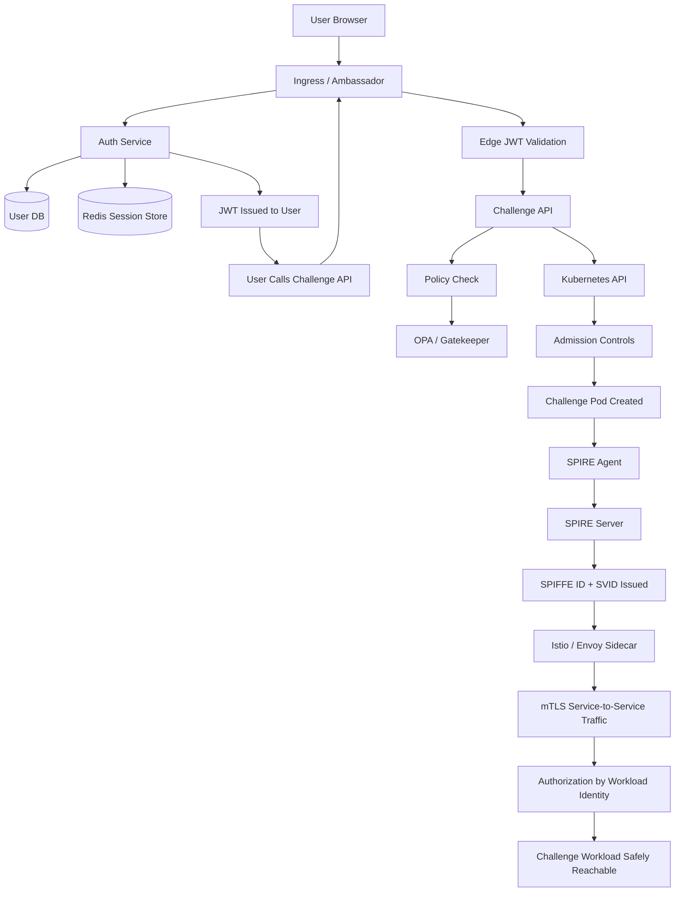

# SPIFFE / SPIRE Security Flow ..beta..
## What each part does, what it secures, and why it exists

---

## Mermaid Flow



---

## Short glossary

| Term | Simple meaning |
|---|---|
| JWT | Token proving which user is logged in |
| Ingress / Ambassador | Front door of the platform |
| OPA / Gatekeeper | Rule engine that allows or blocks actions |
| Kubernetes API | System that creates pods, services, and other cluster resources |
| Admission Controls | Safety checks before Kubernetes accepts a resource |
| SPIFFE ID | Standard identity name for a workload |
| SVID | Signed credential proving a workload’s SPIFFE ID |
| SPIRE | System that issues and manages workload identities |
| SPIRE Agent | Local component on a node that helps workloads get identity |
| SPIRE Server | Central authority that approves and signs workload identities |
| mTLS | Encrypted connection where both sides prove identity |
| Istio / Envoy | Service mesh components that help enforce secure traffic |
| Authorization | Deciding what an authenticated user or workload is allowed to do |

---

## What each part delivers and secures

| Flow component | What it delivers | What it secures | Why we need it |
|---|---|---|---|
| User Browser | Starting point for human interaction | Nothing by itself | This is where the user begins, so the system must treat it as untrusted until identity is proven |
| Ingress / Ambassador | Entry point, routing, TLS handling, edge controls | Protects the platform boundary from unsafe or malformed external access | We need one controlled front door instead of exposing every service directly |
| Auth Service | User authentication and login handling | Confirms human identity | The platform must know which person is using it before granting access |
| User DB | Stores user records and credentials metadata | Protects account verification and identity source of truth | Login only works if the system can validate user credentials against a trusted record |
| Redis Session Store | Stores active sessions or session state | Protects session continuity and login lifecycle | Lets the platform remember whether a user is still authenticated across requests |
| JWT Issued to User | Portable proof that the user authenticated | Protects authenticated user actions from being anonymous | Allows the user to make later requests without re-logging in every time |
| Edge JWT Validation | Checks token validity at the platform edge | Prevents unauthenticated or expired user requests from reaching internal APIs | Stops bad requests early before they spread into the platform |
| Challenge API | Receives user request and orchestrates challenge creation | Protects control-plane logic | This is the service making important decisions, so it must verify both identity and policy before creating resources |
| Policy Check | Evaluates whether the request should be allowed | Protects against misuse even by authenticated users | Authentication alone is not enough; users or services still need limits and rules |
| OPA / Gatekeeper | Central policy engine | Protects compliance, quotas, allowed behaviors, and safe configuration | Gives consistent rule enforcement instead of relying on every app to enforce policy correctly |
| Kubernetes API | Creates and manages cluster resources | Protects cluster state changes behind authenticated API operations | All infrastructure changes should go through a central, auditable control point |
| Admission Controls | Validate resources before creation | Protects the cluster from unsafe pods or configurations | Prevents bad resources from entering the cluster in the first place |
| Challenge Pod Created | The actual workload starts running | Not a control by itself | This is where workload identity becomes important because the pod now needs to prove who it is |
| SPIRE Agent | Local identity helper on the node | Protects workload attestation and secure local identity delivery | The agent can see local workload context and helps make sure identities are given to the right workloads |
| SPIRE Server | Central workload identity authority | Protects trust issuance and identity signing | Someone must be the trusted source that decides which workload gets which identity |
| SPIFFE ID + SVID Issued | Cryptographic workload identity | Protects service identity beyond IP address or location | This gives the workload a strong machine identity that other services can verify |
| Istio / Envoy Sidecar | Handles secure service traffic and policy enforcement | Protects consistent communication and identity-aware routing | Helps operationalize secure service-to-service communication at scale |
| mTLS Service-to-Service Traffic | Encrypted traffic with mutual authentication | Protects confidentiality, integrity, and peer verification | Services should not just talk privately — they should also verify who is on the other end |
| Authorization by Workload Identity | Allows or denies based on verified service identity | Protects internal service boundaries and limits lateral movement | Even trusted workloads should only access what they are specifically allowed to access |
| Challenge Workload Safely Reachable | Final outcome: accessible but controlled service | Protects exposure of the challenge with layered checks in place | The goal is not just to run workloads, but to expose them safely |

---

## Quick explanations

### 1. User identity and workload identity are different

Two different questions exist in this flow:

- Which human is this?
- Which service or workload is this?

JWTs answer the first question.
SPIFFE/SPIRE answer the second.

Both are needed because users and workloads are different security subjects.

### 2. Policy is different from identity

Identity tells us who something is.
Policy tells us what it may do.

That is why a valid JWT or valid SPIFFE ID is not enough on its own.
The system still needs rules.

### 3. TLS and mTLS are different from authentication alone

Authentication proves identity.
TLS protects traffic.
mTLS does both transport protection and mutual verification.

That is why encrypted transport is still needed even after identity has been established.

### 4. SPIFFE/SPIRE solve the workload problem specifically

Kubernetes pods are short-lived.
IPs change.
Services move.

SPIFFE/SPIRE give workloads a stable, verifiable identity model that does not depend on network location.

That is the main reason they are so valuable in dynamic platforms.

---

## Very short takeaway

This flow works because each layer solves a different problem:

- Auth Service + JWT: proves the human user
- Ingress: protects the front door
- OPA / Gatekeeper: enforces rules
- Kubernetes API + Admission: controls what can be created
- SPIRE: proves workload identity
- SPIFFE ID + SVID: gives cryptographic machine identity
- Istio / Envoy + mTLS: secures service-to-service traffic
- Authorization: limits what verified workloads can do

Together, these layers make the platform safer than relying on any single security tool alone.
```
##
##
