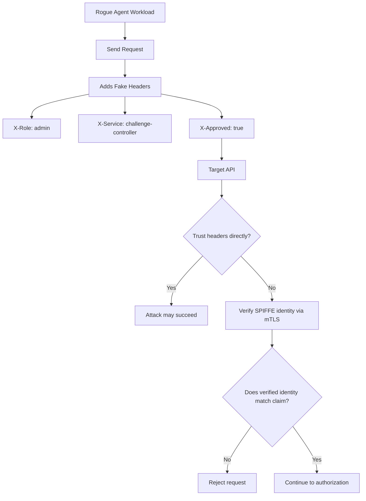
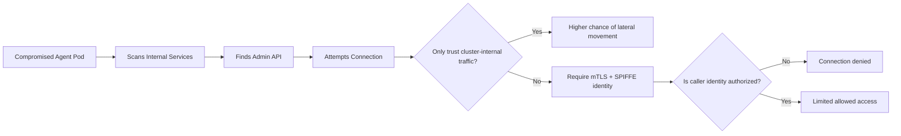
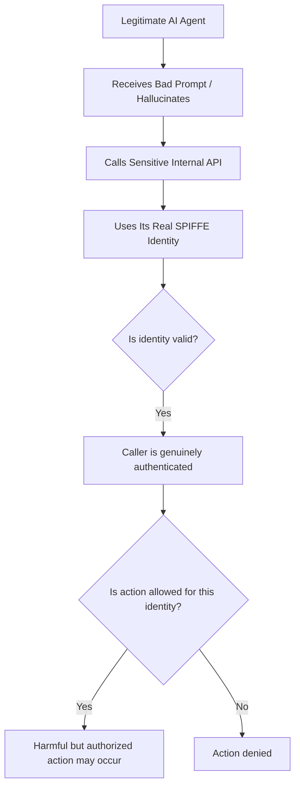
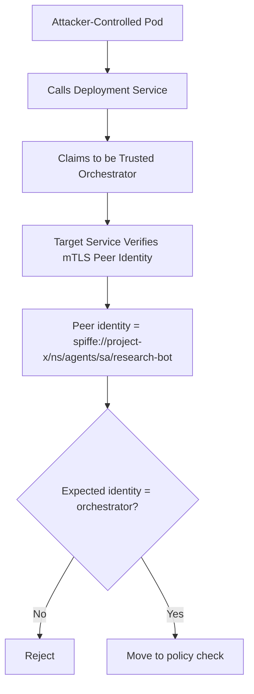
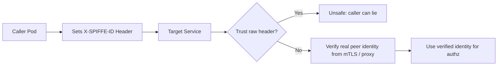
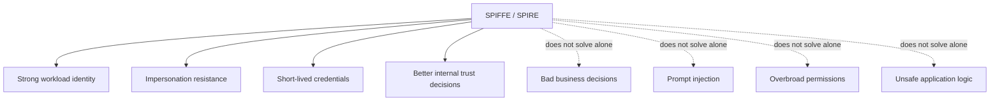

# Red Team View: Agentic Workloads, SPIFFE, and Internal Trust ..beta..
## How one workload might attack another, and what SPIFFE/SPIRE do or do not protect

---

## Goal

This exhibit (attempts to) explain internal attack scenarios in systems with:

- AI agents
- MCP/tool-calling workflows
- autonomous services
- Kubernetes workloads
- SPIFFE/SPIRE
- Istio / Envoy
- JWT-based user auth

The main question is:

> If one internal workload lies, hallucinates, or attacks another workload, what actually protects us?

---

## Core idea

SPIFFE/SPIRE are mainly about this problem:

> “Can one workload prove who it really is?”

They are very strong against:

- impersonation
- fake service identity
- trusting forged headers
- lateral movement based only on network location

They are not enough for this problem:

> “A real workload with real permissions does something harmful.”

That second problem still needs:

- authorization
- least privilege
- policy
- logging
- approval or guardrails for sensitive actions

---

# 1) Baseline internal trust flow


## Explanation

This is the normal trust chain:

1. A user triggers an action
2. The platform starts a workload
3. SPIRE gives the workload a cryptographic identity
4. The workload connects to another service through mTLS
5. The target checks who is calling
6. The target decides whether that identity is allowed

The most important part is this:

> The target should trust verified identity, not self-declared claims.

---

# 2) Attack scenario: forged headers

## Mermaid flow



## Why this matters

A workload can write almost any header it wants.

So if a receiving service trusts headers like:

- `X-Service`
- `X-Role`
- `X-Agent`
- `X-SPIFFE-ID`

without independently verifying them, that service is easy to trick.

## What SPIFFE helps with

SPIFFE helps if the receiving side checks:

- the actual peer identity from mTLS
- a verified sidecar/gateway identity context
- a signed token validated against trust bundles

Then the target can compare:

- claimed identity
vs
- cryptographically verified identity

If they differ, the request can be rejected.

---

## Table: forged header attack

| Item | Red team move | Risk | What SPIFFE/SPIRE help with | What is still required |
|---|---|---|---|---|
| Fake role header | Agent sends `X-Role: admin` | Target may grant admin behavior | Verified workload identity shows the caller is not actually the admin workload | Application must not trust raw headers |
| Fake service name | Agent sends `X-Service: controller` | Caller may impersonate a trusted service | mTLS + SPIFFE reveals real caller identity | Authz policy must compare real identity to allowed roles |
| Fake approval flag | Agent sends `X-Approved: true` | Target may skip policy or approval logic | SPIFFE can prove who sent the request, not whether the request is approved | Signed approvals or server-side policy still needed |

---

# 3) Attack scenario: internal lateral movement

## Mermaid flow



## Why this matters

A common failure mode in clusters is:

> “Anything inside the cluster is probably trusted.”

That is dangerous.

If one pod is compromised, an attacker may try to call:

- internal admin APIs
- secrets services
- orchestration services
- data stores
- policy endpoints

## What SPIFFE helps with

Instead of trusting:

- source IP
- namespace alone
- “internal-only” network location

the target can verify:

- exact workload identity

That makes lateral movement much harder.

---

## Table: lateral movement attack

| Item | Red team move | Risk | What SPIFFE/SPIRE help with | What is still required |
|---|---|---|---|---|
| Internal API probing | Compromised pod calls many cluster services | Attackers may find weakly protected internal APIs | Exact workload identity can be checked at each hop | Strong service authz rules |
| Namespace trust abuse | Pod relies on “same namespace” trust | Over-broad trust allows abuse | SPIFFE gives stronger identity than namespace location | Fine-grained per-service authorization |
| IP-based allowlist bypass | Pod uses allowed network position | Network location is weak proof | SPIFFE identity is cryptographic, not network-based | mTLS enforcement and policy checks |

---

# 4) Attack scenario: hallucinating or overreaching AI agent

## Mermaid flow



## Why this matters

This is the scenario SPIFFE does not solve by itself.

The agent is not pretending.
It is using its real identity.

The problem is not impersonation.
The problem is authority and behavior.

Examples:

- an orchestration agent deletes the wrong workload
- a tool-calling agent requests privileged data
- an LLM agent decides it should “helpfully” perform a dangerous operation

## What SPIFFE helps with

SPIFFE confirms:

- the caller really is who it says it is

That is valuable for audit and access decisions.

## What SPIFFE does not solve

SPIFFE does not answer:

- whether the decision is sensible
- whether the prompt was malicious
- whether the action should require extra approval
- whether the permissions were too broad

---

## Table: legitimate but harmful agent behavior

| Item | Red team move | Risk | What SPIFFE/SPIRE help with | What is still required |
|---|---|---|---|---|
| Hallucinated delete | Real agent deletes wrong resource | Valid identity, harmful behavior | Confirms exactly which workload made the call | Least privilege, approval workflows, action guardrails |
| Prompt-injected tool use | Agent is tricked into calling sensitive tool | Authenticated misuse | Gives auditability and verified caller identity | Tool permission boundaries and policy |
| Overbroad service rights | Legit workload has too much access | Legit identity causes real damage | Helps identify the workload precisely | Narrower authorization scope |

---

# 5) Attack scenario: fake “trusted orchestrator”

## Mermaid flow



## Explanation

This is one of the best examples of why workload identity matters.

Without verification, the attacker only needs to sound convincing.

With SPIFFE-aware verification, the target can say:

> I do not care what you claim in the request.
> I care who you actually are according to trusted cryptographic identity.

---

## Table: fake orchestrator attack

| Item | Red team move | Risk | What SPIFFE/SPIRE help with | What is still required |
|---|---|---|---|---|
| Service impersonation | Pod claims to be orchestrator | Target may grant powerful actions | Verified SPIFFE identity exposes real caller | Receiver must enforce identity-based authz |
| Fake internal trust | Caller says “I’m part of control plane” | Internal privilege escalation | Trust is based on cert identity, not words | Trusted proxy or mTLS identity plumbing |
| Replay of naming conventions | Caller uses believable names | Humans or apps may trust names too easily | SPIFFE provides stronger source of truth | Consistent identity validation in code or mesh |

---

# 6) Attack scenario: trusting “SPIFFE headers” incorrectly

## Mermaid flow



## Important point

SPIFFE is not strongest when used as a plain header.

SPIFFE is strongest when identity is verified from:

- mTLS certificates
- trusted sidecar or mesh metadata
- signed identity tokens validated correctly

If an app simply trusts `X-SPIFFE-ID` from the request, that is weak.

Why?

Because the caller may have written that header itself.

---

## Table: trusting raw identity headers

| Item | Red team move | Risk | What SPIFFE/SPIRE help with | What is still required |
|---|---|---|---|---|
| Fake SPIFFE header | Caller sets `X-SPIFFE-ID` manually | Receiver may trust a lie | Real peer identity can be verified independently | Never trust raw identity headers from untrusted callers |
| Proxy confusion | App cannot distinguish trusted proxy headers from client headers | Header spoofing | Mesh/proxy can provide verified identity context | Clear trusted-header boundary design |
| Claim mismatch | Header says one thing, cert says another | Ambiguous trust decision | Verified identity can be treated as source of truth | Enforce cert-or-proxy-derived identity precedence |

---

# 7) What SPIFFE/SPIRE are good at vs not enough for

## Mermaid summary



## Table: scope of protection

| Security problem | Does SPIFFE/SPIRE help? | Notes |
|---|---|---|
| One workload pretending to be another | Yes, strongly | One of the main benefits |
| Trusting fake service identity in headers | Yes, if real identity is verified separately | Only if you do not trust raw caller-supplied headers |
| Internal lateral movement | Yes, significantly | Stronger than IP or namespace trust |
| Traffic encryption | Partly, through use with mTLS | Usually paired with mesh / TLS stack |
| Legitimate but harmful agent behavior | Not by itself | Needs authz, policy, approvals |
| Prompt injection | Not directly | This is an application/agent control problem |
| Overbroad permissions | Not directly | Identity is only as safe as the authorization model behind it |
| Auditability | Yes, helps a lot | Strong identity makes logs much more meaningful |

---

# 8) Recommended red-team questions

Use these questions when reviewing an agentic platform.

| Question | Why it matters |
|---|---|
| Can a workload claim identity through headers only? | If yes, spoofing may be easy |
| Does the target verify peer identity through mTLS or trusted proxy context? | This is the foundation of workload trust |
| Is authorization based on verified identity or claimed role text? | Claimed roles are easy to fake |
| Can any internal pod reach sensitive internal APIs? | If yes, lateral movement risk is high |
| Are service permissions narrowly scoped? | Legitimate workloads can still do damage if permissions are broad |
| Are sensitive actions approval-gated or guarded? | Important for agentic systems that may hallucinate |
| Are both claimed identity and verified identity logged? | Useful for detecting spoofing and confused deputy patterns |

---

# 9) Short conclusions

## Main takeaway

SPIFFE/SPIRE are very helpful when the threat is:

> “A workload lies about who it is.”

They are less helpful by themselves when the threat is:

> “A real workload is confused, compromised, or too powerful.”

## Best practical model

Use:

- SPIFFE/SPIRE for workload identity
- mTLS for secure transport
- authorization for least privilege
- policy engines for guardrails
- careful trusted-header design
- strong logging and audit trails

## One-sentence summary

> SPIFFE helps you trust who is calling, but you still need policy and authorization to decide whether that caller should be allowed to do the thing it asked to do.
```

##
##
