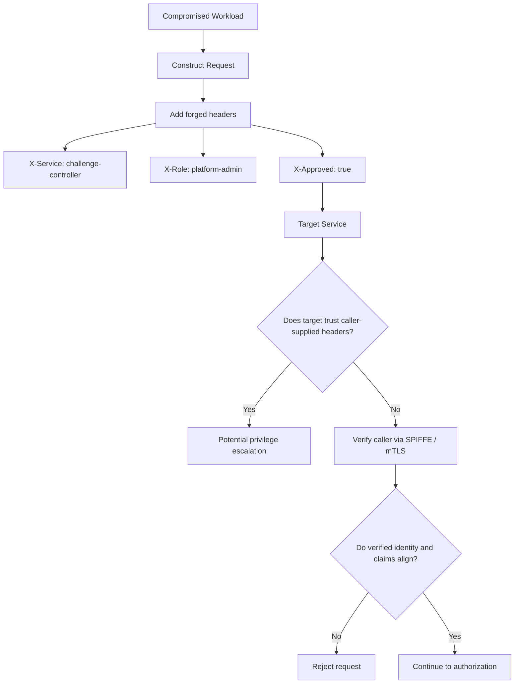
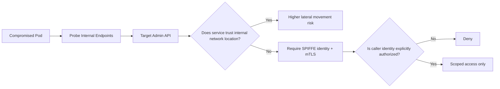
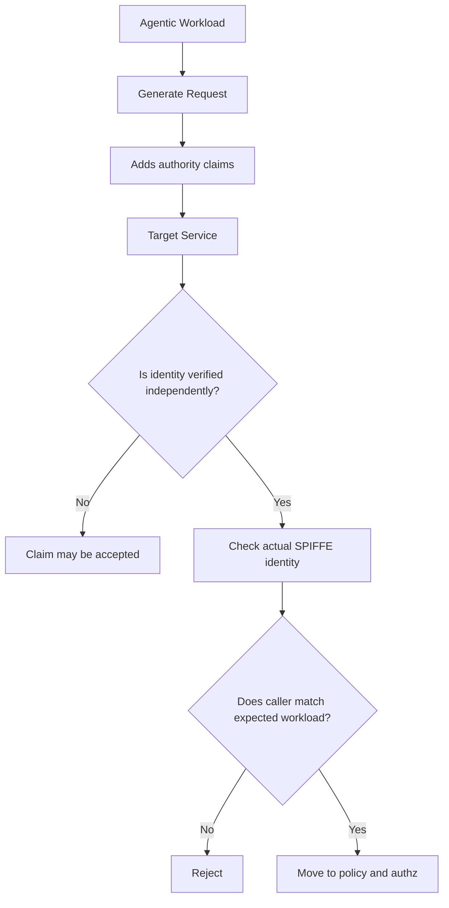
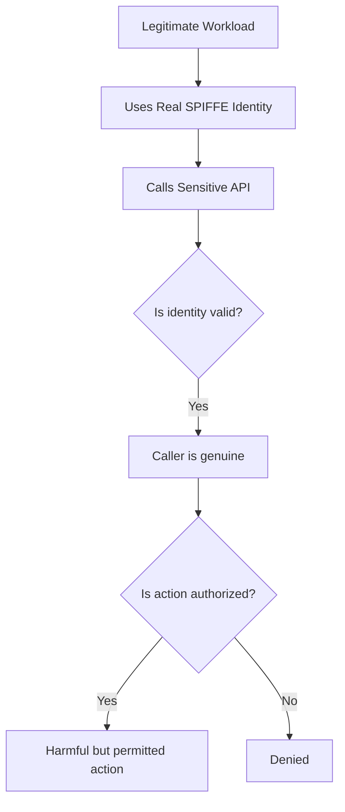
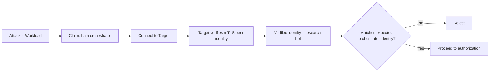
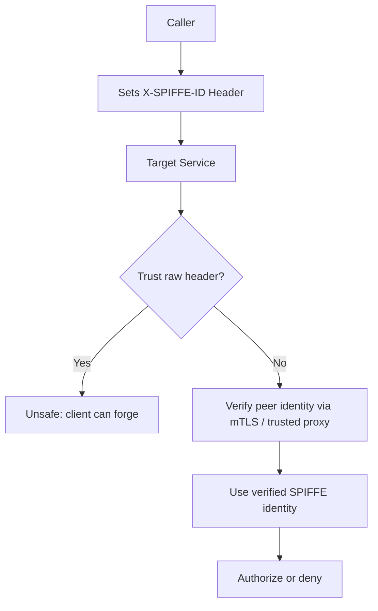
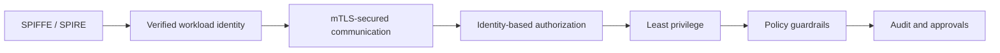

# Red Team Analysis: Workload Identity, SPIFFE/SPIRE, and Agentic Systems .. beta edition ..
## Practical attack scenarios, security boundaries, and what verified workload identity actually protects

---

## Executive Summary

In platforms that use:

- Kubernetes
- internal service APIs
- autonomous or agentic workloads
- MCP-style tool execution
- service mesh
- SPIFFE/SPIRE

one of the most important security questions is:

> How does one workload prove its identity to another workload in a way that cannot be trivially forged?

SPIFFE and SPIRE are highly effective at addressing that problem.

They provide:

- cryptographically verifiable workload identity
- short-lived credentials
- stronger resistance to service impersonation
- safer service-to-service trust decisions than IP-based or header-based trust

From a red-team perspective, this matters because many internal attacks rely on one of the following assumptions:

- internal traffic is implicitly trusted
- service names in headers are trusted
- network location is treated as identity
- workloads can self-assert role or privilege
- downstream services do not independently verify caller identity

SPIFFE/SPIRE help break those assumptions.

However, they do not solve every problem.

They are very strong against:

- workload impersonation
- forged service identity claims
- header-based spoofing when identity is properly verified
- lateral movement that depends on weak internal trust

They are not sufficient on their own against:

- a legitimate workload abusing valid permissions
- an AI agent making harmful but authorized decisions
- prompt injection that causes misuse of allowed tools
- business logic flaws
- overbroad authorization

This distinction is critical:

> SPIFFE/SPIRE strongly improve confidence in who the caller is.
> They do not, by themselves, guarantee that the caller’s requested action is safe.

---

## Security Objective

The primary objective of workload identity is to ensure that internal trust decisions are based on:

- verified cryptographic identity

rather than:

- self-declared headers
- source IP address
- namespace membership alone
- pod naming conventions
- assumptions about “internal” traffic

In practical terms, this means a target service should be able to answer:

1. Who is calling me?
2. Can they prove it cryptographically?
3. Do I trust the authority that issued that identity?
4. Is that identity authorized for this action?

SPIFFE/SPIRE mainly solve questions 1 through 3.
Question 4 still requires authorization and policy.

---

# 1. Baseline Trust Model

## Standard service-to-service trust flow


## Practical interpretation

This baseline flow establishes a clear trust chain:

1. A workload is created
2. SPIRE issues it a cryptographically verifiable identity
3. The workload presents that identity during service communication
4. The receiving service verifies the caller identity
5. The receiver authorizes or denies the requested action

The key operational principle is:

> The receiving service should rely on verified identity, not caller-supplied claims.

---

# 2. What SPIFFE/SPIRE materially improve

SPIFFE/SPIRE improve the security posture of internal service communication by making workload identity:

- explicit
- cryptographically verifiable
- short-lived
- decoupled from IP address or network location
- difficult to forge without access to valid credentials or signing authority

### Without verified workload identity

A target service may mistakenly trust:

- `X-Service: challenge-controller`
- `X-Role: admin`
- source namespace
- cluster-internal source IP
- pod name or DNS name

These are all weak or forgeable in many environments.

### With verified workload identity

The target can instead rely on:

- X.509-SVID via mTLS
- JWT-SVID validated cryptographically
- trusted proxy/mesh identity context
- trust bundles issued by the SPIRE trust domain

This dramatically raises the cost of impersonation.

---

# 3. Core attacker scenarios

## Scenario A: Forged service identity via headers

### Attack narrative

A malicious or compromised workload attempts to call a privileged internal API and includes believable headers such as:

- `X-Service: challenge-controller`
- `X-Role: platform-admin`
- `X-Approved: true`

The target service trusts those headers as identity or authorization context.

### Mermaid flow



### Red-team significance

This is one of the most realistic and common internal trust failures.

If the application trusts self-declared headers, then the attacker only needs to sound convincing.

SPIFFE/SPIRE change the model from:

- “trust what the request says”

to:

- “trust what the cryptographic identity proves”

### What SPIFFE/SPIRE protect here

They protect against successful impersonation, assuming the receiver verifies identity properly.

The attacker can still send fake headers.
What changes is whether those headers are believed.

If the peer identity is verified as:

```text
spiffe://project-x.example.com/ns/agents/sa/research-bot
```

then a header claiming to be `challenge-controller` can be rejected.

---

### Assessment table: forged header scenario

| Category | Assessment |
|---|---|
| Attack goal | Impersonate a more trusted internal service |
| Typical technique | Forge internal identity headers or role claims |
| Primary weakness exploited | Receiver trusts caller-supplied metadata |
| SPIFFE/SPIRE value | Provides independently verifiable workload identity |
| Residual risk | Application still fails if it trusts raw headers over verified identity |
| Required complementary controls | mTLS enforcement, trusted proxy boundary, identity-aware authorization |

---

## Scenario B: Lateral movement across internal APIs

### Attack narrative

A compromised pod begins probing internal services such as:

- orchestration APIs
- secrets services
- challenge control services
- internal admin endpoints

The attacker relies on weak assumptions like:

- “cluster-internal traffic is trusted”
- “same namespace traffic is trusted”
- “source IP is enough to permit access”

### Mermaid flow



### Red-team significance

This scenario is important because many internal systems remain overly dependent on network trust.

Once a pod is compromised, the attacker can often move laterally if internal APIs only distinguish:

- internal vs external
rather than
- trusted workload vs untrusted workload

### What SPIFFE/SPIRE protect here

SPIFFE/SPIRE make internal trust decisions more precise.

Instead of trusting a source because it is “inside the cluster,” a service can require:

- a valid workload identity
- issued by a trusted authority
- matching an explicit authorization rule

This reduces the usefulness of simple internal network access as an attack primitive.

---

### Assessment table: lateral movement scenario

| Category | Assessment |
|---|---|
| Attack goal | Reach internal privileged services after initial compromise |
| Typical technique | Reuse cluster-internal reachability as trust signal |
| Primary weakness exploited | Implicit trust in internal traffic |
| SPIFFE/SPIRE value | Converts internal trust from location-based to identity-based |
| Residual risk | Real workloads with valid identity may still have excessive permissions |
| Required complementary controls | Fine-grained authorization, least privilege, service segmentation |

---

## Scenario C: AI agent or toolchain overclaims authority

### Attack narrative

An agentic workload or MCP-connected tool runner makes a request implying that it has elevated privileges or valid approval context.

Examples:

- “I am the orchestration controller”
- “This operation was approved”
- “I am acting on behalf of the admin service”
- “This request is safe to execute”

The target service accepts the claim without verifying the caller’s real identity.

### Mermaid flow



### Red-team significance

Agentic systems increase the chance of internally generated but unreliable claims.

Even without malicious intent, an AI-connected workload may:

- hallucinate authority
- incorrectly infer permissions
- pass along invented context
- replay prior outputs in unsafe ways

This makes cryptographically verified workload identity more important, not less.

### What SPIFFE/SPIRE protect here

They help answer:

> Did this request actually come from the workload it claims to represent?

That is highly valuable in agentic systems because internal claims may be syntactically plausible but semantically false.

---

### Assessment table: overclaimed authority scenario

| Category | Assessment |
|---|---|
| Attack goal | Gain privileged behavior through fabricated authority claims |
| Typical technique | Misleading metadata, tool output, or role headers |
| Primary weakness exploited | Target trusts narrative context more than verified caller identity |
| SPIFFE/SPIRE value | Forces trust decisions onto cryptographic workload identity |
| Residual risk | Legitimate workload may still make harmful requests under its own identity |
| Required complementary controls | Authorization, approval workflows, policy checks, tool scoping |

---

## Scenario D: Legitimate workload, harmful behavior

### Attack narrative

A real workload with a valid identity makes a harmful request under its own credentials.

Examples:

- an orchestration agent deletes the wrong resource
- an AI tool runner retrieves sensitive data it was allowed to access
- a platform service makes an unsafe but technically authorized change
- a prompt-injected agent misuses a valid tool

### Mermaid flow



### Red-team significance

This is where teams often misunderstand workload identity.

SPIFFE/SPIRE solve impersonation very well.
They do not solve poor authorization design.

If the caller is legitimate and allowed, then verified identity alone is not enough to stop harmful behavior.

### What SPIFFE/SPIRE protect here

They still provide value:

- exact attribution of which workload acted
- better audit trails
- clearer service identity for policy
- lower chance of confused identity

But they do not stop:

- bad decisions
- overpowered roles
- unsafe automation
- prompt-driven misuse within allowed scope

---

### Assessment table: legitimate harmful behavior scenario

| Category | Assessment |
|---|---|
| Attack goal | Abuse a valid identity’s own permissions |
| Typical technique | Use legitimate access for harmful or incorrect action |
| Primary weakness exploited | Overbroad permissions or weak authorization logic |
| SPIFFE/SPIRE value | Strong attribution and trustworthy caller identity |
| Residual risk | Harm remains possible if permissions are too broad |
| Required complementary controls | Least privilege, action-level authorization, approvals, guardrails |

---

# 4. Can workload identity be forged?

## Professional answer

Yes, in principle any security system can fail under sufficient compromise, but under normal operating assumptions:

> SPIRE is specifically designed to make workload identity forgery difficult by requiring identities to be issued by a trusted authority and verified cryptographically.

This means a workload should not be able to successfully impersonate another workload merely by:

- sending a different header
- changing its name
- appearing from an internal IP
- using an expected namespace
- making a believable claim in JSON or metadata

To succeed at true forgery, an attacker would typically need one of the following:

1. A valid SVID for the target identity
2. The private key corresponding to that identity
3. Compromise of the SPIRE server or signing chain
4. A verifier that fails to validate identity properly
5. A path that bypasses the identity-verification layer entirely

This is a much stronger position than systems that trust caller-declared metadata.

---

## Mermaid: forged identity attempt



## Key conclusion

SPIFFE/SPIRE do not stop a caller from making a false claim.

They stop the platform from needing to believe that claim.

That is the critical difference.

---

# 5. Trusting “SPIFFE headers” vs trusting verified SPIFFE identity

This distinction deserves special emphasis.

## Unsafe model

```text
Client sends: X-SPIFFE-ID: spiffe://project-x/.../orchestrator
Server trusts the header directly
```

This is weak if the client can set the header.

## Safer model

```text
Client presents X.509-SVID through mTLS
Server or trusted sidecar verifies identity
Verified SPIFFE ID is extracted from cert or trusted proxy context
Authorization uses verified identity
```

### Mermaid comparison



## Practical takeaway

SPIFFE is most valuable when identity is verified from:

- certificate exchange
- signed token validation
- trusted service mesh metadata
- trusted proxy context

It is much less valuable if reduced to a plain header the caller can write.

---

# 6. Red-team conclusions

## What SPIFFE/SPIRE are highly effective against

| Threat | Impact of SPIFFE/SPIRE |
|---|---|
| Service impersonation | Strongly reduces it |
| Forged internal identity claims | Strongly reduces it if identity is verified properly |
| Header-based spoofing | Strongly reduces it if raw headers are not trusted |
| Internal trust based only on network location | Significantly improves over that model |
| Weak attribution of internal actions | Significantly improves auditability |

## What SPIFFE/SPIRE do not solve on their own

| Threat | Why additional controls are needed |
|---|---|
| Legitimate workload abuse | Real identity can still have harmful permissions |
| Prompt injection | This is an application and agent safety issue |
| Overbroad authorization | Identity does not replace least privilege |
| Unsafe business logic | Verified identity does not make decisions correct |
| Destructive but valid automation | Requires action-level safeguards and review mechanisms |

---

# 7. Recommended control model for agentic systems

For platforms that run AI agents, orchestrators, or MCP-style tool workloads, the practical control stack should be:

1. Verified workload identity with SPIFFE/SPIRE
2. mTLS for authenticated encrypted service communication
3. Authorization based on verified identity, not claimed role text
4. Least-privilege permissions per workload
5. Policy engines for guardrails and allowed action boundaries
6. Strong audit logging of both claimed and verified identities
7. Approval or safety controls for destructive or high-impact operations

### Mermaid summary



---

# Final Assessment

From a red-team perspective, SPIFFE/SPIRE are not “just another security layer.”

They directly address a high-value internal attack path:

> one workload pretending to be another workload

That matters even more in environments with agentic systems, where internally generated claims may be plausible, frequent, and unreliable.

The practical security value is this:

- they reduce trust in caller narrative
- they increase trust in verified machine identity
- they make impersonation materially harder
- they improve the quality of downstream authorization decisions

But they should be understood correctly:

> SPIFFE/SPIRE help prove who the caller is.
> They do not guarantee that the caller’s requested action is safe, wise, or appropriately scoped.

That is why verified workload identity must be paired with:

- authorization
- least privilege
- policy enforcement
- application-level safeguards
- auditability

Only that combined model provides meaningful protection in modern agentic platforms.
```

##
##
