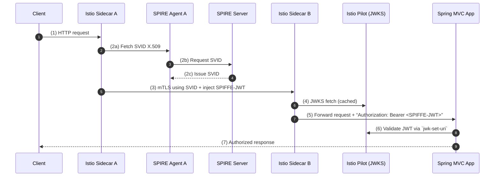

# SPIRE ++ SPRING ++ SPIFFE

---



```text
                        ┌────────┐
(1) HTTP               v│        │
Client ──────────────▶vv│ IstioA │
                        │ sidecar│
                        └───┬────┘
                            │  (2) SVID via SPIRE Agent A
                            ▼
                     ┌─────────────┐
                     │ SPIRE Agent │
                     └─────────────┘
                            │
                     (2)    ▼
                   ┌─────────────┐
                   │ SPIRE Server│
                   └─────────────┘
                            ▲
                            │
                        ┌───┴────┐
                        │ IstioB │
(3) mTLS + JWT          │ sidecar│
IstioA ────────────────▶│        │
                        └───┬────┘
                            │
(5) “Authorization: Bearer <JWT>”
                            ▼
                      ┌───────────┐
                      │ Spring    │
                      │ MVC App   │
                      └───────────┘
```

---

| Step | Purpose                                                    | Artifact                      | File / Command                   |
| ---- | ---------------------------------------------------------- | ----------------------------- | -------------------------------- |
| 1    | Issue SPIFFE SVID for your Kubernetes ServiceAccount       | **SPIRE Entry**               | `spire-server entry create …`    |
| 2    | Enforce mTLS everywhere in the mesh                        | **Istio PeerAuthentication**  | `peer-auth.yaml`                 |
| 3    | Allow only specific SPIFFE identities to call your service | **Istio AuthorizationPolicy** | `authz.yaml`                     |
| 4    | Have Istio inject a SPIFFE-signed JWT into each request    | *Automatic via Istio*         | —                                |
| 5    | Validate that JWT in-app as an OAuth2 Resource Server      | **Spring `application.yml`**  | `resourceserver.jwt.jwk-set-uri` |
| 6    | Map JWT scopes/principals to Spring Security authorities   | **`SecurityConfig.java`**     | Java config class                |
| 7    | *(Optional)* Extract raw SPIFFE URI from mTLS client cert  | **`SpiffeCertAdvice.java`**   | Spring `@ControllerAdvice`       |

---

### 1. SPIRE Entry

```bash
spire-server entry create \
  -parentID spiffe://example.org/ns/default/sa/my-service-account \
  -spiffeID  spiffe://example.org/ns/default/sa/my-service-account \
  -selector k8s_sa:default:my-service-account
```

---

### 2. Istio PeerAuthentication

```yaml
# peer-auth.yaml
apiVersion: security.istio.io/v1beta1
kind: PeerAuthentication
metadata:
  name: mesh-mtls
  namespace: default
spec:
  mtls:
    mode: STRICT
```

```bash
kubectl apply -f peer-auth.yaml
```

---

### 3. Istio AuthorizationPolicy

```yaml
# authz.yaml
apiVersion: security.istio.io/v1beta1
kind: AuthorizationPolicy
metadata:
  name: allow-backend-spiffe
  namespace: default
spec:
  selector:
    matchLabels:
      app: my-spring-app
  rules:
  - from:
    - source:
        principals:
        - "spiffe://example.org/ns/default/sa/backend-service"
```

```bash
kubectl apply -f authz.yaml
```

---

### 4. Istio-Injected SPIFFE JWT

Once PeerAuthentication & AuthorizationPolicy are in place, Istio sidecars automatically issue a per-request SPIFFE-JWT and add:

```
Authorization: Bearer <SPIFFE-JWT>
```

---

### 5. Spring Resource Server Config

```yaml
# src/main/resources/application.yml
spring:
  security:
    oauth2:
      resourceserver:
        jwt:
          jwk-set-uri: http://istiod.istio-system.svc:15014/keys
```

---

### 6. Spring Security Java Config

```java
// SecurityConfig.java
package com.example.security;

import org.springframework.context.annotation.*;
import org.springframework.security.config.annotation.method.configuration.*;
import org.springframework.security.config.annotation.web.builders.*;
import org.springframework.security.config.annotation.web.configuration.*;
import org.springframework.security.web.*;

@Configuration
@EnableWebSecurity
@EnableGlobalMethodSecurity(prePostEnabled = true)
public class SecurityConfig {

  @Bean
  SecurityFilterChain filterChain(HttpSecurity http) throws Exception {
    http
      .oauth2ResourceServer(oauth2 -> oauth2.jwt())
      .authorizeHttpRequests(auth -> auth
        .anyRequest().authenticated()
      );
    return http.build();
  }
}
```

---

### 7. (Optional) Extract SPIFFE URI from X-Forwarded-Client-Cert

```java
// SpiffeCertAdvice.java
package com.example.security;

import org.springframework.web.bind.annotation.*;

@RestControllerAdvice
public class SpiffeCertAdvice {

  @ModelAttribute("spiffeId")
  public String extractSpiffeId(
      @RequestHeader("x-forwarded-client-cert") String xfcc) {
    for (String part : xfcc.split(";")) {
      part = part.trim();
      if (part.startsWith("URI=")) {
        return part.substring(4);
      }
    }
    return null;
  }
}
```
