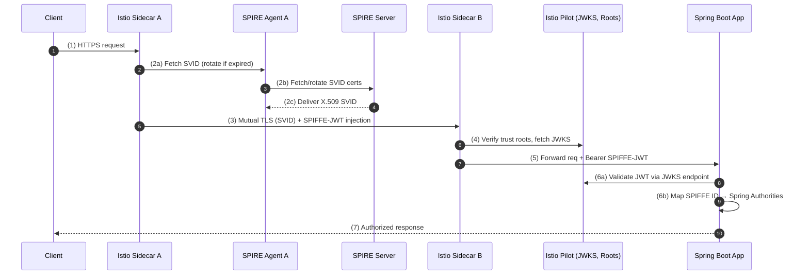

# SPIRE + Istio + Spring Boot (SPIFFE Integration) ..beta..

End‑to‑end workload identity: **SPIRE issues SVIDs → Istio enforces mTLS & injects JWTs → Spring Boot validates JWT → access is authorized**.

---

## 🔄 Sequence Flow



---

## 🧩 Step-by-Step

| Step | Purpose                                                          | Artifact                      | File / Command                   |
| ---- | ---------------------------------------------------------------- | ----------------------------- | -------------------------------- |
| 0    | Boot SPIRE: trust domain + agents                               | **SPIRE Server & Agents**     | `spire-server run`, `spire-agent run` |
| 1    | Issue per‑workload SPIFFE SVID (rotated automatically)          | **SPIRE Entry**               | `spire-server entry create …`    |
| 2    | Enforce mTLS across the mesh                                    | **Istio PeerAuthentication**  | `peer-auth.yaml`                 |
| 3    | Authorize only specific SPIFFE IDs                              | **Istio AuthorizationPolicy** | `authz.yaml`                     |
| 4    | Inject SPIFFE JWTs into requests                                | **Istio Sidecars**            | automatic                        |
| 5    | Validate JWT in‑app via Spring Boot                             | **Spring Config (YAML)**      | `application.yml`                |
| 6    | Map SPIFFE IDs → Roles in Spring Security                       | **SecurityConfig.java**       | Java config                      |
| 7    | (Optional) Inspect raw XFCC header for debugging                | **SpiffeCertAdvice.java**     | `@ControllerAdvice`              |
| 8    | Observe: expose security metrics, cert expiry                   | **Spring Actuator/Prometheus**| `application.yml`                |

---

## 1. SPIRE Workload Entry

```bash
spire-server entry create \
  -parentID spiffe://example.org/ns/default/sa/default \
  -spiffeID  spiffe://example.org/ns/default/sa/my-spring-app \
  -selector k8s:ns:default \
  -selector k8s_sa:default:my-service-account
```

---

## 2. Istio PeerAuthentication

```yaml
# peer-auth.yaml
apiVersion: security.istio.io/v1beta1
kind: PeerAuthentication
metadata:
  name: mesh-mtls
  namespace: default
spec:
  mtls:
    mode: STRICT
```

```bash
kubectl apply -f peer-auth.yaml
```

---

## 3. Istio AuthorizationPolicy

```yaml
# authz.yaml
apiVersion: security.istio.io/v1beta1
kind: AuthorizationPolicy
metadata:
  name: allow-backend
  namespace: default
spec:
  selector:
    matchLabels:
      app: my-spring-app
  action: ALLOW
  rules:
  - from:
    - source:
        principals:
        - "spiffe://example.org/ns/default/sa/backend-service"
    to:
    - operation:
        methods: ["GET"]
        paths: ["/actuator/health","/api/**"]
```

---

## 4. Istio-Injection of JWT

Once PeerAuth + AuthorizationPolicy are configured, Istio sidecars automatically:

```
Authorization: Bearer <SPIFFE-JWT>
```

(Validated via Istiod `JWKS` endpoint).

---

## 5. Spring Boot Resource Server

```yaml
# src/main/resources/application.yml
spring:
  security:
    oauth2:
      resourceserver:
        jwt:
          jwk-set-uri: http://istiod.istio-system.svc:15014/keys

management:
  endpoints:
    web:
      exposure:
        include: ["health","info","metrics"]
```

---

## 6. Spring Security Role Mapping

```java
// SecurityConfig.java
package com.example.security;

import org.springframework.context.annotation.*;
import org.springframework.security.config.annotation.web.builders.HttpSecurity;
import org.springframework.security.web.*;
import org.springframework.security.oauth2.jwt.*;
import org.springframework.security.core.authority.SimpleGrantedAuthority;
import org.springframework.security.core.GrantedAuthority;

import java.util.*;

@Configuration
public class SecurityConfig {
  @Bean
  SecurityFilterChain filterChain(HttpSecurity http) throws Exception {
    http
      .authorizeHttpRequests(authz -> authz
        .requestMatchers("/public/**").permitAll()
        .anyRequest().authenticated()
      )
      .oauth2ResourceServer(oauth2 -> 
        oauth2.jwt(jwt -> jwt.jwtAuthenticationConverter(this::spiffeConverter))
      );
    return http.build();
  }

  private org.springframework.security.core.Authentication spiffeConverter(Jwt jwt) {
    String spiffe = jwt.getSubject(); // e.g. spiffe://example.org/ns/default/sa/backend-service
    List<GrantedAuthority> authorities = mapSpiffeToAuthorities(spiffe);
    return new org.springframework.security.oauth2.server.resource.authentication.JwtAuthenticationToken(jwt, authorities);
  }

  private List<GrantedAuthority> mapSpiffeToAuthorities(String spiffe) {
    if (spiffe.contains("backend-service")) {
      return List.of(new SimpleGrantedAuthority("ROLE_BACKEND"));
    }
    return List.of(new SimpleGrantedAuthority("ROLE_UNKNOWN"));
  }
}
```

---

## 7. (Optional) SPIFFE Debug Extraction

```java
// SpiffeCertAdvice.java
package com.example.security;

import org.springframework.web.bind.annotation.*;

@RestControllerAdvice
public class SpiffeCertAdvice {
  @ModelAttribute("spiffeId")
  public String extractSpiffeId(@RequestHeader(value="x-forwarded-client-cert", required=false) String xfcc) {
    if (xfcc == null) return null;
    for (String part : xfcc.split(";")) {
      if (part.trim().startsWith("URI=")) {
        return part.trim().substring(4);
      }
    }
    return null;
  }
}
```

---

## 8. Observability & Health

Spring Actuator + Prometheus metrics will expose:

- JWT validation counts/errors  
- Endpoint health  
- JWKS availability  

```yaml
management:
  endpoint:
    health:
      show-details: ALWAYS
  metrics:
    export:
      prometheus:
        enabled: true
```

---

## ✅ Summary

- **SPIRE** provides workload X.509 / JWT SVIDs (auto‑rotating).  
- **Istio** enforces STRICT mTLS and injects SPIFFE‑signed JWTs.  
- **Spring Boot** validates JWT with Istiod JWKS, maps identities into roles, and optionally exposes SPIFFE IDs for debugging.  
- **Security policies** are declarative (Istio YAML), and **auth logic** is centralized in Spring Security.  
- **Observability** ensures confidence: track cert/jwt expiry, validation metrics, and health endpoints.  

##
##
