# **Security Layer Evolution: mTLS → SPIFFE/SPIRE → Istio → Falco/eBPF**  ..beta..
## Complete Stack Security Analysis in Kubernetes

---

## **Security Stack Overview: Layer-by-Layer Evolution**

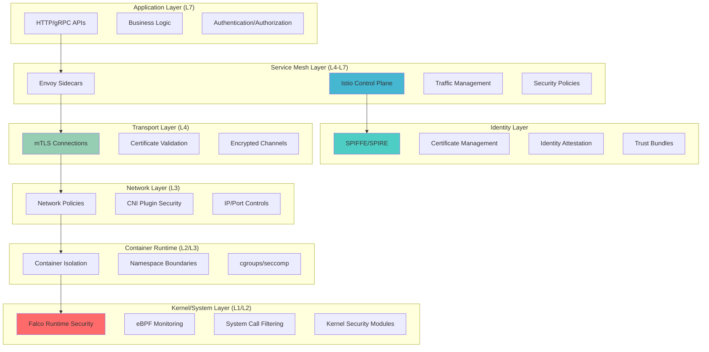

---

## **Security Evolution Comparison Matrix**

| **Layer** | **Basic K8s** | **+ mTLS** | **+ SPIFFE/SPIRE** | **+ Istio** | **+ Falco/eBPF** |
|-----------|---------------|------------|-------------------|-------------|------------------|
| **L7 - Application** | Basic auth tokens | Certificate-based auth | Workload identity verification | Policy-based access control | Application behavior monitoring |
| **L4 - Transport** | Plain TCP/HTTP | Encrypted TLS tunnels | Automatic cert rotation | Traffic encryption + routing | Connection anomaly detection |
| **L3 - Network** | Network policies | Encrypted packets | Identity-based routing | Service mesh networking | Network intrusion detection |
| **L2 - Container** | Pod isolation | Container-level certs | Workload attestation | Sidecar security | Runtime behavior analysis |
| **L1 - Kernel** | Basic isolation | Process security | Identity propagation | Enhanced isolation | System call monitoring |

---

## **Layer 1: Kernel/System Security with Falco + eBPF**

### **Without Enhanced Security**
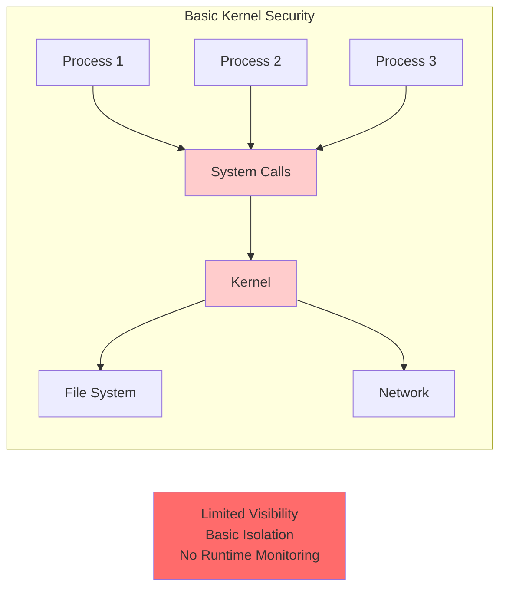

### **With Falco + eBPF Enhanced Security**
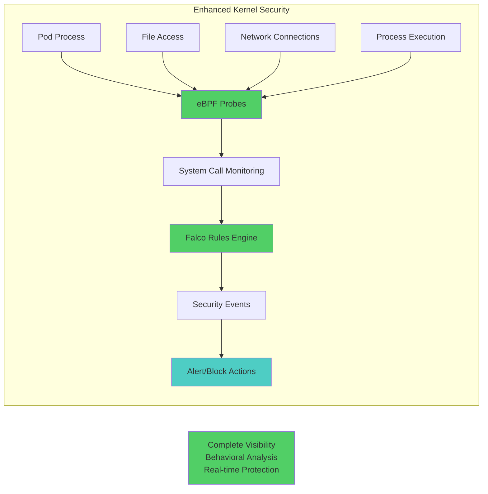

### **Falco Rules for Microservices Security**
```yaml
# Falco rules for detecting suspicious activities in microservices
apiVersion: v1
kind: ConfigMap
metadata:
  name: falco-rules
  namespace: falco
data:
  microservices_rules.yaml: |
    - rule: Suspicious Container Network Activity
      desc: Detect unexpected network connections from containers
      condition: >
        spawned_process and container and
        (proc.name in (nc, ncat, netcat, socat, curl, wget) and
         not proc.args contains "healthcheck" and
         not proc.args contains "metrics")
      output: >
        Suspicious network tool executed in container
        (user=%user.name command=%proc.cmdline container=%container.name
         image=%container.image.repository:%container.image.tag)
      priority: WARNING
      tags: [network, mitre_lateral_movement]

    - rule: Unauthorized Process in Service Container
      desc: Detect unauthorized processes in microservice containers
      condition: >
        spawned_process and container and
        not proc.name in (java, node, python, gunicorn, nginx, envoy) and
        not proc.name startswith "istio-" and
        not proc.pname in (java, node, python, gunicorn)
      output: >
        Unauthorized process started in service container
        (user=%user.name command=%proc.cmdline container=%container.name
         image=%container.image.repository:%container.image.tag)
      priority: ERROR
      tags: [process, mitre_execution]

    - rule: Service Accessing Sensitive Files
      desc: Detect when services access sensitive system files
      condition: >
        open_read and container and
        (fd.name startswith "/etc/shadow" or
         fd.name startswith "/etc/passwd" or
         fd.name startswith "/root/" or
         fd.name startswith "/var/log/auth")
      output: >
        Service accessing sensitive files
        (file=%fd.name command=%proc.cmdline container=%container.name
         image=%container.image.repository:%container.image.tag)
      priority: CRITICAL
      tags: [filesystem, mitre_credential_access]
```

---

## **Layer 2-3: Container & Network Security Evolution**

### **Basic Container Networking**
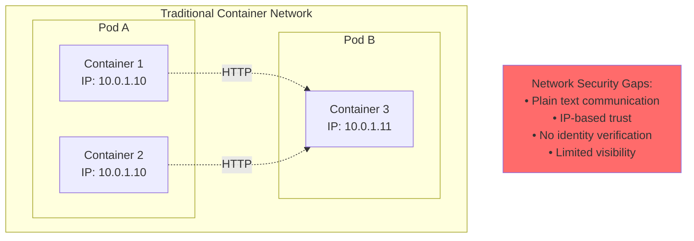

### **Enhanced with Network Policies + mTLS**
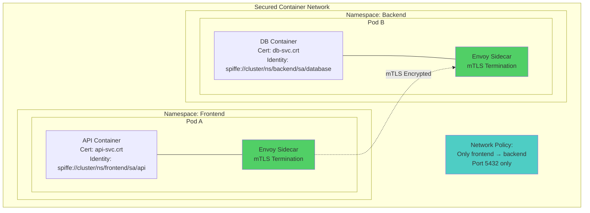

### **Network Policy with Identity-Based Rules**
```yaml
# Network policy enhanced with service identity
apiVersion: networking.k8s.io/v1
kind: NetworkPolicy
metadata:
  name: identity-based-policy
  namespace: backend
spec:
  podSelector:
    matchLabels:
      app: database
  policyTypes:
  - Ingress
  - Egress
  ingress:
  - from:
    # Only allow traffic from pods with specific service account
    - namespaceSelector:
        matchLabels:
          name: frontend
      podSelector:
        matchLabels:
          service-identity: "spiffe://cluster.local/ns/frontend/sa/api"
    ports:
    - protocol: TCP
      port: 5432
  egress:
  # Allow DNS resolution
  - to: []
    ports:
    - protocol: UDP
      port: 53
    - protocol: TCP
      port: 53
  # Allow metrics to monitoring namespace
  - to:
    - namespaceSelector:
        matchLabels:
          name: monitoring
    ports:
    - protocol: TCP
      port: 9090

---
# Cilium-based identity-aware network policy
apiVersion: "cilium.io/v2"
kind: CiliumNetworkPolicy
metadata:
  name: service-identity-policy
  namespace: backend
spec:
  endpointSelector:
    matchLabels:
      app: database
  ingress:
  - fromEndpoints:
    - matchLabels:
        "spiffe.io/spiffe-id": "spiffe://cluster.local/ns/frontend/sa/api"
    toPorts:
    - ports:
      - port: "5432"
        protocol: TCP
      rules:
        http:
        - method: "POST"
          path: "/api/query"
        - method: "GET" 
          path: "/health"
```

---

## **Layer 4: Transport Security Evolution**

### **mTLS Certificate Lifecycle with SPIFFE/SPIRE**
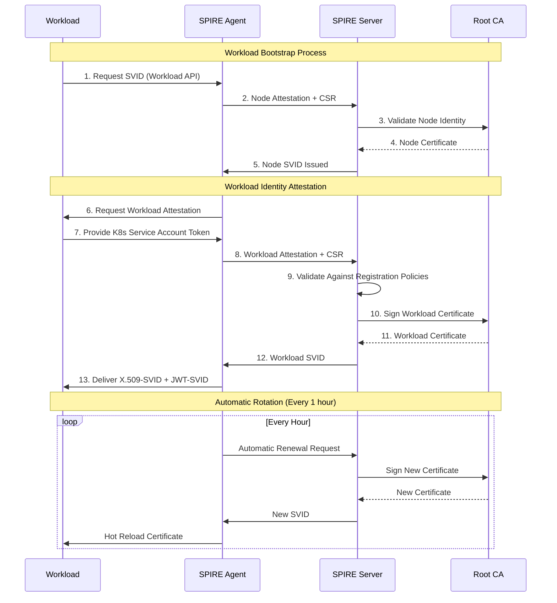

### **SPIRE Architecture in Kubernetes**
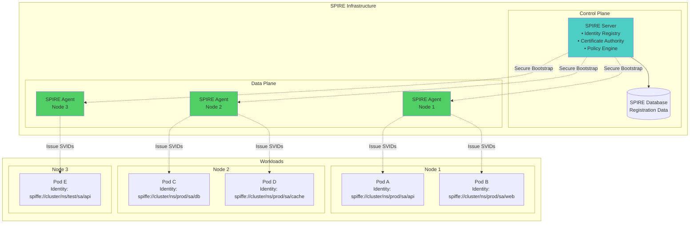

### **Certificate Comparison: Manual vs SPIFFE/SPIRE**
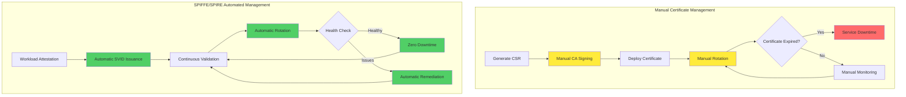

---

## **Layer 5-6: Istio Service Mesh Integration**

### **Complete Service Mesh Security Stack**
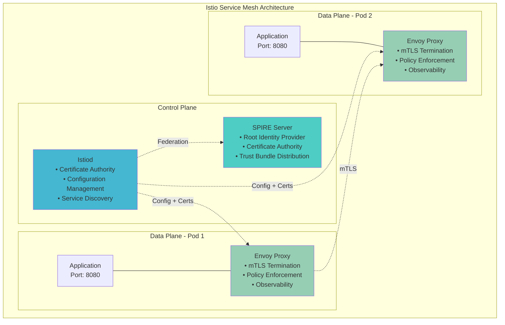

### **Security Policy Evolution**
```yaml
# Basic Istio Security
apiVersion: security.istio.io/v1beta1
kind: PeerAuthentication
metadata:
  name: default
  namespace: production
spec:
  mtls:
    mode: STRICT

---
# Enhanced with SPIFFE Integration
apiVersion: security.istio.io/v1beta1
kind: PeerAuthentication
metadata:
  name: spiffe-enhanced
  namespace: production
spec:
  mtls:
    mode: STRICT
  selector:
    matchLabels:
      app: payment-service
  # Use SPIFFE-issued certificates
  portLevelMtls:
    8080:
      mode: STRICT

---
# Advanced Authorization with SPIFFE Identities
apiVersion: security.istio.io/v1beta1
kind: AuthorizationPolicy
metadata:
  name: spiffe-authz
  namespace: production
spec:
  selector:
    matchLabels:
      app: payment-service
  rules:
  - from:
    - source:
        # SPIFFE-based identity verification
        principals: 
        - "spiffe://cluster.local/ns/production/sa/order-service"
        - "spiffe://cluster.local/ns/production/sa/billing-service"
  - to:
    - operation:
        methods: ["POST", "GET"]
        paths: ["/api/v1/payment/*"]
  - when:
    # Additional context-aware conditions
    - key: source.certificate_fingerprint
      values: ["sha256:a1b2c3d4..."]
    - key: source.certificate_subject
      values: ["CN=order-service.production.cluster.local"]
    - key: request.headers[x-request-id]
      notValues: [""]

---
# Runtime Security Integration with Falco
apiVersion: security.istio.io/v1beta1
kind: AuthorizationPolicy
metadata:
  name: falco-integration
  namespace: production
spec:
  selector:
    matchLabels:
      app: database
  rules:
  - from:
    - source:
        principals: ["spiffe://cluster.local/ns/production/sa/api-service"]
  - when:
    # Block requests from workloads flagged by Falco
    - key: custom.falco_risk_score
      values: ["low", "medium"]
    # Deny access if Falco detected suspicious activity
    - key: custom.falco_alert
      notValues: ["high", "critical"]
```

---

## **Layer 7: Application Security with Complete Observability**

### **Complete Security Telemetry Pipeline**
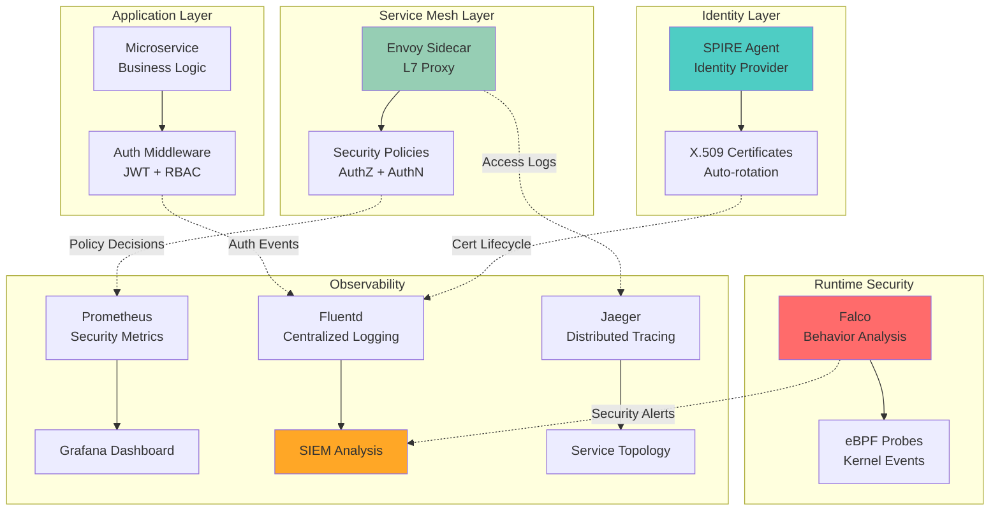

### **Complete Security Configuration Example**
```yaml
# Application with complete security stack
apiVersion: apps/v1
kind: Deployment
metadata:
  name: secure-microservice
  namespace: production
  labels:
    app: payment-service
    version: v1
spec:
  replicas: 3
  selector:
    matchLabels:
      app: payment-service
  template:
    metadata:
      labels:
        app: payment-service
        version: v1
      annotations:
        # Enable Istio sidecar injection
        sidecar.istio.io/inject: "true"
        # SPIFFE identity
        spiffe.io/spiffe-id: "spiffe://cluster.local/ns/production/sa/payment-service"
        # Falco monitoring annotations
        falco.org/monitor: "true"
        falco.org/rules: "payment-service-rules"
    spec:
      serviceAccountName: payment-service
      securityContext:
        # Pod-level security context
        runAsNonRoot: true
        runAsUser: 1001
        runAsGroup: 2001
        fsGroup: 3001
        seccompProfile:
          type: RuntimeDefault
      containers:
      - name: payment-service
        image: myapp/payment-service:v1.2.3
        ports:
        - containerPort: 8080
          name: http
        - containerPort: 9090
          name: metrics
        securityContext:
          # Container-level security
          allowPrivilegeEscalation: false
          readOnlyRootFilesystem: true
          capabilities:
            drop:
            - ALL
            add:
            - NET_BIND_SERVICE
        # Resource limits for security
        resources:
          requests:
            memory: "128Mi"
            cpu: "100m"
          limits:
            memory: "256Mi"
            cpu: "200m"
        # Health checks
        livenessProbe:
          httpGet:
            path: /health
            port: 8080
            scheme: HTTP
          initialDelaySeconds: 30
          periodSeconds: 10
        readinessProbe:
          httpGet:
            path: /ready
            port: 8080
          initialDelaySeconds: 5
          periodSeconds: 5
        # Environment variables for security
        env:
        - name: ENABLE_MTLS
          value: "true"
        - name: SPIFFE_ENDPOINT_SOCKET
          value: "unix:///run/spire/sockets/agent.sock"
        - name: LOG_LEVEL
          value: "INFO"
        volumeMounts:
        - name: spire-agent-socket
          mountPath: /run/spire/sockets
          readOnly: true
        - name: tmp-volume
          mountPath: /tmp
        - name: cache-volume
          mountPath: /app/cache
      volumes:
      - name: spire-agent-socket
        hostPath:
          path: /run/spire/sockets
          type: Directory
      - name: tmp-volume
        emptyDir: {}
      - name: cache-volume
        emptyDir: {}

---
# Service for the deployment
apiVersion: v1
kind: Service
metadata:
  name: payment-service
  namespace: production
  labels:
    app: payment-service
spec:
  selector:
    app: payment-service
  ports:
  - name: http
    port: 8080
    targetPort: 8080
  - name: metrics
    port: 9090
    targetPort: 9090

---
# ServiceMonitor for Prometheus scraping
apiVersion: monitoring.coreos.com/v1
kind: ServiceMonitor
metadata:
  name: payment-service-metrics
  namespace: production
spec:
  selector:
    matchLabels:
      app: payment-service
  endpoints:
  - port: metrics
    interval: 15s
    path: /metrics
    scheme: http
```

---

## **Security Improvement Matrix: Before vs After**

### **Threat Mitigation Comparison**
```mermaid
graph TB
    subgraph "Threat Landscape"
        T1[Man-in-the-Middle]
        T2[Service Spoofing]  
        T3[Lateral Movement]
        T4[Credential Theft]
        T5[Runtime Attacks]
        T6[Data Exfiltration]
        T7[Privilege Escalation]
        T8[Supply Chain Attacks]
    end
    
    subgraph "Basic K8s (Minimal Protection)"
        B1[Network Policies Only]
        B2[Basic RBAC]
        B3[Container Isolation]
        
        T1 -.->|Vulnerable| B1
        T2 -.->|Vulnerable| B2
        T3 -.->|Partially Protected| B1
        T4 -.->|Vulnerable| B2
        T5 -.->|Minimal Protection| B3
        T6 -.->|Vulnerable| B1
        T7 -.->|Partially Protected| B2
        T8 -.->|Vulnerable| B3
    end
    
    subgraph "Complete Security Stack (Strong Protection)"
        S1[mTLS + SPIFFE/SPIRE]
        S2[Istio Service Mesh]
        S3[Falco + eBPF]
        S4[Zero Trust Policies]
        
        T1 -.->|Mitigated| S1
        T2 -.->|Mitigated| S1
        T3 -.->|Strongly Mitigated| S2
        T4 -.->|Mitigated| S1
        T5 -.->|Detected & Blocked| S3
        T6 -.->|Monitored & Alerted| S3
        T7 -.->|Prevented| S4
        T8 -.->|Detected| S3
    end
    
    style B1 fill:#ff6b6b
    style B2 fill:#ff6b6b
    style B3 fill:#ff6b6b
    style S1 fill:#51cf66
    style S2 fill:#51cf66
    style S3 fill:#51cf66
    style S4 fill:#51cf66
```

### **Security Metrics Improvement**
| **Security Aspect** | **Basic K8s** | **+ mTLS** | **+ SPIFFE/SPIRE** | **+ Istio** | **+ Falco/eBPF** |
|---------------------|---------------|------------|-------------------|-------------|------------------|
| **Identity Verification** | 30% | 70% | 95% | 95% | 95% |
| **Data Encryption** | 20% | 90% | 95% | 95% | 95% |
| **Access Control** | 40% | 60% | 80% | 95% | 95% |
| **Threat Detection** | 10% | 15% | 20% | 40% | 95% |
| **Incident Response** | 20% | 25% | 30% | 50% | 90% |
| **Compliance** | 30% | 60% | 80% | 85% | 95% |
| **Runtime Protection** | 25% | 30% | 35% | 45% | 95% |
| **Observability** | 20% | 40% | 60% | 85% | 95% |

---

## **Complete Integration Example: Real-world Scenario**

### **E-commerce Microservices with Full Security Stack**
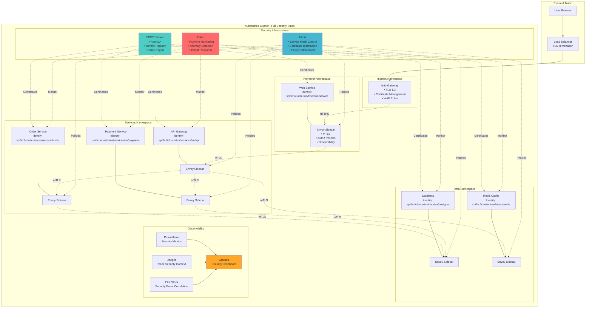

### **Security Flow for a Payment Request**
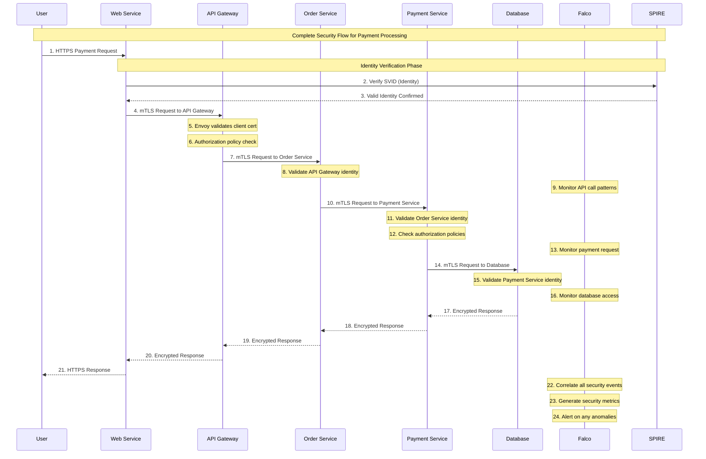

##
##
