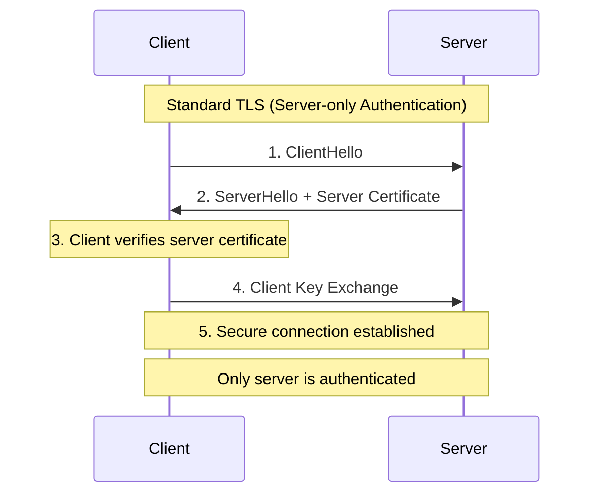
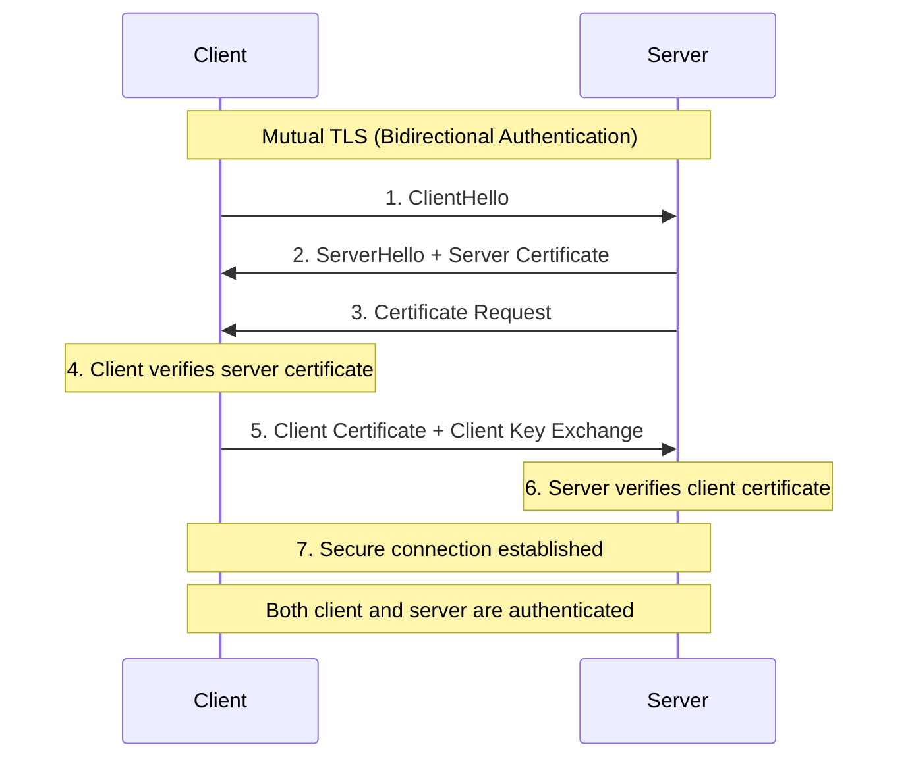
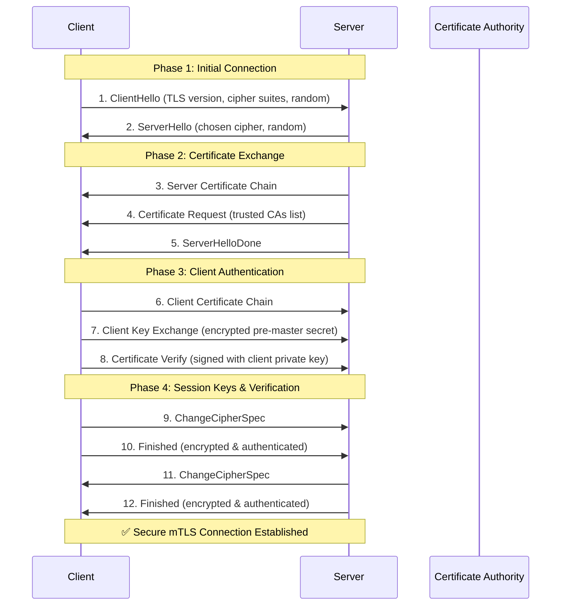
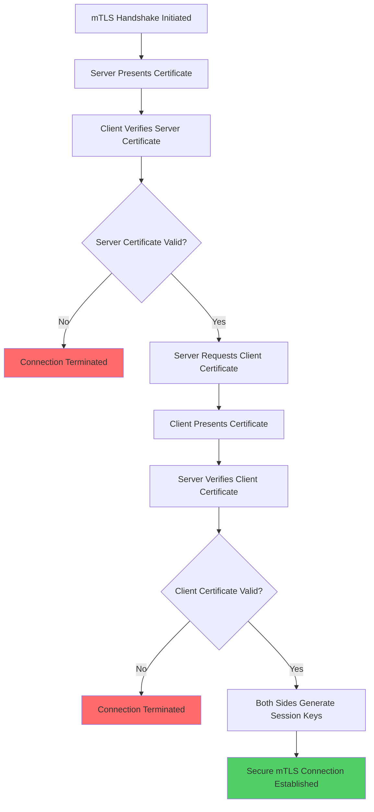
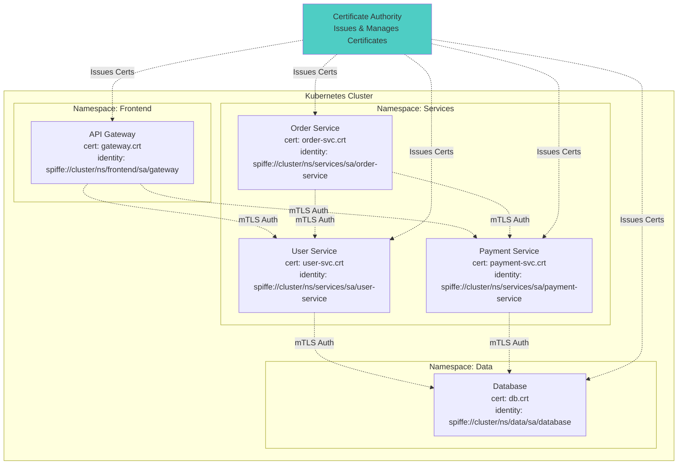
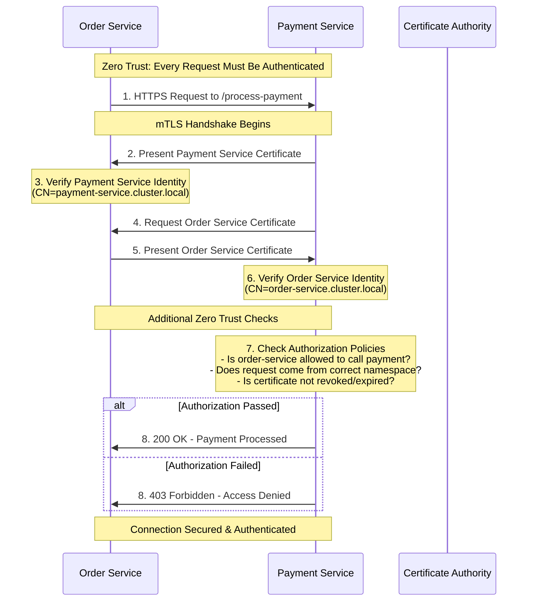
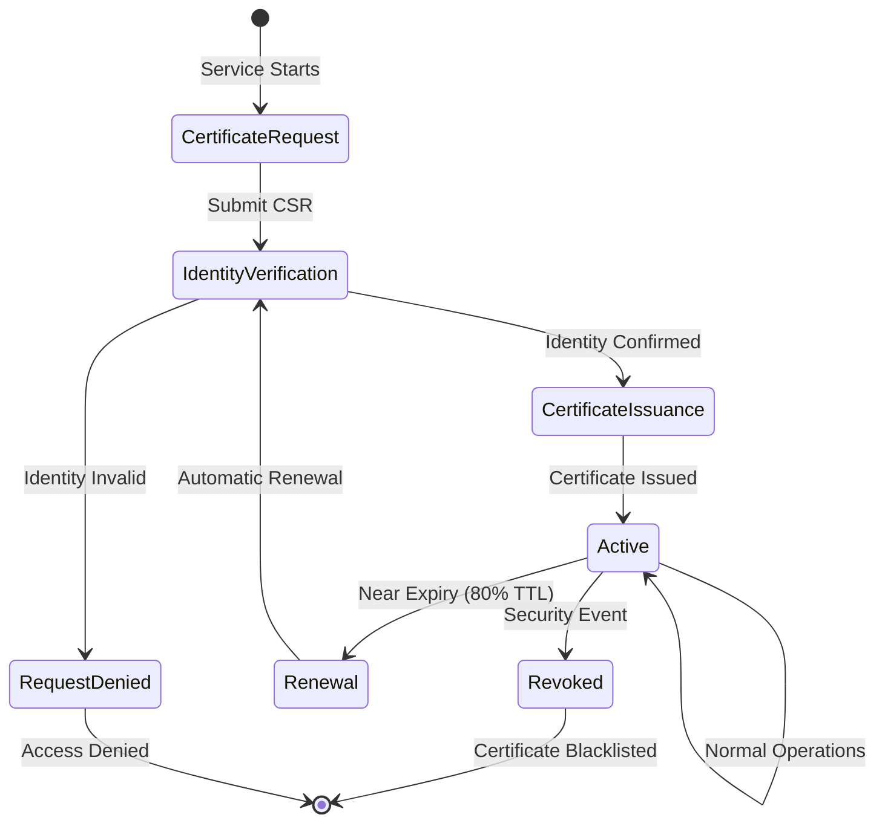
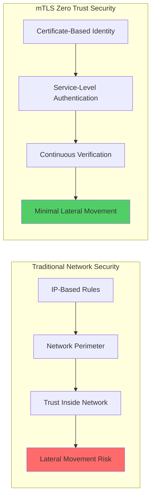
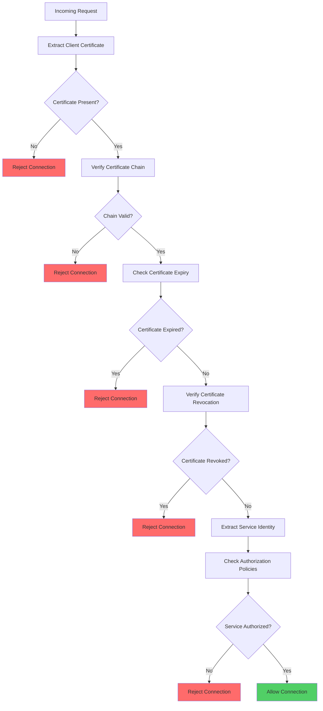
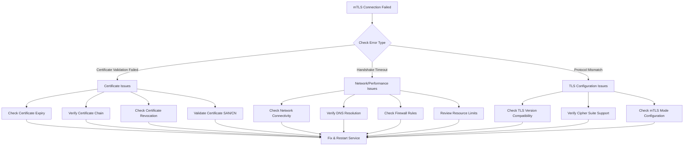

# **Mutual TLS (mTLS) in Zero Trust Architecture**
## Deep Dive: Authentication, Implementation & Security Benefits

---

## **What is Mutual TLS (mTLS)?**

**Mutual TLS** extends the standard TLS protocol by requiring **both the client and server to authenticate each other** using digital certificates. 
Unlike traditional TLS where only the server presents a certificate, mTLS ensures bidirectional authentication, creating a cryptographically secure identity verification system.

### **Standard TLS vs. mTLS Comparison**





---

## **mTLS Handshake Process - Technical Deep Dive**

### **Detailed mTLS Handshake Flow**



### **Certificate Verification Process**



---

## **mTLS in Microservices Architecture**

### **Service-to-Service Communication with mTLS**



### **Zero Trust mTLS Flow Example**



---

## **mTLS Implementation in Kubernetes/Istio**

### **Istio Service Mesh mTLS Configuration**

#### **1. Enable Strict mTLS Policy**
```yaml
# Cluster-wide strict mTLS
apiVersion: security.istio.io/v1beta1
kind: PeerAuthentication
metadata:
  name: default
  namespace: istio-system
spec:
  mtls:
    mode: STRICT
---
# Namespace-specific mTLS
apiVersion: security.istio.io/v1beta1
kind: PeerAuthentication
metadata:
  name: namespace-policy
  namespace: production
spec:
  mtls:
    mode: STRICT
---
# Service-specific mTLS with exceptions
apiVersion: security.istio.io/v1beta1
kind: PeerAuthentication
metadata:
  name: payment-service-mtls
  namespace: production
spec:
  selector:
    matchLabels:
      app: payment-service
  mtls:
    mode: STRICT
  portLevelMtls:
    8080:
      mode: STRICT
    9090:  # Health check port
      mode: PERMISSIVE
```

#### **2. Certificate Management with SPIFFE/SPIRE**
```yaml
# SPIRE Server Configuration
apiVersion: apps/v1
kind: Deployment
metadata:
  name: spire-server
  namespace: spire
spec:
  template:
    spec:
      containers:
      - name: spire-server
        image: ghcr.io/spiffe/spire-server:1.8.0
        args:
        - -config
        - /run/spire/config/server.conf
        volumeMounts:
        - name: spire-config
          mountPath: /run/spire/config
          readOnly: true
        - name: spire-data
          mountPath: /run/spire/data
---
# SPIRE Agent DaemonSet
apiVersion: apps/v1
kind: DaemonSet
metadata:
  name: spire-agent
  namespace: spire
spec:
  template:
    spec:
      hostPID: true
      hostNetwork: true
      dnsPolicy: ClusterFirstWithHostNet
      containers:
      - name: spire-agent
        image: ghcr.io/spiffe/spire-agent:1.8.0
        args:
        - -config
        - /run/spire/config/agent.conf
        securityContext:
          privileged: true
        volumeMounts:
        - name: spire-config
          mountPath: /run/spire/config
          readOnly: true
        - name: spire-bundle
          mountPath: /run/spire/bundle
        - name: spire-agent-socket
          mountPath: /run/spire/sockets
```

#### **3. Workload Identity Registration**
```yaml
# SPIFFE ID Registration for Services
apiVersion: spiffeid.spiffe.io/v1beta1
kind: SpiffeID
metadata:
  name: payment-service
  namespace: production
spec:
  spiffeId: spiffe://cluster.local/ns/production/sa/payment-service
  parentId: spiffe://cluster.local/spire/agent/k8s_psat/production
  selector:
    k8s:
      ns: production
      sa: payment-service
---
apiVersion: spiffeid.spiffe.io/v1beta1
kind: SpiffeID
metadata:
  name: order-service
  namespace: production
spec:
  spiffeId: spiffe://cluster.local/ns/production/sa/order-service
  parentId: spiffe://cluster.local/spire/agent/k8s_psat/production
  selector:
    k8s:
      ns: production
      sa: order-service
```

### **mTLS Certificate Lifecycle**



---

## **mTLS Security Benefits in Zero Trust**

### **1. Identity-Based Network Security**



### **2. Attack Mitigation with mTLS**

| **Attack Vector** | **Without mTLS** | **With mTLS** | **Mitigation Level** |
|-------------------|------------------|---------------|---------------------|
| **Man-in-the-Middle** | ❌ Vulnerable to MITM attacks | ✅ Mutual authentication prevents MITM | **Complete** |
| **Service Spoofing** | ❌ Easy to impersonate services | ✅ Certificate validation required | **Complete** |
| **Lateral Movement** | ❌ Network access = service access | ✅ Each service requires authentication | **High** |
| **Replay Attacks** | ❌ Can replay network traffic | ✅ Certificate-based session keys | **High** |
| **Data Interception** | ❌ Plain text or weak encryption | ✅ Strong TLS encryption | **Complete** |
| **Privilege Escalation** | ❌ Network compromise = full access | ✅ Service-specific certificates | **High** |

### **3. mTLS Certificate Validation Process**



---

## **Practical mTLS Implementation Examples**

### **Go Service with mTLS**
```go
package main

import (
    "crypto/tls"
    "crypto/x509"
    "fmt"
    "io/ioutil"
    "log"
    "net/http"
)

func setupMTLSClient() *http.Client {
    // Load client certificate and key
    clientCert, err := tls.LoadX509KeyPair("client.crt", "client.key")
    if err != nil {
        log.Fatal("Error loading client certificate:", err)
    }
    
    // Load CA certificate to verify server
    caCert, err := ioutil.ReadFile("ca.crt")
    if err != nil {
        log.Fatal("Error loading CA certificate:", err)
    }
    
    caCertPool := x509.NewCertPool()
    caCertPool.AppendCertsFromPEM(caCert)
    
    // Configure TLS with mTLS
    tlsConfig := &tls.Config{
        Certificates: []tls.Certificate{clientCert},
        RootCAs:      caCertPool,
        ServerName:   "api-service.cluster.local", // Must match server cert
        MinVersion:   tls.VersionTLS12,
    }
    
    transport := &http.Transport{
        TLSClientConfig: tlsConfig,
    }
    
    return &http.Client{Transport: transport}
}

func setupMTLSServer() *http.Server {
    // Load server certificate and key
    serverCert, err := tls.LoadX509KeyPair("server.crt", "server.key")
    if err != nil {
        log.Fatal("Error loading server certificate:", err)
    }
    
    // Load CA certificate to verify clients
    caCert, err := ioutil.ReadFile("ca.crt")
    if err != nil {
        log.Fatal("Error loading CA certificate:", err)
    }
    
    caCertPool := x509.NewCertPool()
    caCertPool.AppendCertsFromPEM(caCert)
    
    // Configure TLS with client certificate verification
    tlsConfig := &tls.Config{
        Certificates: []tls.Certificate{serverCert},
        ClientAuth:   tls.RequireAndVerifyClientCert,
        ClientCAs:    caCertPool,
        MinVersion:   tls.VersionTLS12,
        CipherSuites: []uint16{
            tls.TLS_ECDHE_RSA_WITH_AES_256_GCM_SHA384,
            tls.TLS_ECDHE_RSA_WITH_CHACHA20_POLY1305,
        },
    }
    
    server := &http.Server{
        Addr:      ":8443",
        TLSConfig: tlsConfig,
    }
    
    return server
}

// HTTP handler with client certificate validation
func secureHandler(w http.ResponseWriter, r *http.Request) {
    // Extract client certificate
    if r.TLS == nil || len(r.TLS.PeerCertificates) == 0 {
        http.Error(w, "Client certificate required", http.StatusUnauthorized)
        return
    }
    
    clientCert := r.TLS.PeerCertificates[0]
    
    // Extract service identity from certificate
    serviceIdentity := clientCert.Subject.CommonName
    
    // Additional Zero Trust validations
    if !isServiceAuthorized(serviceIdentity, r.URL.Path) {
        http.Error(w, "Service not authorized for this resource", http.StatusForbidden)
        return
    }
    
    // Log the authenticated request
    log.Printf("Authenticated request from service: %s, path: %s", serviceIdentity, r.URL.Path)
    
    fmt.Fprintf(w, "Hello, authenticated service: %s", serviceIdentity)
}

func isServiceAuthorized(serviceIdentity, path string) bool {
    // Implement your authorization logic
    authorizations := map[string][]string{
        "order-service":   {"/api/payment", "/api/inventory"},
        "payment-service": {"/api/billing", "/api/fraud-check"},
        "user-service":    {"/api/profile", "/api/preferences"},
    }
    
    allowedPaths, exists := authorizations[serviceIdentity]
    if !exists {
        return false
    }
    
    for _, allowedPath := range allowedPaths {
        if path == allowedPath || strings.HasPrefix(path, allowedPath) {
            return true
        }
    }
    
    return false
}

func main() {
    http.HandleFunc("/api/", secureHandler)
    
    server := setupMTLSServer()
    
    log.Println("Starting mTLS server on :8443")
    log.Fatal(server.ListenAndServeTLS("", ""))
}
```

### **Python Service with mTLS (Flask)**
```python
import ssl
import logging
from flask import Flask, request, jsonify
from OpenSSL import crypto
import requests

app = Flask(__name__)

class MTLSValidator:
    def __init__(self, ca_cert_path):
        with open(ca_cert_path, 'rb') as f:
            self.ca_cert = crypto.load_certificate(crypto.FILETYPE_PEM, f.read())
    
    def validate_client_certificate(self, cert_pem):
        """Validate client certificate against CA"""
        try:
            client_cert = crypto.load_certificate(crypto.FILETYPE_PEM, cert_pem)
            
            # Create certificate store and add CA
            store = crypto.X509Store()
            store.add_cert(self.ca_cert)
            
            # Verify certificate
            store_context = crypto.X509StoreContext(store, client_cert)
            store_context.verify_certificate()
            
            return True, client_cert.get_subject().CN
        except Exception as e:
            logging.error(f"Certificate validation failed: {e}")
            return False, None

mtls_validator = MTLSValidator('ca.crt')

@app.before_request
def verify_client_certificate():
    """Verify client certificate for all requests"""
    if request.is_secure and request.environ.get('SSL_CLIENT_CERT'):
        cert_pem = request.environ.get('SSL_CLIENT_CERT')
        is_valid, service_identity = mtls_validator.validate_client_certificate(cert_pem)
        
        if not is_valid:
            return jsonify({'error': 'Invalid client certificate'}), 401
        
        # Store service identity for use in handlers
        request.service_identity = service_identity
        
        # Log authenticated request
        logging.info(f'Authenticated request from {service_identity} to {request.path}')
    else:
        return jsonify({'error': 'Client certificate required'}), 401

@app.route('/api/payment', methods=['POST'])
def process_payment():
    # Check if the requesting service is authorized
    if request.service_identity not in ['order-service', 'billing-service']:
        return jsonify({'error': 'Service not authorized'}), 403
    
    return jsonify({'status': 'payment processed'})

def make_mtls_request(url, cert_file, key_file, ca_file):
    """Make an mTLS request to another service"""
    try:
        response = requests.post(
            url,
            cert=(cert_file, key_file),
            verify=ca_file,
            json={'amount': 100.00},
            timeout=30
        )
        return response
    except requests.exceptions.SSLError as e:
        logging.error(f"mTLS request failed: {e}")
        raise

if __name__ == '__main__':
    # SSL context for the Flask app
    context = ssl.SSLContext(ssl.PROTOCOL_TLSv1_2)
    context.verify_mode = ssl.CERT_REQUIRED
    context.load_cert_chain('server.crt', 'server.key')
    context.load_verify_locations('ca.crt')
    
    app.run(
        host='0.0.0.0',
        port=8443,
        ssl_context=context
    )
```

---

## **mTLS Troubleshooting & Monitoring**

### **Common mTLS Issues & Solutions**



### **mTLS Monitoring & Observability**
```yaml
# Prometheus metrics for mTLS monitoring
apiVersion: v1
kind: ConfigMap
metadata:
  name: mtls-monitoring
data:
  prometheus.yml: |
    global:
      scrape_interval: 15s
    
    scrape_configs:
    - job_name: 'istio-mesh'
      kubernetes_sd_configs:
      - role: endpoints
        namespaces:
          names:
          - production
          - staging
      
      relabel_configs:
      - source_labels: [__meta_kubernetes_service_name, __meta_kubernetes_endpoint_port_name]
        action: keep
        regex: .*-metrics;http-monitoring
      
    rule_files:
    - "/etc/prometheus/rules/*.yml"

---
# Alerting rules for mTLS issues
apiVersion: v1
kind: ConfigMap
metadata:
  name: mtls-alerts
data:
  mtls-rules.yml: |
    groups:
    - name: mtls-security
      rules:
      - alert: mTLSCertificateExpiringSoon
        expr: |
          (
            istio_cert_expiry_timestamp - time()
          ) / 86400 < 7
        for: 1m
        labels:
          severity: warning
        annotations:
          summary: "mTLS certificate expiring soon"
          description: "Certificate for {{ $labels.service }} expires in less than 7 days"
      
      - alert: mTLSHandshakeFailureRate
        expr: |
          rate(istio_requests_total{response_code=~"4[0-9][0-9]"}[5m]) > 0.1
        for: 2m
        labels:
          severity: critical
        annotations:
          summary: "High mTLS handshake failure rate"
          description: "mTLS authentication failures > 10% for service {{ $labels.destination_service_name }}"
      
      - alert: mTLSPolicyViolation
        expr: |
          increase(istio_security_policy_violations_total[5m]) > 0
        for: 0m
        labels:
          severity: critical
        annotations:
          summary: "mTLS policy violation detected"
          description: "Security policy violation in namespace {{ $labels.namespace }}"
```

---

## **Summary: mTLS as Zero Trust Foundation**

mTLS provides the cryptographic foundation for Zero Trust by ensuring:

1. **Strong Identity**: Every service has a cryptographically verifiable identity
2. **Continuous Authentication**: Every connection requires mutual certificate validation
3. **Encryption**: All service-to-service communication is encrypted
4. **Non-repudiation**: Certificate-based authentication provides audit trails
5. **Microsegmentation**: Service-level authentication enables fine-grained access control

In a Zero Trust architecture, mTLS transforms the network from a "trusted environment" into a "continuously verified environment" where every interaction must prove its legitimacy through cryptographic means.
