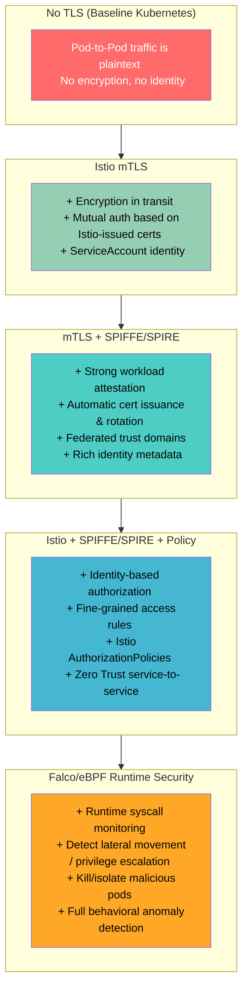
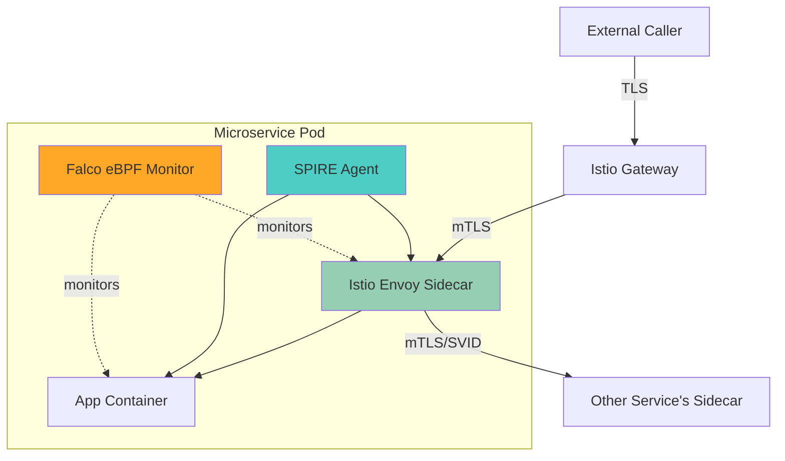

# ZeroTrust (..microservices..) 

## 🔐 **Security Evolution Through the Stack**



---

## 📶 **What Each Layer Buys You**

| **Layer**                      | **What You Get** | **Remaining Gaps** |
|--------------------------------|------------------|--------------------|
| **L0: No TLS**                 | Raw cluster works, but insecure | Traffic visible, spoofing trivial, lateral movement easy |
| **L1: Istio mTLS**              | Encryption against snooping, mutual authentication between pods (via Istiod CA) | Weak identity (service account only), Istiod as central trust bottleneck |
| **L2: + SPIFFE/SPIRE**         | Strong workload identity with attestation, automatic cert rotation, federation | Still need policy enforcement for least-privilege |
| **L3: + Istio AuthZ Policies** | Adds Zero Trust policies (`who can talk to who` down to path/service level) | No runtime/system-level protection |
| **L4: + Falco/eBPF**           | Runtime detection (syscalls, file access, container escapes), integrates with mesh alerts | Advanced threats (supply chain, mis-signed identities) still need higher-level governance |

---

## 🔄 **Contextual Diagram: Security Layers Around a Microservice**



- **Istio Envoy (mTLS)** 🟩 ensures pod ↔ pod traffic is encrypted & authenticated.  
- **SPIRE Agent** 🟦 provides **attested identity (SPIFFE ID)**, binds workloads strongly to their identity.  
- **Falco/eBPF** 🟧 watches the kernel & workloads at runtime for anomalies, enforcing defense-in-depth.  

---

## 📘 Executive Takeaway

- **mTLS alone (Istio)**: **Yes, it’s significant!** Encrypts your east-west traffic and gives you basic service account–based identity. A huge win over plaintext pods.  
- **mTLS + SPIFFE/SPIRE**: Adds *trustworthy workload identity* with automated lifecycle, rotation, and federation → critical for Zero Trust.  
- **mTLS + SPIFFE/SPIRE + Istio Policies**: Enforces real Zero Trust at the service-to-service communication layer. Identity-aware, least-privilege networking.  
- **Add Falco/eBPF**: Extends Zero Trust **down into the kernel/runtime** — capturing anomalies, syscall abuse, and container breakouts in real time.  

---

👉 So, having *just Istio mTLS* is a **good security uplift** (encryption + identity), but it becomes **transformational** when paired with SPIRE for identity integrity and Falco/eBPF for runtime guardrails.  

---

##
##

## 🔑 What *Just mTLS* Provides in Istio (Without SPIFFE/SPIRE)

### **1. Encryption in Transit**
- When Istio sidecars (Envoy proxies) have mTLS **enabled STRICT mode**, every pod-to-pod connection in the mesh is automatically encrypted using TLS.
- **Value:** Prevents eavesdropping (packet sniffing) and MITM (Man-In-The-Middle) attacks inside your cluster.
- Even if your cluster network or node is compromised, raw traffic is unreadable.

---

### **2. Mutual Authentication**
- mTLS by definition means **both sides present X.509 certificates**:
  - Client Envoy shows a cert
  - Server Envoy shows a cert
- Each side verifies the other’s cert was signed by the **Istio Citadel (Istiod) certificate authority**.
- **Value:** Ensures the thing you’re talking to is *at least some workload in the mesh*.  
  (But note: certificates are simple and usually scoped only to *service accounts* in Istio’s built-in CA.)

---

### **3. Identity… but Limited**
- Without SPIFFE/SPIRE, **Istio still issues workload certificates**:
  - SAN (Subject Alternative Name) fields look like:  
    ```
    spiffe://cluster.local/ns/namespace/sa/serviceaccount
    ```
  - BUT: this is Istiod’s **built-in implementation of the SPIFFE ID spec**, not a full SPIRE attestation flow.
- Meaning:
  - You *do get workload identity* through Istio’s CA system.
  - But the “trust guarantees” are **weaker**, since Istiod trusts Kubernetes API as truth, without strong attestation.
  - Compromise of Istiod = compromise of all identities.

---

### **4. Policy Enforcement**
- When you turn on **PeerAuthentication** and **AuthorizationPolicy** in Istio:
  - Workloads can be restricted to only *accept connections* from workloads authenticated via specific service accounts.
- Example:
  ```yaml
  principals:
    - "cluster.local/ns/payments/sa/payment-service-account"
  ```
- **Value:** This prevents an arbitrary pod from impersonating another pod; they need a valid Istio-issued cert.

---

## ✋ The Limitations of “Just mTLS in Istio”

1. **No Strong Attestation**  
   - Istiod provisions certs directly from K8s metadata.
   - It assumes: *if you can spin up a pod with a service account, you own that identity*.
   - A compromised node or misconfigured K8s RBAC could mint certs.

2. **Single Point of Trust**  
   - Istiod acts as CA.
   - If Istiod or its signing key leaks, the entire mesh identity fabric collapses.

3. **Basic Lifecycle Management**  
   - Certificates rotate automatically (default: 24 hours).
   - But lifecycle, revocation, and federation are limited compared to SPIRE.

4. **No External Federation**  
   - If you want to federate trust domains (multi-cluster, hybrid cloud, other orgs), “just Istio” can’t do the sophisticated stuff that SPIFFE/SPIRE makes possible.

---

## 🚦 What It *Does Do Significantly*
So is “just mTLS” meaningful? **Yes** — even plain Istio-managed mTLS dramatically raises the bar:

- Encrypts *all East-West traffic* by default (pods <-> pods).
- Ensures pods can’t just spoof TCP connections — they must have a valid Istio-issued cert.
- Integrates identity with Kubernetes service accounts → semi-granular access control (per-namespace, per-service).

**In practice:** 
- Without mTLS = cluster traffic is all plain HTTP/gRPC/TCP, visible to anyone who compromises a node.  
- With mTLS = traffic is encrypted, identity-asserted, and harder to forge. That’s a big win.

---

## 📊 Visualizing: “Just mTLS” vs “mTLS + SPIFFE/SPIRE”

```mermaid
flowchart LR
    subgraph "Just mTLS (Istio-only)"
        A[Pod A]--mTLS-->B[Pod B]
        A -.Cert from Istiod.-> CA1[Istio CA]
        B -.Cert from Istiod.-> CA1
        note left of A: Identity == serviceaccount
        note right of B: Verified by Istiod CA
    end
    
    subgraph "mTLS + SPIFFE/SPIRE"
        C[Pod A]--mTLS-->D[Pod B]
        C -.Attested Identity.-> CA2[SPIRE Server]
        D -.Attested Identity.-> CA2
        CA2 -.Federation Trust Bundle.-> ExtCA[External PKI/Federated Mesh]
        note left of C: Strong attestation<br/>(node / workload / claims)
        note right of D: Federated identity possible
    end
```

- **Just Istio + mTLS** = Encrypted traffic, service account–based identity, CA trust via Istiod.  
- **Istio + mTLS + SPIFFE/SPIRE** = All of the above *plus strong workload attestation, external federation, better lifecycle management, richer policies.*

---

✅ **Answer in short:**  
Having “just mTLS with Istio” is significant — it **encrypts all pod traffic and enforces workload identity based on service accounts**. That **already stops sniffing, spoofing, and basic lateral movement** inside the cluster.  

But without SPIFFE/SPIRE, you’re still **trusting K8s service accounts and Istiod as a CA**. That works fine for a lot of orgs, but lacks **hardware-bound attestation, revocation robustness, and federated trust** — which is why SPIFFE/SPIRE is the natural evolution.  

---

##
##

Zero Trust is a security model that assumes no user or device should be trusted by default—regardless of whether they're inside or outside the network. 

Even if a user is authenticated, that doesn’t mean the session is given blanket, unchecked access. Instead, every access request is continuously evaluated based on context, behavior, and risk factors.

# Key Points of Zero Trust (2025 Perspective)
Never Trust, Always Verify:
Even after initial authentication, every action and access request is scrutinized. This means that trust is never assumed permanently—it’s always subject to re-validation.

Continuous Authentication & Authorization:
Sessions are not statically trusted. Instead, continuous monitoring, adaptive authentication, and real-time context (e.g., device health, geolocation, user behavior) determine if the session should continue to have access.

Microsegmentation:
Networks and resources are segmented into very small zones. Even if a user gains access to one segment, they must re-authenticate or have their context re-evaluated to access another segment.

Least Privilege:
Users and applications are granted only the minimum permissions required for their tasks. This minimizes the potential damage if an account or session is compromised.

Visibility and Analytics:
Zero Trust relies on robust logging, monitoring, and analytics. Every action is logged and analyzed for anomalies that might indicate a breach or misuse, enabling rapid response.

In 2025
In today’s environment, zero trust means that an authenticated session is still under constant scrutiny. Even if someone logs in successfully, they don’t automatically receive complete trust. 
Their actions, context, and environment are continuously re-evaluated, and any suspicious behavior may trigger additional security checks or even session termination.

In essence, Zero Trust in 2025 is about not taking any entity at face value—even authenticated users. 

It’s a dynamic and granular approach to security that minimizes risk by ensuring that every access is continuously validated, making it much harder for attackers to move laterally or escalate privileges within an environment.


# EKS

# Zero Trust in Modern EKS Microservices
Zero Trust is a security philosophy that operates on the principle of “never trust, always verify.” 
Even if a user or service is authenticated, every request must be evaluated based on context, continuous monitoring, and least privilege principles. In a modern EKS microservices environment, this means that every service, every pod, and every connection is treated as potentially hostile until proven otherwise.

Core Principles of Zero Trust
Never Trust, Always Verify:
No entity (user, service, or device) is trusted by default, regardless of its location within the network.

Continuous Authentication & Authorization:
Every access request is verified in real time using contextual information such as identity, device health, geolocation, and behavior patterns.

Microsegmentation:
The network is segmented into smaller, isolated zones, so even if an attacker compromises one segment, lateral movement is severely restricted.

Least Privilege Access:
Every process and user is granted only the minimum privileges needed to perform its tasks. This limits the potential damage of any single breach.

Comprehensive Monitoring and Analytics:
Continuous logging and real-time analysis help detect anomalies and trigger automated responses.

How Zero Trust Applies to EKS Microservices
In an EKS environment, microservices are deployed as containers orchestrated by Kubernetes. Implementing Zero Trust in this context involves multiple layers:

1. Service Mesh Security
Mutual TLS (mTLS):
Tools like Istio or Linkerd can enforce mTLS between microservices. This means that every service-to-service communication is authenticated and encrypted. Even if one service is compromised, the attacker must still authenticate to other services, significantly limiting lateral movement.

Fine-Grained Policies:
Service meshes allow you to define policies that restrict which services can communicate with each other. For example, you can enforce that the payment service only accepts traffic from the order service, based on identity assertions.

2. Identity and Access Management
AWS IAM Roles for Service Accounts (IRSA):
In EKS, you can assign specific IAM roles to Kubernetes service accounts. This ensures that each pod only gets the permissions it needs. Even if an attacker compromises a pod, they’re limited by the narrowly scoped IAM role.

Kubernetes RBAC and OPA/Gatekeeper:
Role-Based Access Control (RBAC) in Kubernetes is used to control who can perform actions within the cluster. Tools like Open Policy Agent (OPA) with Gatekeeper can enforce custom security policies, ensuring that only approved actions are permitted within the cluster.

3. Network Policies and Microsegmentation
Kubernetes Network Policies:
These allow you to control the traffic between pods. For example, you can restrict access so that only the API gateway can reach the backend services. This limits exposure even if one microservice is compromised.

VPC and Subnet Isolation:
At the infrastructure level, AWS VPC configurations, along with subnet segmentation and security groups, further isolate workloads.

4. Encryption and Data Protection
Encryption in Transit and at Rest:
All communication between services should be encrypted. TLS (or mTLS within the service mesh) secures data in transit, while AWS KMS can be used to encrypt data at rest.

Key Management:
A strong KMS solution (whether AWS KMS, HashiCorp Vault, or similar) is essential for managing cryptographic keys and ensuring that decryption is possible only by authorized services.

5. Continuous Monitoring and Incident Response
Centralized Logging and SIEM:
Collect logs from Kubernetes, EKS, and your service mesh in a centralized system (e.g., ELK, Splunk). This enables real-time anomaly detection and correlation of events.

Real-Time Metrics and Alerts:
Tools like Prometheus and Grafana monitor cluster health and performance. Anomalies in traffic patterns or resource usage can trigger alerts, allowing for rapid incident response.

Automated Incident Response:
Integrate with automated tools to isolate compromised pods or scale down services upon detecting suspicious activity.

Modern-Day Examples
Imagine a scenario in a DigitalOcean EKS cluster where microservices communicate through a service mesh:

Scenario:
A microservice (say, an order service) tries to call the payment service. Even though both services are authenticated via mTLS, the service mesh checks additional factors such as:

Does the order service have the correct identity (verified through certificates)?
Is the request coming from a known network segment?
Do RBAC policies allow this service-to-service communication?
If any of these checks fail, the request is denied even though the order service is already authenticated.

Example with IRSA:
Each pod in the cluster is assigned an IAM role via IRSA. The analytics service has a role that only permits it to write logs to a specific S3 bucket. Even if the pod is compromised, the attacker cannot escalate privileges to access data outside of what the assigned IAM role permits.

Example with Network Policies:
Using Kubernetes Network Policies, only the API gateway can initiate a connection to the user service. Even if an attacker gains control of a pod in another namespace, they cannot directly communicate with the user service due to strict network segmentation.

Zero Trust Incident Response:
In an advanced setup, anomaly detection based on continuous metrics might flag unusual behavior (like a sudden spike in requests from a particular pod). Automated workflows then quarantine the pod while security teams investigate further.


| **Component** | **Description**                                                                 | **Role in Zero Trust**                                                                                                     | **Benefits**                                                                                                       |
|---------------|---------------------------------------------------------------------------------|----------------------------------------------------------------------------------------------------------------------------|--------------------------------------------------------------------------------------------------------------------|
| **mTLS**    | Mutual TLS requires both client and server to present certificates during TLS handshake. | Ensures that every service-to-service call is authenticated and encrypted, so that even if a network segment is compromised, no implicit trust is granted. | - Authenticates both endpoints<br>- Encrypts data in transit<br>- Prevents man-in-the-middle attacks               |
| **Microservices** | A distributed application architecture where functionality is divided into small, loosely coupled services. | Each service operates with its own security boundary; Zero Trust mandates that every service must continuously verify each request’s legitimacy, even if coming from within the same network. | - Fine-grained security per service<br>- Limits lateral movement<br>- Improves scalability and agility               |
| **Istio**     | A service mesh that provides traffic management, security (including mTLS enforcement), and observability across microservices. | Acts as the control plane for Zero Trust by automating mTLS, enforcing policies, and monitoring inter-service communication. | - Transparent security enforcement<br>- Centralized policy management<br>- Enhanced observability and analytics      |


# mTLS (Mutual TLS):
In a Zero Trust environment, simply authenticating once at the network perimeter is not enough. mTLS ensures that every call between microservices is mutually authenticated—each side verifies the other’s certificate—so that even if an attacker breaches one service, they cannot impersonate another. This continuous verification is crucial for maintaining a “never trust, always verify” posture.

# Microservices:
Microservices architecture splits an application into smaller, autonomous services. In a Zero Trust model, each microservice is treated as its own security domain. Even if one service is compromised, isolation between services (via namespaces, RBAC, etc.) prevents an attacker from easily moving laterally. Each microservice must enforce its own authentication, authorization, and data validation.

# Istio:
Istio integrates with Kubernetes (and EKS) to form a service mesh that automatically handles many security tasks. It transparently enforces mTLS between services, ensuring that communications are always encrypted and authenticated. Additionally, Istio provides centralized policy management and fine-grained access control, helping enforce Zero Trust principles across your entire microservices architecture. It also offers observability tools that allow for continuous monitoring and rapid detection of anomalies.


# Summary
In 2025, Zero Trust in an EKS microservices environment means:

Every inter-service request is authenticated, authorized, and encrypted using service meshes (e.g., Istio) and mTLS.
Identity is enforced through tightly scoped IAM roles, Kubernetes RBAC, and policies enforced by OPA.
Network communications are isolated using Kubernetes Network Policies and VPC segmentation.
Data is protected both in transit and at rest with robust encryption, supported by modern KMS systems.
Continuous monitoring, logging, and automated responses ensure that even if a breach occurs, lateral movement is minimized, and incidents are quickly contained.
