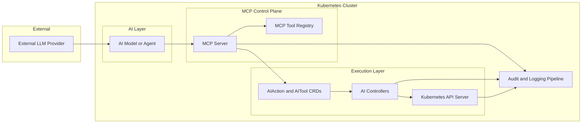
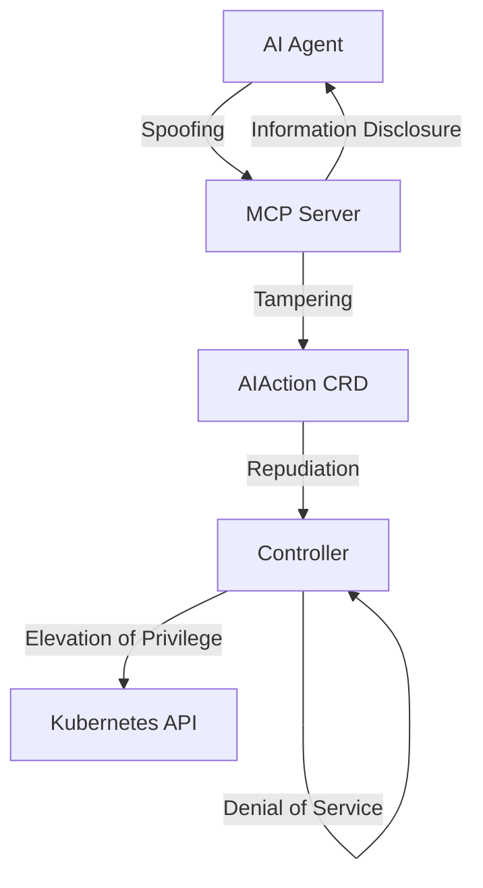
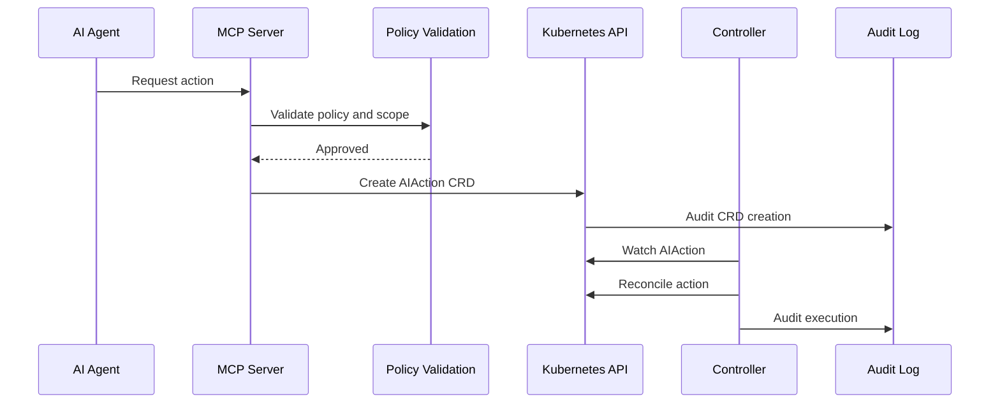
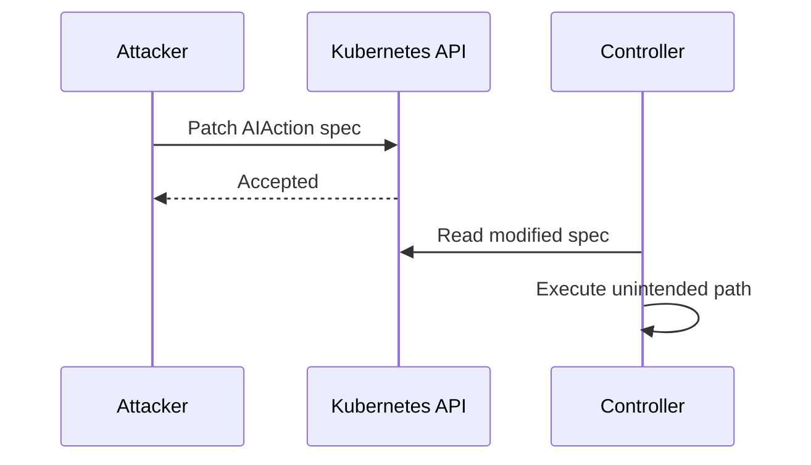
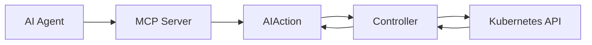
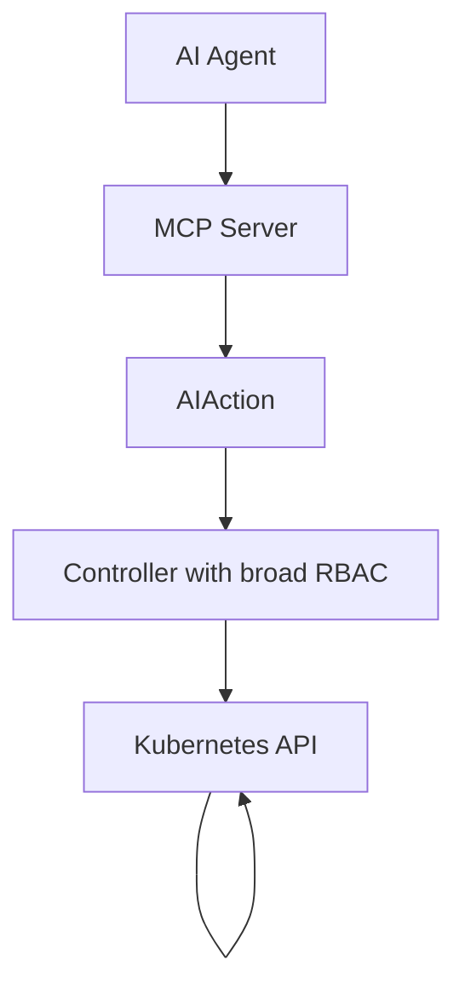
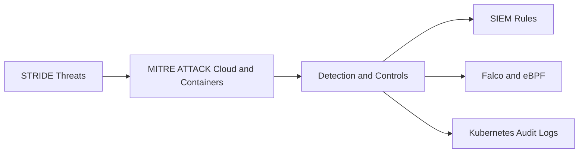
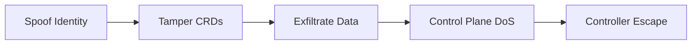

# 🧠 Model Context Protocol (MCP) as a Kubernetes Control Plane *(beta)*

## STRIDE Threat Model + MITRE ATT&CK Mapping

> **TL;DR**
> MCP is safe only when it behaves like a Kubernetes control plane API — not a tool runner.
> AI is untrusted input. Controllers are the blast radius. Defense-in-depth is mandatory.

---

## 1. Scope & System Boundary

### In Scope

* AI Models / Agents *(untrusted)*
* MCP Server (policy and validation)
* MCP Tool Registry
* MCP to Kubernetes interface
* Kubernetes API Server
* AI Controllers (reconcile loops)
* CRDs (`AIAction`, `AITool`)
* Audit and logging pipeline

### Out of Scope (Adjacent)

* Model training pipelines
* External SaaS LLM providers (assumed upstream)
* Human CI/CD workflows

---

## 2. MCP as a Kubernetes Control Plane (Architecture)



**Key Insight**
Everything *before* MCP is hostile.
Everything *after* controllers has real infrastructure power.

---

## 3. STRIDE Overview

| Category               | Risk Theme                |
| ---------------------- | ------------------------- |
| Spoofing               | Identity impersonation    |
| Tampering              | Unauthorized modification |
| Repudiation            | Loss of accountability    |
| Information Disclosure | Data leakage              |
| Denial of Service      | Availability impact       |
| Elevation of Privilege | Unauthorized power        |

---

## 4. STRIDE Overlay on MCP



---

## 5. Secure Execution Flow (Happy Path)



### Design Properties

* No direct model to Kubernetes API access
* MCP validates before CRD creation
* Controllers enforce final execution guardrails

---

## 6. STRIDE Failure Mode: CRD Tampering (T + E)



### Required Controls

* Admission webhooks
* Immutable CRDs after creation
* Strong typing (no string execution)
* No shell invocation

---

## 7. Denial of Service: Reconcile Storms



### Mitigations

* TTL on AIAction CRDs
* Retry caps and backoff
* Circuit breakers in controllers
* MCP rate limiting

---

## 8. Elevation of Privilege: Over-Privileged Controller



**Critical Insight**
Controllers define the actual blast radius — not MCP.

---

## 9. STRIDE to MITRE ATT&CK Mapping (Summary)



**Outcome**
AI control-plane risks map cleanly to known ATT&CK techniques — not novel AI threats.

---

## 10. Red and Purple Team Exercise Chain



This provides a ready-made CTF and purple-team roadmap.

---

## 11. STRIDE-Informed Design Rules

* ❌ No direct model to Kubernetes API access
* ❌ No shell execution
* ❌ No wildcard RBAC
* ❌ No implicit trust in tool descriptions
* ❌ No mutable post-validation state
* ❌ No unaudited execution paths

---

## 12. Executive Summary

> **Bottom Line**
> MCP is only safe when it behaves like a Kubernetes policy API — not a tool runner.

---

## 13. Repository Layout (Suggested)

```text
mcp-stride/
├── README.md
├── docs/
│   ├── stride-threat-model.md
│   ├── mitre-mapping.md
│   ├── diagrams.md
├── ctf/
│   ├── spoofing.md
│   ├── crd-tampering.md
│   ├── controller-escape.md
└── policies/
    ├── gatekeeper.yaml
    ├── kyverno.yaml
```

---

##
##
