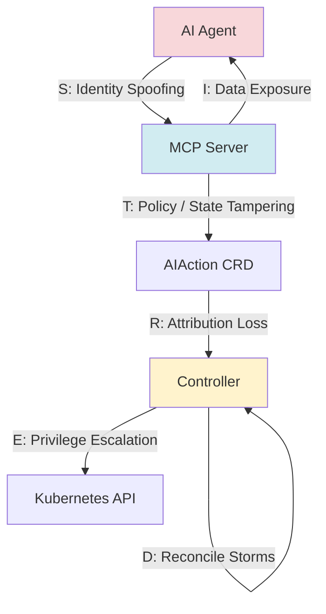
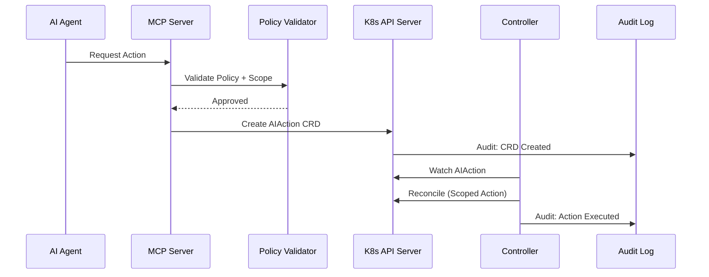
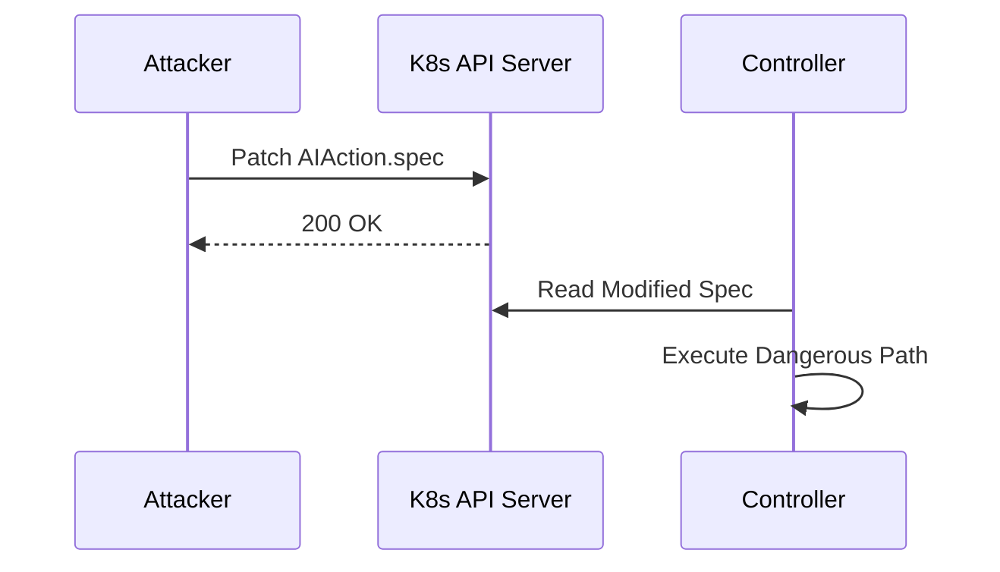
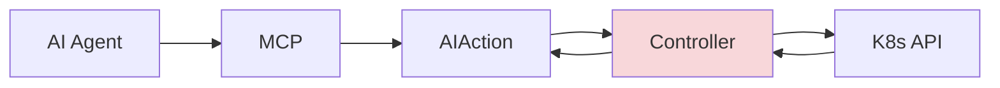
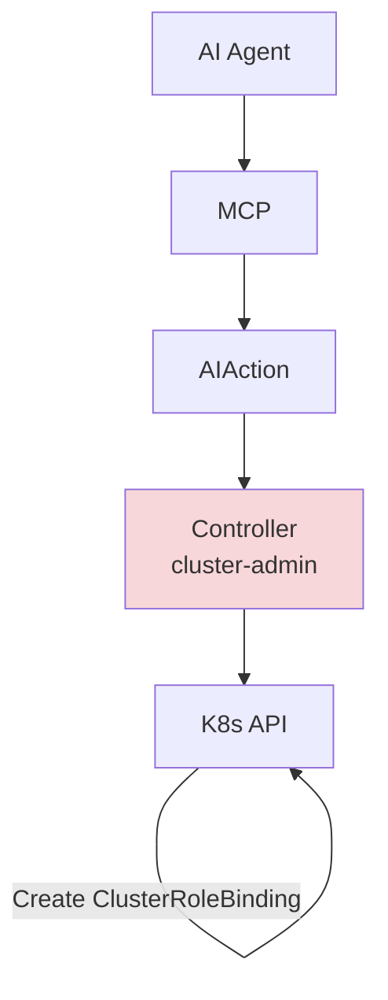
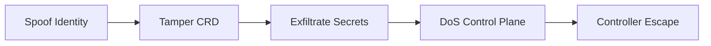
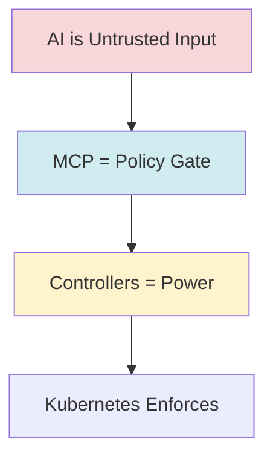

# 🧠 Model Context Protocol (MCP) as a Kubernetes Control Plane ..beta..

## STRIDE Threat Model + MITRE ATT&CK Mapping

> **TL;DR:** MCP is safe only when it behaves like a Kubernetes control plane API — not a tool runner.
> AI is *untrusted input*. Controllers are the *blast radius*. Defense-in-depth is mandatory.

---

## 1. Scope & System Boundary

### In Scope

* AI Models / Agents *(untrusted)*
* MCP Server (policy + validation)
* MCP Tool Registry
* MCP → Kubernetes Interface
* Kubernetes API Server
* AI Controllers (reconcile loops)
* CRDs (`AIAction`, `AITool`, etc.)
* Audit & logging pipeline

### Out of Scope (Adjacent)

* Model training pipelines
* External SaaS LLM providers (assumed upstream)
* Human CI/CD workflows

---

## 2. MCP as a Kubernetes Control Plane (Architecture)

```mermaid
flowchart LR
    subgraph External
        LLM[External LLM Provider<br/>(Untrusted)]
    end

    subgraph Cluster["Kubernetes Cluster"]
        subgraph MCP["MCP Control Plane"]
            MCPAPI[MCP Server<br/>Policy + Validation]
            Registry[MCP Tool Registry]
        end

        subgraph AI["AI Layer"]
            Agent[AI Model / Agent<br/>(Untrusted Input)]
        end

        subgraph Control["Execution Layer"]
            CRD[AIAction / AITool CRDs]
            Ctrl[AI Controllers<br/>(Reconcile Loops)]
            KAPI[Kubernetes API Server]
        end

        Audit[Audit & Logging Pipeline]
    end

    LLM --> Agent
    Agent --> MCPAPI
    MCPAPI --> Registry
    MCPAPI --> CRD
    CRD --> Ctrl
    Ctrl --> KAPI
    MCPAPI --> Audit
    Ctrl --> Audit
    KAPI --> Audit

    style LLM fill:#ffe6e6
    style Agent fill:#ffe6e6
    style MCPAPI fill:#e6f0ff
    style Ctrl fill:#fff2cc
```

**Key Insight:**
Everything *before* MCP is hostile.
Everything *after* controllers is real infrastructure power.

---

## 3. STRIDE Overview

| Category               | Risk Theme                |
| ---------------------- | ------------------------- |
| Spoofing               | Identity impersonation    |
| Tampering              | Unauthorized modification |
| Repudiation            | Loss of accountability    |
| Information Disclosure | Data leakage              |
| Denial of Service      | Availability impact       |
| Elevation of Privilege | Unauthorized power        |

---

## 4. STRIDE Overlay on MCP



---

## 5. Secure Execution Flow (Happy Path)



**Design Properties**

* No direct model → Kubernetes API access
* MCP validates *before* CRD creation
* Controllers enforce final execution guardrails

---

## 6. STRIDE Failure Mode: CRD Tampering (T + E)



**Required Controls**

* Admission webhooks
* Immutable CRDs post-create
* Strong typing (no string execution)
* No shell invocation

---

## 7. Denial of Service: Reconcile Storms



**Mitigations**

* TTL on AIAction CRDs
* Retry caps & backoff
* Circuit breakers in controllers
* MCP rate limiting

---

## 8. Elevation of Privilege: Over-Privileged Controller



**Critical Insight:**
Controllers define *actual* blast radius — not MCP.

---

## 9. STRIDE → MITRE ATT&CK Mapping (Summary)

```mermaid
flowchart LR
    STRIDE[S T R I D E]
    ATTACK[MITRE ATT&CK<br/>(Cloud + Containers)]
    DETECT[Detection & Controls]

    STRIDE --> ATTACK
    ATTACK --> DETECT

    DETECT --> SIEM[SIEM Rules]
    DETECT --> Falco[Falco / eBPF]
    DETECT --> Audit[K8s Audit Logs]
```

**Outcome:**
AI control-plane risks map cleanly to *known* ATT&CK techniques — not novel AI threats.

---

## 10. Red / Purple Team Exercise Chain



This provides a **ready-made CTF / purple-team roadmap**.

---

## 11. STRIDE-Informed Design Rules

* ❌ No direct model → Kubernetes API access
* ❌ No shell execution
* ❌ No wildcard RBAC
* ❌ No implicit trust in tool descriptions
* ❌ No mutable post-validation state
* ❌ No unaudited execution paths

---

## 12. Executive Summary (Slide-Ready)



> **Bottom Line:**
> MCP is only safe when it behaves like a Kubernetes policy API — not a tool runner.

---

## 13. Repository Suggestions (Optional)

```text
mcp-stride/
├── README.md
├── docs/
│   ├── stride-threat-model.md
│   ├── mitre-mapping.md
│   ├── diagrams.md
├── ctf/
│   ├── spoofing.md
│   ├── crd-tampering.md
│   ├── controller-escape.md
└── policies/
    ├── gatekeeper.yaml
    ├── kyverno.yaml
```

##
##
