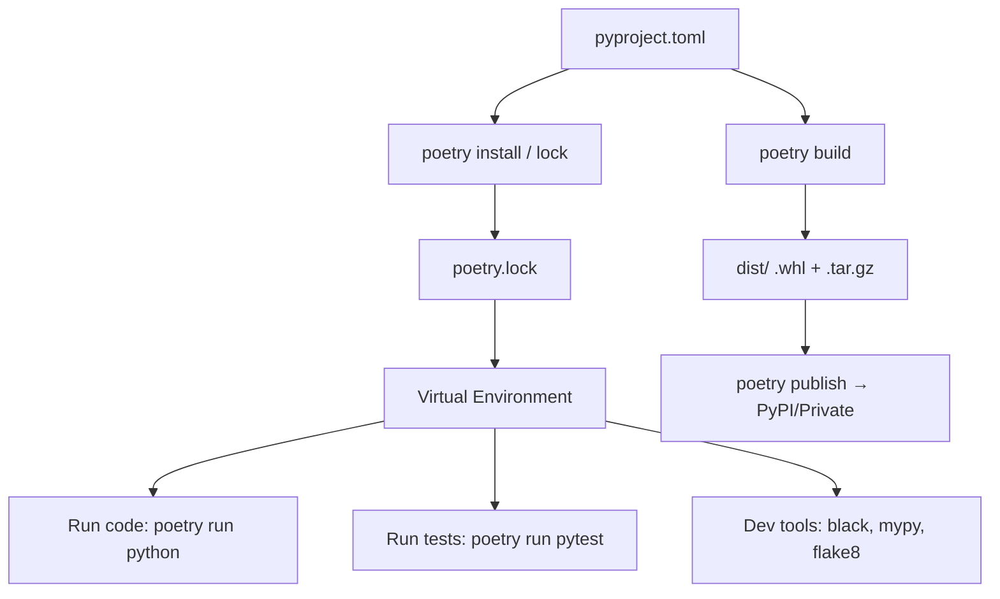

# 📘 Poetry + Python Project Guide ..beta..

## 🔧 What is Poetry?

Poetry is a tool for:

* **Dependency management** (replaces `requirements.txt`).
* **Virtual environments** (managed automatically).
* **Packaging & publishing** (to PyPI or private registries).

👉 Think of it as **npm/yarn for Python**.

---

## 📂 Project Layout

When you create a new project with Poetry:

```bash
poetry new my_project
```

You get:

```
my_project/
├── pyproject.toml        # Project metadata + dependencies
├── README.md             # Docs
├── my_project/           # Your Python package
│   ├── __init__.py       # Marks this as a package
│   └── example.py        # Example module
└── tests/                # Test suite
    └── test_example.py
```

### 🔑 Key Points:

* `pyproject.toml` = **heart of the project**
* `my_project/` = **your package source**
* `tests/` = unit & integration tests
* `__init__.py` → tells Python “this is a package”

---

## 📜 pyproject.toml Example

```toml
[tool.poetry]
name = "my_project"
version = "0.1.0"
description = "Example Python project with Poetry"
authors = ["Your Name <you@example.com>"]
readme = "README.md"
packages = [{ include = "my_project" }]

[tool.poetry.dependencies]
python = "^3.11"
requests = "^2.31.0"
pandas = "^2.0.0"

[tool.poetry.group.dev.dependencies]
pytest = "^8.0.0"
black = "^24.0"
mypy = "^1.0"
flake8 = "^7.0"

[build-system]
requires = ["poetry-core"]
build-backend = "poetry.core.masonry.api"
```

---

## 📦 Managing Dependencies

```bash
poetry add requests              # Add a runtime dependency
poetry add pytest --group dev    # Add a dev dependency
poetry remove pandas             # Remove a dependency
poetry update                    # Update all deps to latest allowed
poetry lock                      # Rebuild lock file
```

---

## 🏃 Running Code

```bash
poetry shell             # spawn into Poetry’s virtualenv
poetry run python app.py # run inside venv
poetry run pytest        # run tests
```

---

## 🧩 Modules & Packages

### Example Layout

```
my_project/
├── __init__.py
├── main.py
├── utils.py
└── subpkg/
    ├── __init__.py
    └── helpers.py
```

### Importing

```python
# in main.py
from my_project.utils import some_function
from my_project.subpkg.helpers import helper_func
```

### Executing as a Module

```bash
poetry run python -m my_project.main
```

---

## 🧪 Testing

Poetry defaults to **pytest** if you add it:

```bash
poetry add pytest --group dev
```

Run tests:

```bash
poetry run pytest
```

Test files go in `tests/`:

```python
# tests/test_utils.py
from my_project.utils import some_function

def test_some_function():
    assert some_function(2, 2) == 4
```

---

## 🛠️ Development Tools

```bash
poetry add black mypy flake8 --group dev
```

Run them:

```bash
poetry run black my_project
poetry run mypy my_project
poetry run flake8 my_project
```

---

## 📤 Building & Publishing

```bash
poetry build             # Creates .tar.gz and .whl in dist/
poetry publish           # Push to PyPI
poetry publish --build --username <user> --password <pass>
```

Private registry? Add it:

```bash
poetry config repositories.myrepo https://pypi.mycompany.com/simple
poetry publish -r myrepo
```

---

## 🧭 Useful Commands

```bash
poetry show --tree        # dependency tree
poetry check              # validate pyproject.toml
poetry export -f requirements.txt > requirements.txt
poetry env list           # list envs
poetry env use python3.11 # switch interpreter
poetry version patch      # bump version (also minor|major)
```

---

## 🏗️ Deep Dive: Packaging Internals

### `__init__.py`

* Makes a directory a **Python package**.
* Can be empty or define what the package exports:

```python
# my_project/__init__.py
from .utils import some_function
__all__ = ["some_function"]
```

Now users can do:

```python
from my_project import some_function
```

### `__all__`

Defines the “public API”:

```python
__all__ = ["ClassA", "func_b"]
```

### Namespaces

You can split packages across multiple dirs using **namespace packages**:

* **Implicit namespace (no `__init__.py`)** → useful for plugins.
* Example:

  ```
  analytics_core/
      core/...
  analytics_plugins/
      plugins/...
  ```

Both can be installed and imported under `analytics`.

### Alternative configs

Older tools used:

* `setup.py`
* `setup.cfg`
* `MANIFEST.in`

Poetry + `pyproject.toml` **replaces all of these**.

---

## ⚡ Pro Tips

* Keep **all code inside the package directory** (`my_project/`) so imports are clean.
* Always commit `poetry.lock` to keep builds reproducible.
* Use `poetry export` if you need `requirements.txt` for Docker or CI.
* Run `poetry run <cmd>` to ensure you’re using the correct environment.
* Use `pyproject.toml` as **the single source of truth** for metadata, deps, and build.

---

## 📊 Mental Model Diagram (Mermaid)



---

##
##
