```mermaid
%%{init: {'flowchart': {'htmlLabels': true}}}%%
flowchart TD

  %% 1. Dependency Update (Renovate)
  subgraph A["1. Dependency Update\n(Renovate)"]
    A1["Schedule: weekly @ 01:00 UTC"] 
      --> A2["Run renovate/renovate-action@v38"]
    A2 --> A3["Renovate updates deps & opens PR"]
  end

  %% 2. Pull-Request CI Checks
  subgraph B["2. PR CI Checks"]
    A3 --> B1["Checkout code"]
    B1 --> B2["Setup runtime\n(Node/Python/Java…)"]
    B2 --> B3["Run unit tests"]
    B3 -- "fail" --> B8["Block PR: fix tests"]
    B3 -- "pass" --> B4["Start service health check"]
    B4 -- "fail" --> B9["Block PR: fix service startup"]
    B4 -- "pass" --> B5["Proceed to build"]
  end

  %% 3. Build & Vulnerability Scan
  subgraph C["3. Build & Vulnerability Scan"]
    B5 --> C1["Build Docker image\n(app:SHA)"]
    C1 --> C2["Run Trivy scan"]
    C2 -- "CVE-2021-1234, CVE-2022-2345" 
        --> C4["❌ Block & comment PR:\npatch CVEs"]
    C2 -- "pass" --> C3["✅ Tag image & push to ECR"]
  end

  %% 4. Deploy to Dev via GitOps (Argo CD + Kargo)
  subgraph D["4. Deploy to Dev\n(EKS Dev)"]
    C3 --> D1["Update Dev manifest\nin GitOps repo"]
    D1 --> D2["Argo CD detects change & syncs"]
    D2 --> D3["Kargo CLI applies to EKS Dev"]
    D3 --> D4["Run post-deploy smoke tests"]
    D4 -- "fail" --> D5["Auto-rollback via Argo CD"]
    D4 -- "pass" --> D6["Dev cluster healthy"]
  end

  %% 5. Promote to Staging
  subgraph E["5. Promote to Staging\n(EKS Staging)"]
    D6 --> E1["⬆️ Manual approval"]
    E1 --> E2["Update Staging manifest\nin GitOps repo"]
    E2 --> E3["Argo CD sync → EKS Staging"]
    E3 --> E4["Run Staging integration tests"]
    E4 -- "fail" --> E5["Alert & rollback"]
    E4 -- "pass" --> E6["Staging healthy"]
  end

  %% 6. Promote to Production
  subgraph F["6. Promote to Production\n(EKS Prod)"]
    E6 --> F1["⬆️ Manual approval"]
    F1 --> F2["Update Prod manifest\nin GitOps repo"]
    F2 --> F3["Argo CD sync → EKS Prod"]
    F3 --> F4["Run Prod smoke & canary checks"]
    F4 -- "fail" --> F5["Alert & rollback"]
    F4 -- "pass" --> F6["🎉 Production live"]
  end
  ```

```

##
##

```
flowchart TD
  %% 1. Dependency Update (Renovate)
  subgraph A["1. Dependency Update (Renovate)"]
    A1["Schedule: weekly @ 01:00 UTC"] --> A2["Run renovate/renovate-action@v38"]
    A2 --> A3["Renovate updates deps & opens PR"]
  end

  %% 2. Pull-Request CI Checks
  subgraph B["2. PR CI Checks"]
    A3 --> B1["Checkout code"]
    B1 --> B2["Set up runtime (Node/Python/Java…)"]
    B2 --> B3["Run unit tests"]
    B3 -- fail --> B8["Block PR: fix tests"]
    B3 -- pass --> B4["Start service health check"]
    B4 -- fail --> B9["Block PR: fix service"]
    B4 -- pass --> B5["Proceed to build"]
  end

  %% 3. Build & Vulnerability Scan
  subgraph C["3. Build & Vulnerability Scan"]
    B5 --> C1["Build Docker image (app:SHA)"]
    C1 --> C2["Run Trivy scan"]
    C2 -- "CVE-2021-1234, CVE-2022-2345 detected" --> C4["Block & comment PR: patch CVEs"]
    C2 -- pass --> C3["Tag image → push to ECR"]
  end

  %% 4. Dev Deployment via GitOps (Argo CD / Kargo)
  subgraph D["4. Deploy to Dev (EKS Dev)"]
    C3 --> D1["Update Dev k8s manifest (image:SHA) in gitops-repo"]
    D1 --> D2["Argo CD detects change & syncs"]
    D2 --> D3["Apply via Kargo CLI on EKS Dev"]
    D3 --> D4["Run post-deploy smoke tests"]
    D4 -- fail --> D5["Auto-rollback via Argo CD"]
    D4 -- pass --> D6["Dev is healthy"]
  end

  %% 5. Promote to Staging
  subgraph E["5. Promote to Staging (EKS Staging)"]
    D6 --> E1["Manual approval required"]
    E1 --> E2["Update manifest in staging gitops-repo"]
    E2 --> E3["Argo CD sync → EKS Staging"]
    E3 --> E4["Run staging integration tests"]
    E4 -- fail --> E5["Alert & rollback"]
    E4 -- pass --> E6["Staging is healthy"]
  end

  %% 6. Promote to Production
  subgraph F["6. Promote to Production (EKS Prod)"]
    E6 --> F1["Manual approval required"]
    F1 --> F2["Update manifest in prod gitops-repo"]
    F2 --> F3["Argo CD sync → EKS Prod"]
    F3 --> F4["Run prod smoke & canary checks"]
    F4 -- fail --> F5["Alert & rollback"]
    F4 -- pass --> F6["Production is live"]
  end
