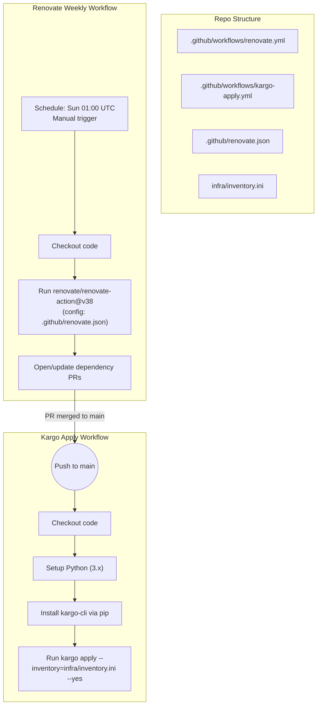

## 📦 Automated Dependency Updates & Infra Deployment ( Beta )




  
This repository contains a turnkey setup for:

1. **Weekly Dependency Updates** using [Renovate](https://github.com/renovatebot/renovate) via GitHub Actions
2. **Automatic Infrastructure Deployment** using [Kargo](https://github.com/kubepack/kargo) when changes land on your default branch

---

### 🗂 Repository Structure, Almost

```text
.github/
├── workflows/
│   ├── renovate.yml        # Runs Renovate on a weekly schedule
│   └── kargo-apply.yml     # Applies Kargo manifests on push to main
└── renovate.json           # Renovate configuration (schedule, managers, hooks)
infra/
└── inventory.ini           # Kargo inventory
...
```

---

## ⚙️ Renovate Weekly Workflow

**File:** `.github/workflows/renovate.yml`

```yaml
name: Renovate Weekly

on:
  schedule:
    # Every Sunday at 01:00 UTC
    - cron: '0 1 * * 0'
  workflow_dispatch: # manual trigger

jobs:
  renovate:
    runs-on: ubuntu-latest
    permissions:
      contents: write
      pull-requests: write
    steps:
      - name: Checkout code
        uses: actions/checkout@v4

      - name: Run Renovate
        uses: renovate/renovate-action@v38
        with:
          config-file: .github/renovate.json
        env:
          GITHUB_TOKEN: ${{ secrets.GITHUB_TOKEN }}
```

* **Schedule**: Triggers every **Sunday at 01:00 UTC**, and can be run manually.
* **Permissions**: `contents: write` and `pull-requests: write` allow Renovate to open branches & PRs.
* **Action**: Uses the official `renovate-action@v38` to pick up your `renovate.json` config.

---

## 📝 Renovate Configuration

**File:** `.github/renovate.json`

```jsonc
{
  "extends": ["config:base"],
  "schedule": ["after 1am on Sunday"],

  // Enable managers for JavaScript, Java, Python, Docker, Helm, etc.
  "packageManagers": {
    "npm": { "enabled": true },
    "docker": { "enabled": true },
    "helm": { "enabled": true },
    "maven": { "enabled": true },
    "gradle": { "enabled": true },
    "pip_requirements": { "enabled": true },
    "poetry": { "enabled": true }
  },

  // Open security fixes immediately (or on your schedule)
  "security": { "enabled": true },

  // After any update PR merges, run Kargo in CI
  "packageRules": [
    {
      "matchUpdateTypes": ["patch", "minor", "major"],
      "postUpdateTasks": {
        "commands": [
          "echo '🔄 Running kargo apply…'",
          "kargo apply --inventory ./infra/inventory.ini --yes"
        ],
        "fileFilters": ["**/Chart.yaml", "**/package.json"]
      }
    }
  ]
}
```

* **`extends: ["config:base"]`**: Includes sensible defaults for most ecosystems.
* **`schedule`**: Restricts Renovate to weekly runs.
* **`packageManagers`**: Explicitly enables JavaScript, Java, Python, Docker, Helm etc.
* **`security.enabled`**: Ensures critical security patches are surfaced immediately.
* **Post-update Tasks**: Triggers `kargo apply` in CI when dependency PRs merge.

---

## 🚀 Kargo Apply Workflow

**File:** `.github/workflows/kargo-apply.yml`

```yaml
name: Kargo Apply on Merge

on:
  push:
    branches: [ main ] # or your default branch

jobs:
  deploy:
    runs-on: ubuntu-latest

    steps:
      - name: Checkout code
        uses: actions/checkout@v4

      - name: Set up Python (for Kargo CLI)
        uses: actions/setup-python@v4
        with:
          python-version: '3.x'

      - name: Install Kargo
        run: pip install kargo-cli

      - name: Run Kargo apply
        working-directory: ./infra
        run: |
          echo "🔄 Applying Kargo manifests…"
          kargo apply --inventory ./inventory.ini --yes
```

* **Trigger**: On every push to `main` (includes Renovate merges).
* **Steps**:

  1. **Checkout** your code
  2. **Setup Python** to install `kargo-cli`
  3. **Install Kargo** via `pip`
  4. **Apply** your manifests in the `infra` directory

---

## 🔧 Testing Locally

1. **Fork & clone** this repo to your home cluster test environment.
2. **Verify Renovate**:

   * Run the Action locally with [act](https://github.com/nektos/act) or trigger `workflow_dispatch`.
3. **Merge a Renovate PR** (or push any commit) to `main`.
4. **Observe** the `kargo-apply.yml` run in GitHub Actions:

   * It should install `kargo-cli` and apply your manifests to your cluster.
5. **Validate** your cluster state:

   * Use `kubectl get pods,svc,...` to confirm resources are up-to-date.

---

## 📖 Further Reading

* [Renovate Docs: Scheduling](https://docs.renovatebot.com/configuration-options/#schedule)
* [Renovate Docs: Post-update Tasks](https://docs.renovatebot.com/configuration-options/#post-updatetasks)
* [Kargo CLI Quickstart](https://github.com/kubepack/kargo#quickstart)

---

